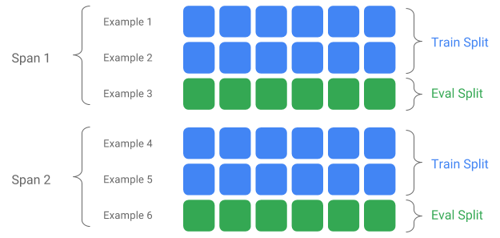

# The ExampleGen TFX Pipeline Component

The ExampleGen TFX Pipeline component ingests data into TFX pipelines. It
consumes external files/services to generate Examples which will be read by
other TFX components. It also provides consistent and configurable partition,
and shuffles the dataset for ML best practice.

*   Consumes: Data from external data sources such as CSV, `TFRecord`, Avro,
    Parquet and BigQuery.
*   Emits: `tf.Example` records, `tf.SequenceExample` records, or proto format,
    depending on the payload format.

## ExampleGen and Other Components

ExampleGen provides data to components that make use of the
[TensorFlow Data Validation](tfdv.md) library, such as
[SchemaGen](schemagen.md), [StatisticsGen](statsgen.md), and
[Example Validator](exampleval.md). It also provides data to
[Transform](transform.md), which makes use of the [TensorFlow Transform](tft.md)
library, and ultimately to deployment targets during inference.

## Data Sources and Formats
Currently a standard installation of TFX includes full ExampleGen components for
these data sources and formats:

* [CSV](https://github.com/tensorflow/tfx/tree/master/tfx/components/example_gen/csv_example_gen)
* [tf.Record](https://github.com/tensorflow/tfx/tree/master/tfx/components/example_gen/import_example_gen)
* [BigQuery](https://github.com/tensorflow/tfx/tree/master/tfx/extensions/google_cloud_big_query/example_gen)

Custom executors are also available which enable the development of ExampleGen
components for these data sources and formats:

* [Avro](https://github.com/tensorflow/tfx/blob/master/tfx/components/example_gen/custom_executors/avro_executor.py)
* [Parquet](https://github.com/tensorflow/tfx/blob/master/tfx/components/example_gen/custom_executors/parquet_executor.py)

See the usage examples in the source code and
[this discussion](/tfx/guide/examplegen#custom_examplegen) for more information on
how to use and develop custom executors.

Note: In most case it's better to inherit from `base_example_gen_executor`
instead of `base_executor`. So following the Avro or Parquet example in the
Executor source code may be advisable.

In addition, these data sources and formats are available as
[custom component](/tfx/guide/understanding_custom_components) examples:

* [Presto](https://github.com/tensorflow/tfx/tree/master/tfx/examples/custom_components/presto_example_gen)

### Ingesting data formats which are supported by Apache Beam

Apache Beam supports ingesting data from a
[broad range of data sources and formats](https://beam.apache.org/documentation/io/built-in/),
([see below](#additional_data_formats)).  These capabilities
can be used to create custom ExampleGen components for TFX, which is
demonstrated by some existing ExampleGen components
([see below](#additional_data_formats)).

## How to use an ExampleGen Component

For supported data sources (currently, CSV files, TFRecord files with
`tf.Example`, `tf.SequenceExample` and proto format, and results of BigQuery
queries) the ExampleGen pipeline component can be used directly in deploy and
requires little customization. For example:

```python
example_gen = CsvExampleGen(input_base='data_root')
```

or like below for importing external TFRecord with `tf.Example` directly:

```python
example_gen = ImportExampleGen(input_base=path_to_tfrecord_dir)
```

## Span, Version and Split

A Span is a grouping of training examples. If your data is persisted on a
filesystem, each Span may be stored in a separate directory. The semantics of a
Span are not hardcoded into TFX; a Span may correspond to a day of data, an hour
of data, or any other grouping that is meaningful to your task.

Each Span can hold multiple Versions of data. To give an example, if you remove
some examples from a Span to clean up poor quality data, this could result in a
new Version of that Span. By default, TFX components operate on the latest
Version within a Span.

Each Version within a Span can further be subdivided into multiple Splits. The
most common use-case for splitting a Span is to split it into training and eval
data.



### Custom input/output split

Note: this feature is only available after TFX 0.14.

To customize the train/eval split ratio which ExampleGen will output, set the
`output_config` for ExampleGen component. For example:

```python
# Input has a single split 'input_dir/*'.
# Output 2 splits: train:eval=3:1.
output = proto.Output(
             split_config=example_gen_pb2.SplitConfig(splits=[
                 proto.SplitConfig.Split(name='train', hash_buckets=3),
                 proto.SplitConfig.Split(name='eval', hash_buckets=1)
             ]))
example_gen = CsvExampleGen(input_base=input_dir, output_config=output)
```

Notice how the `hash_buckets` were set in this example.

For an input source which has already been split, set the `input_config` for
ExampleGen component:

```python

# Input train split is 'input_dir/train/*', eval split is 'input_dir/eval/*'.
# Output splits are generated one-to-one mapping from input splits.
input = proto.Input(splits=[
                example_gen_pb2.Input.Split(name='train', pattern='train/*'),
                example_gen_pb2.Input.Split(name='eval', pattern='eval/*')
            ])
example_gen = CsvExampleGen(input_base=input_dir, input_config=input)
```

For file based example gen (e.g. CsvExampleGen and ImportExampleGen), `pattern`
is a glob relative file pattern that maps to input files with root directory
given by input base path. For query-based example gen (e.g. BigQueryExampleGen,
PrestoExampleGen), `pattern` is a SQL query.

By default, the entire input base dir is treated as a single input split, and
the train and eval output split is generated with a 2:1 ratio.

Please refer to
[proto/example_gen.proto](https://github.com/tensorflow/tfx/blob/master/tfx/proto/example_gen.proto)
for ExampleGen's input and output split configuration. And refer to
[downstream components guide](#examplegen_downstream_components) for utilizing
the custom splits downstream.

#### Splitting Method

When using `hash_buckets` splitting method, instead of the entire record, one
can use a feature for partitioning the examples. If a feature is present,
ExampleGen will use a fingerprint of that feature as the partition key.

This feature can be used to maintain a stable split w.r.t. certain properties of
examples: for example, a user will always be put in the same split if "user_id"
were selected as the partition feature name.

The interpretation of what a "feature" means and how to match a "feature" with
the specified name depends on the ExampleGen implementation and the type of the
examples.

For ready-made ExampleGen implementations:

*   If it generates tf.Example, then a "feature" means an entry in
    tf.Example.features.feature.
*   If it generates tf.SequenceExample, then a "feature" means an entry in
    tf.SequenceExample.context.feature.
*   Only int64 and bytes features are supported.

In the following cases, ExampleGen throws runtime errors:

*   Specified feature name does not exist in the example.
*   Empty feature: `tf.train.Feature()`.
*   Non supported feature types, e.g., float features.

To output the train/eval split based on a feature in the examples, set the
`output_config` for ExampleGen component. For example:

```python
# Input has a single split 'input_dir/*'.
# Output 2 splits based on 'user_id' features: train:eval=3:1.
output = proto.Output(
             split_config=proto.SplitConfig(splits=[
                 proto.SplitConfig.Split(name='train', hash_buckets=3),
                 proto.SplitConfig.Split(name='eval', hash_buckets=1)
             ],
             partition_feature_name='user_id'))
example_gen = CsvExampleGen(input_base=input_dir, output_config=output)
```

Notice how the `partition_feature_name` was set in this example.

### Span

Note: this feature is only available after TFX 0.15.

Span can be retrieved by using '{SPAN}' spec in the
[input glob pattern](https://github.com/tensorflow/tfx/blob/master/tfx/proto/example_gen.proto):

*   This spec matches digits and maps the data into the relevant SPAN numbers.
    For example, 'data_{SPAN}-*.tfrecord' will collect files like
    'data_12-a.tfrecord', 'date_12-b.tfrecord'.
*   Optionally, this spec can be specified with the width of the integers when
    mapped. For example, 'data_{SPAN:2}.file' maps to files like 'data_02.file'
    and 'data_27.file' (as inputs for Span-2 and Span-27 respectively), but does
    not map to 'data_1.file' nor 'data_123.file'.
*   When SPAN spec is missing, it's assumed to be always Span '0'.
*   If SPAN is specified, pipeline will process the latest span, and store the
    span number in metadata.

For example, let's assume there are input data:

*   '/tmp/span-1/train/data'
*   '/tmp/span-1/eval/data'
*   '/tmp/span-2/train/data'
*   '/tmp/span-2/eval/data'

and the input config is shown as below:

```python
splits {
  name: 'train'
  pattern: 'span-{SPAN}/train/*'
}
splits {
  name: 'eval'
  pattern: 'span-{SPAN}/eval/*'
}
```

when triggering the pipeline, it will process:

*   '/tmp/span-2/train/data' as train split
*   '/tmp/span-2/eval/data' as eval split

with span number as '2'. If later on '/tmp/span-3/...' are ready, simply
trigger the pipeline again and it will pick up span '3' for processing. Below
shows the code example for using span spec:

```python
input = proto.Input(splits=[
                proto.Input.Split(name='train',
                                            pattern='span-{SPAN}/train/*'),
                proto.Input.Split(name='eval',
                                            pattern='span-{SPAN}/eval/*')
            ])
example_gen = CsvExampleGen(input_base='/tmp', input_config=input)
```

Retrieving a certain span can be done with RangeConfig, which is detailed below.

### Date

Note: this feature is only availible after TFX 0.24.0.

If your data source is organized on filesystem by date, TFX supports mapping
dates directly to span numbers. There are three specs to represent mapping from
dates to spans: {YYYY}, {MM} and {DD}:

*   The three specs should be altogether present in the
    [input glob pattern](https://github.com/tensorflow/tfx/blob/master/tfx/proto/example_gen.proto)
    if any is specified:
*   Either {SPAN} spec or this set of date specs can be specified exclusively.
*   A calendar date with the year from YYYY, the month from MM, and the day of
    the month from DD is calculated, then the span number is calculated as as
    the number of days since unix epoch (i.e. 1970-01-01). For example,
    'log-{YYYY}{MM}{DD}.data' matches to a file 'log-19700101.data' and consumes
    it as input for Span-0, and 'log-20170101.data' as input for Span-17167.
*   If this set of date specs is specified, pipeline will process the latest
    latest date, and store the corresponding span number in metadata.

For example, let's assume there are input data organized by calendar date:

*   '/tmp/1970-01-02/train/data'
*   '/tmp/1970-01-02/eval/data'
*   '/tmp/1970-01-03/train/data'
*   '/tmp/1970-01-03/eval/data'

and the input config is shown as below:

```python
splits {
  name: 'train'
  pattern: '{YYYY}-{MM}-{DD}/train/*'
}
splits {
  name: 'eval'
  pattern: '{YYYY}-{MM}-{DD}/eval/*'
}
```

when triggering the pipeline, it will process:

*   '/tmp/1970-01-03/train/data' as train split
*   '/tmp/1970-01-03/eval/data' as eval split

with span number as '2'. If later on '/tmp/1970-01-04/...' are ready, simply
trigger the pipeline again and it will pick up span '3' for processing. Below
shows the code example for using date spec:

```python
input = proto.Input(splits=[
                proto.Input.Split(name='train',
                                            pattern='{YYYY}-{MM}-{DD}/train/*'),
                proto.Input.Split(name='eval',
                                            pattern='{YYYY}-{MM}-{DD}/eval/*')
            ])
example_gen = CsvExampleGen(input_base='/tmp', input_config=input)
```

### Version

Note: this feature is only availible after TFX 0.24.0.

Version can be retrieved by using '{VERSION}' spec in the
[input glob pattern](https://github.com/tensorflow/tfx/blob/master/tfx/proto/example_gen.proto):

*   This spec matches digits and maps the data to the relevant VERSION numbers
    under the SPAN. Note that the Version spec can be used combination with
    either Span or Date spec.
*   This spec can also be optionally specified with the width in the same way as
    SPAN spec. e.g. 'span-{SPAN}/version-{VERSION:4}/data-*'.
*   When VERSION spec is missing, version is set to be None.
*   If SPAN and VERSION are both specified, pipeline will process the latest
    version for the latest span, and store the version number in metadata.
*   If VERSION is specified, but not SPAN (or date spec), an error will be
    thrown.

For example, let's assume there are input data:

*   '/tmp/span-1/ver-1/train/data'
*   '/tmp/span-1/ver-1/eval/data'
*   '/tmp/span-2/ver-1/train/data'
*   '/tmp/span-2/ver-1/eval/data'
*   '/tmp/span-2/ver-2/train/data'
*   '/tmp/span-2/ver-2/eval/data'

and the input config is shown as below:

```python
splits {
  name: 'train'
  pattern: 'span-{SPAN}/ver-{VERSION}/train/*'
}
splits {
  name: 'eval'
  pattern: 'span-{SPAN}/ver-{VERSION}/eval/*'
}
```

when triggering the pipeline, it will process:

*   '/tmp/span-2/ver-2/train/data' as train split
*   '/tmp/span-2/ver-2/eval/data' as eval split

with span number as '2' and version number as '2'. If later on
'/tmp/span-2/ver-3/...' are ready, simply trigger the pipeline again and it
will pick up span '2' and version '3' for processing. Below shows the code
example for using version spec:

```python
input = proto.Input(splits=[
                proto.Input.Split(name='train',
                                            pattern='span-{SPAN}/ver-{VERSION}/train/*'),
                proto.Input.Split(name='eval',
                                            pattern='span-{SPAN}/ver-{VERSION}/eval/*')
            ])
example_gen = CsvExampleGen(input_base='/tmp', input_config=input)
```

### Range Config

Note: this feature is only available after TFX 0.24.0.

TFX supports retrieval and processing of a specific span in file-based
ExampleGen using range config, an abstract config used to describe ranges for
different TFX entities. To retrieve a specific span, set the `range_config` for
a file-based ExampleGen component. For example, let's assume there are input
data:

*   '/tmp/span-01/train/data'
*   '/tmp/span-01/eval/data'
*   '/tmp/span-02/train/data'
*   '/tmp/span-02/eval/data'

To specifically retrieve and process data with span '1', we specify a range
config in addition to the input config. Note that ExampleGen only supports
single-span static ranges (to specify processing of specific individual spans).
Thus, for StaticRange, start_span_number must equal end_span_number. Using the
provided span, and the span width information (if provided) for zero-padding,
ExampleGen will replace the SPAN spec in the provided split patterns with the
desired span number. An example of usage is shown below:

```python
# In cases where files have zero-padding, the width modifier in SPAN spec is
# required so TFX can correctly substitute spec with zero-padded span number.
input = proto.Input(splits=[
                proto.Input.Split(name='train',
                                            pattern='span-{SPAN:2}/train/*'),
                proto.Input.Split(name='eval',
                                            pattern='span-{SPAN:2}/eval/*')
            ])
# Specify the span number to be processed here using StaticRange.
range = proto.RangeConfig(
                static_range=proto.StaticRange(
                        start_span_number=1, end_span_number=1)
            )

# After substitution, the train and eval split patterns will be
# 'input_dir/span-01/train/*' and 'input_dir/span-01/eval/*', respectively.
example_gen = CsvExampleGen(input_base=input_dir, input_config=input,
                            range_config=range)
```

Range config can also be used to process specific dates, if the date spec is
used instead of SPAN spec. For example, let's assume there are input data
organized by calendar date:

*   '/tmp/1970-01-02/train/data'
*   '/tmp/1970-01-02/eval/data'
*   '/tmp/1970-01-03/train/data'
*   '/tmp/1970-01-03/eval/data'

To specifically retrieve and process data on January 2nd, 1970, we do the
following:

```python
from  tfx.components.example_gen import utils

input = proto.Input(splits=[
                proto.Input.Split(name='train',
                                            pattern='{YYYY}-{MM}-{DD}/train/*'),
                proto.Input.Split(name='eval',
                                            pattern='{YYYY}-{MM}-{DD}/eval/*')
            ])
# Specify date to be converted to span number to be processed using StaticRange.
span = utils.date_to_span_number(1970, 1, 2)
range = proto.RangeConfig(
                static_range=range_config_pb2.StaticRange(
                        start_span_number=span, end_span_number=span)
            )

# After substitution, the train and eval split patterns will be
# 'input_dir/1970-01-02/train/*' and 'input_dir/1970-01-02/eval/*',
# respectively.
example_gen = CsvExampleGen(input_base=input_dir, input_config=input,
                            range_config=range)
```

## Custom ExampleGen

If the currently available ExampleGen components don't fit your needs, you can
create a custom ExampleGen, which will enable you to read from different data
sources or in different data formats.

### File-Based ExampleGen Customization (Experimental)

First, extend BaseExampleGenExecutor with a custom Beam PTransform, which
provides the conversion from your train/eval input split to TF examples. For
example, the
[CsvExampleGen executor](https://github.com/tensorflow/tfx/blob/master/tfx/components/example_gen/csv_example_gen/executor.py)
provides the conversion from an input CSV split to TF examples.

Then, create a component with above executor, as done in [CsvExampleGen component](https://github.com/tensorflow/tfx/blob/master/tfx/components/example_gen/csv_example_gen/component.py).
Alternatively, pass a custom executor into the standard
ExampleGen component as shown below.

```python
from tfx.components.base import executor_spec
from tfx.components.example_gen.csv_example_gen import executor

example_gen = FileBasedExampleGen(
    input_base=os.path.join(base_dir, 'data/simple'),
    custom_executor_spec=executor_spec.ExecutorClassSpec(executor.Executor))
```

Now, we also support reading Avro and Parquet files using this
[method](https://github.com/tensorflow/tfx/blob/master/tfx/components/example_gen/custom_executors/).

### Additional Data Formats

Apache Beam supports reading a number of
[additional data formats](https://beam.apache.org/documentation/io/built-in/).
through Beam I/O Transforms. You can create custom ExampleGen components by
leveraging the Beam I/O Transforms using a pattern similar to the
[Avro example](https://github.com/tensorflow/tfx/blob/master/tfx/components/example_gen/custom_executors/avro_executor.py#L56)

```python
  return (pipeline
          | 'ReadFromAvro' >> beam.io.ReadFromAvro(avro_pattern)
          | 'ToTFExample' >> beam.Map(utils.dict_to_example))
```
As of this writing the currently supported formats and data sources for the Beam
Python SDK include:

* Amazon S3
* Apache Avro
* Apache Hadoop
* Apache Kafka
* Apache Parquet
* Google Cloud BigQuery
* Google Cloud BigTable
* Google Cloud Datastore
* Google Cloud Pub/Sub
* Google Cloud Storage (GCS)
* MongoDB

Check the [Beam docs](https://beam.apache.org/documentation/io/built-in/) for
the latest list.

### Query-Based ExampleGen Customization (Experimental)

First, extend BaseExampleGenExecutor with a custom Beam PTransform, which reads
from the external data source. Then, create a simple component by
extending QueryBasedExampleGen.

This may or may not require additional connection configurations. For example,
the
[BigQuery executor](https://github.com/tensorflow/tfx/blob/master/tfx/extensions/google_cloud_big_query/example_gen/executor.py)
reads using a default beam.io connector, which abstracts the connection
configuration details. The
[Presto executor](https://github.com/tensorflow/tfx/blob/master/tfx/examples/custom_components/presto_example_gen/presto_component/executor.py),
requires a custom Beam PTransform and a
[custom connection configuration protobuf](https://github.com/tensorflow/tfx/blob/master/tfx/examples/custom_components/presto_example_gen/proto/presto_config.proto)
as input.

If a connection configuration is required for a custom ExampleGen component, create
a new protobuf and pass it in through custom_config, which is now an optional
execution parameter. Below is an example of how to use a configured component.

```python
from tfx.examples.custom_components.presto_example_gen.proto import presto_config_pb2
from tfx.examples.custom_components.presto_example_gen.presto_component.component import PrestoExampleGen

presto_config = presto_config_pb2.PrestoConnConfig(host='localhost', port=8080)
example_gen = PrestoExampleGen(presto_config, query='SELECT * FROM chicago_taxi_trips')
```

## ExampleGen Downstream Components

Custom split configuration is supported for downstream components.

### StatisticsGen

Default behavior is to perform stats generation for all splits.

To exclude any splits, set the `exclude_splits` for StatisticsGen component. For
example:

```python
# Exclude the 'eval' split.
statistics_gen = StatisticsGen(
             examples=example_gen.outputs['examples'],
             exclude_splits=['eval'])
```

### SchemaGen

Default behavior is to generate a schema based on all splits.

To exclude any splits, set the `exclude_splits` for SchemaGen component. For
example:

```python
# Exclude the 'eval' split.
schema_gen = SchemaGen(
             statistics=statistics_gen.outputs['statistics'],
             exclude_splits=['eval'])
```

### ExampleValidator

Default behavior is to validate the statistics of all splits on input examples
against a schema.

To exclude any splits, set the `exclude_splits` for ExampleValidator component.
For example:

```python
# Exclude the 'eval' split.
example_validator = ExampleValidator(
             statistics=statistics_gen.outputs['statistics'],
             schema=schema_gen.outputs['schema'],
             exclude_splits=['eval'])
```

### Transform

Default behavior is analyze and produce the metadata from the 'train' split and
transform all splits.

To specify the analyze splits and transform splits, set the `splits_config` for
Transform component. For example:

```python
# Analyze the 'train' split and transform all splits.
transform = Transform(
      examples=example_gen.outputs['examples'],
      schema=schema_gen.outputs['schema'],
      module_file=_taxi_module_file,
      splits_config=proto.SplitsConfig(analyze=['train'],
                                               transform=['train', 'eval']))
```

### Trainer and Tuner

Default behavior is train on the 'train' split and evaluate on the 'eval' split.

To specify the train splits and evaluate splits, set the `train_args` and
`eval_args` for Trainer component. For example:

```python
# Train on the 'train' split and evaluate on the 'eval' split.
Trainer = Trainer(
      module_file=_taxi_module_file,
      examples=transform.outputs['transformed_examples'],
      schema=schema_gen.outputs['schema'],
      transform_graph=transform.outputs['transform_graph'],
      train_args=proto.TrainArgs(splits=['train'], num_steps=10000),
      eval_args=proto.EvalArgs(splits=['eval'], num_steps=5000))
```

### Evaluator

Default behavior is provide metrics computed on the 'eval' split.

To compute evaluation statistics on custom splits, set the `example_splits` for
Evaluator component. For example:

```python
# Compute metrics on the 'eval1' split and the 'eval2' split.
evaluator = Evaluator(
      examples=example_gen.outputs['examples'],
      model=trainer.outputs['model'],
      example_splits=['eval1', 'eval2'])
```

More details are available in the
[CsvExampleGen API reference](https://www.tensorflow.org/tfx/api_docs/python/tfx/v1/components/CsvExampleGen),
[FileBasedExampleGen API implementation](https://github.com/tensorflow/tfx/blob/master/tfx/components/example_gen/component.py)
and
[ImportExampleGen API reference](https://www.tensorflow.org/tfx/api_docs/python/tfx/v1/components/ImportExampleGen).
