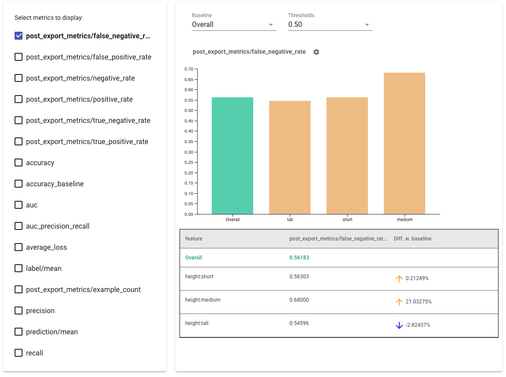

# Using Fairness Indicators

Fairness Indicators is designed to support teams in evaluating and improving
models for fairness concerns in partnership with the broader Tensorflow toolkit.
The tool is currently actively used internally by many of our products, and is
now available in BETA to try for your own use cases.

Fairness Indicators enables easy computation of commonly-identified fairness
metrics for binary and multiclass classifiers. Many existing tools for
evaluating fairness concerns don’t work well on large scale datasets and models.
At Google, it is important for us to have tools that can work on billion-user
systems. Fairness Indicators will allow you to evaluate across any size of use
case.

## Tensorflow Models

### Data

To run Fairness Indicators with TFMA, make sure the evaluation dataset is
labelled for the features you would like to slice by. If you don't have the
exact slice features for your fairness concerns, you may explore trying to find
an evaluation set that does, or considering proxy features within your feature
set that may highlight outcome disparities. For additional guidance, see
[here](bit.ly/fairness-indicators-guidance).

### Model

You can use the Tensorflow Estimator class to build your model. Support for
Keras models is coming soon to TFMA. If you would like to run TFMA on a Keras
model, please see the “Model-Agnostic TFMA” section below.

After your Estimator is trained, you will need to export a saved model for
evaluation purposes. To learn more, see the
[TFMA guide](https://www.tensorflow.org/tfx/model_analysis/get_started).

### Configuring Slices

Next, define the slices you would like to evaluate on:

```python
slice_spec = [
  tfma.slicer.SingleSliceSpec(columns=[‘fur color’])
]
```

If you want to evaluate intersectional slices (for example, both fur color and
height), you can set the following:

```python
slice_spec = [
  tfma.slicer.SingleSliceSpec(columns=[‘fur_color’, ‘height’])
]`
```

### Compute Fairness Metrics

Add a Fairness Indicators callback to the `metrics_callback` list. In the
callback, you can define a list of thresholds that the model will be evaluated
at.

```python
from tensorflow_model_analysis.addons.fairness.post_export_metrics import fairness_indicators

# Build the fairness metrics. Besides the thresholds, you also can config the example_weight_key, labels_key here. For more details, please check the api.
metrics_callbacks = \
    [tfma.post_export_metrics.fairness_indicators(thresholds=[0.1, 0.3,
     0.5, 0.7, 0.9])]

eval_shared_model = tfma.default_eval_shared_model(
    eval_saved_model_path=tfma_export_dir,
    add_metrics_callbacks=metrics_callbacks)
```

Before running the config, determine whether or not you want to enable
computation of confidence intervals. Confidence intervals are computed using
Poisson bootstrapping and require recomputation over 20 samples.

```python
compute_confidence_intervals = True
```

Run the TFMA evaluation pipeline:

```python
validate_dataset = tf.data.TFRecordDataset(filenames=[validate_tf_file])

# Run the fairness evaluation.
with beam.Pipeline() as pipeline:
  _ = (
      pipeline
      | beam.Create([v.numpy() for v in validate_dataset])
      | 'ExtractEvaluateAndWriteResults' >>
       tfma.ExtractEvaluateAndWriteResults(
                 eval_shared_model=eval_shared_model,
                 slice_spec=slice_spec,
                 compute_confidence_intervals=compute_confidence_intervals,
                 output_path=tfma_eval_result_path)
  )
eval_result = tfma.load_eval_result(output_path=tfma_eval_result_path)
```

### Render Fairness Indicators

```python
from tensorflow_model_analysis.addons.fairness.view import widget_view

widget_view.render_fairness_indicator(eval_result)
```



Tips for using Fairness Indicators:

*   **Select metrics to display** by checking the boxes on the left hand side.
    Individual graphs for each of the metrics will appear in the widget, in
    order.
*   **Change the baseline slice**, the first bar on the graph, using the
    dropdown selector. Deltas will be calculated with this baseline value.
*   **Select thresholds** using the dropdown selector. You can view multiple
    thresholds on the same graph. Selected thresholds will be bolded, and you
    can click a bolded threshold to un-select it.
*   **Hover over a bar** to see metrics for that slice.
*   **Identify disparities with the baseline** using the "Diff w. baseline"
    column, which identifies the percentage difference between the current slice
    and the baseline.
*   **Explore the data points of a slice in depth** using the
    [What-If Tool](https://pair-code.github.io/what-if-tool/). See
    [here](https://github.com/tensorflow/fairness-indicators/) for an example.

## Model Agnostic Evaluation

To better support clients that have different models and workflows, we have
developed an evaluation library which is agnostic to the model being evaluated.

Anyone who wants to evaluate their machine learning system can use this,
especially if you have non-TensorFlow based models. Using the Apache Beam Python
SDK, you can create a standalone TFMA evaluation binary and then run it to
analyze your model.

### Data

This step is to provide the dataset you want the evaluations to run on. It
should be in
[tf.Example](https://www.tensorflow.org/tutorials/load_data/tfrecord) proto
format having labels, predictions and other features you might want to slice on.

```python
tf.Example {
    features {
        feature {
          key: "fur_color" value { bytes_list { value: "gray" } }
        }
        feature {
          key: "height" value { bytes_list { value: "tall" } }
        }
        feature {
          key: "prediction" value { float_list { value: 0.9 } }
        }
        feature {
          key: "label" value { float_list { value: 1.0 } }
        }
    }
}
```

### Model

Instead of specifying a model, you an create a model agnostic eval config and
extractor to parse and provide the data TFMA needs to compute metrics.
[ModelAgnosticConfig](https://github.com/tensorflow/model-analysis/blob/master/tensorflow_model_analysis/model_agnostic_eval/model_agnostic_predict.py)
spec defines the features, predictions, and labels to be used from the input
examples.

For this, create a feature map with keys representing all the features including
label and prediction keys and values representing the data type of the feature.

```python
feature_map[label_key] = tf.FixedLenFeature([], tf.float32, default_value=[0])
```

Create a model agnostic config using label keys, prediction keys and the feature
map.

```python
model_agnostic_config = model_agnostic_predict.ModelAgnosticConfig(
    label_keys=list(ground_truth_labels),
    prediction_keys=list(predition_labels),
    feature_spec=feature_map)
```

### Set up Model Agnostic Extractor

[Extractor](https://github.com/tensorflow/model-analysis/blob/master/tensorflow_model_analysis/model_agnostic_eval/model_agnostic_extractor.py)
is used to extract the features, labels and predictions from the input using
model agnostic config. And if you want to slice your data, you also need to
define the
[slice key spec](https://github.com/tensorflow/model-analysis/tree/master/tensorflow_model_analysis/slicer),
containing information about the columns you want to slice on.

```python
model_agnostic_extractors = [
    model_agnostic_extractor.ModelAgnosticExtractor(
        model_agnostic_config=model_agnostic_config, desired_batch_size=3),
    slice_key_extractor.SliceKeyExtractor([
        slicer.SingleSliceSpec(),
        slicer.SingleSliceSpec(columns=[‘height’]),
    ])
]
```

### Compute Fairness Metrics

As part of
[EvalSharedModel](https://www.tensorflow.org/tfx/model_analysis/api_docs/python/tfma/types/EvalSharedModel),
you can provide all the metrics on which you want your model to be evaluated.
Metrics are provided in the form of metrics callbacks like the ones defined in
[post_export_metrics](https://github.com/tensorflow/model-analysis/blob/master/tensorflow_model_analysis/post_export_metrics/post_export_metrics.py)
or
[fairness_indicators](https://github.com/tensorflow/model-analysis/blob/master/tensorflow_model_analysis/addons/fairness/post_export_metrics/fairness_indicators.py).

```python
metrics_callbacks.append(
    post_export_metrics.fairness_indicators(
        thresholds=[0.5, 0.9],
        target_prediction_keys=[prediction_key],
        labels_key=label_key))
```

It also takes in a `construct_fn` which is used to create a tensorflow graph to
perform the evaluation.

```python
eval_shared_model = types.EvalSharedModel(
    add_metrics_callbacks=metrics_callbacks,
    construct_fn=model_agnostic_evaluate_graph.make_construct_fn(
        add_metrics_callbacks=metrics_callbacks,
        fpl_feed_config=model_agnostic_extractor
        .ModelAgnosticGetFPLFeedConfig(model_agnostic_config)))
```

Once everything is set up, use one of `ExtractEvaluate` or
`ExtractEvaluateAndWriteResults` functions provided by
[model_eval_lib](https://github.com/tensorflow/model-analysis/blob/master/tensorflow_model_analysis/api/model_eval_lib.py)
to evaluate the model.

```python
_ = (
    examples |
    'ExtractEvaluateAndWriteResults' >>
        model_eval_lib.ExtractEvaluateAndWriteResults(
        eval_shared_model=eval_shared_model,
        output_path=output_path,
        extractors=model_agnostic_extractors))

eval_result = tensorflow_model_analysis.load_eval_result(output_path=tfma_eval_result_path)
```

Finally, render Fairness Indicators using the instructions from the "Render
Fairness Indicators" section above.
