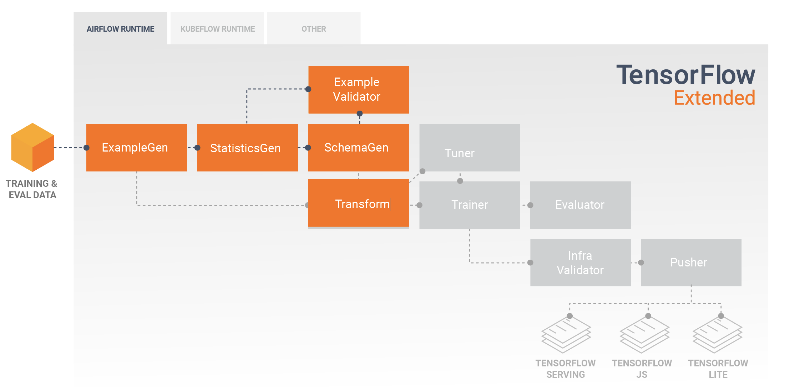
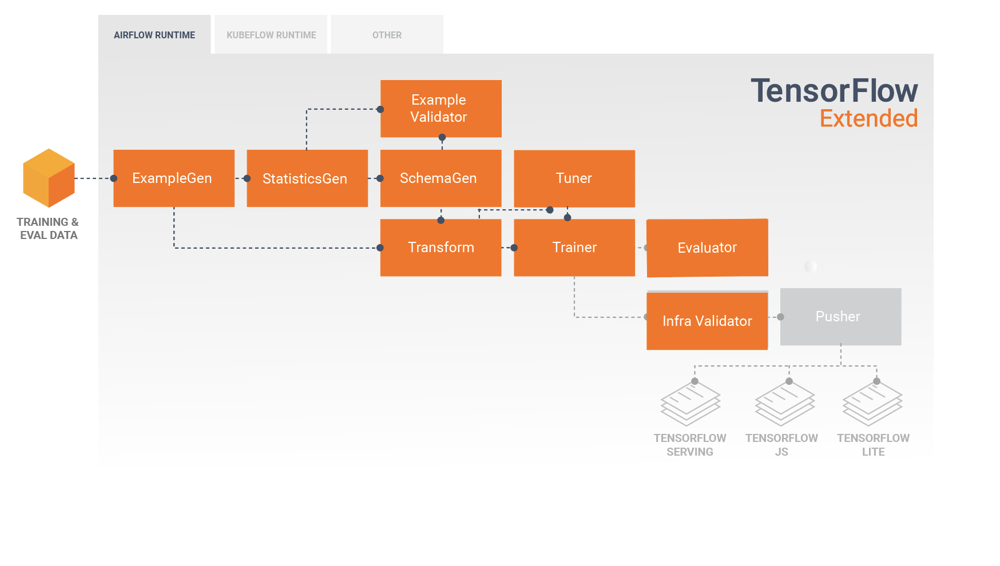

# The TFX User Guide

## Introduction

TFX is a Google-production-scale machine learning (ML) platform based on
TensorFlow. It provides a configuration framework and shared libraries to
integrate common components needed to define, launch, and monitor your machine
learning system.

## TFX 1.0

We are happy to announce the availability of the
[TFX 1.0.0](https://github.com/tensorflow/tfx/releases). This
is the initial post-beta release of TFX, which provides stable public APIs and
artifacts. You can be assured that your future TFX pipelines will keep working
after an upgrade within the compatibility scope defined in this
[RFC](https://github.com/tensorflow/community/blob/master/rfcs/20210307-tfx-api-artifact-compat.md).

## Installation

[](
https://github.com/tensorflow/tfx)
[](https://badge.fury.io/py/tfx)

```bash
pip install tfx
```

Note: See the
[TensorFlow Serving](https://www.tensorflow.org/tfx/guide/serving),
[TensorFlow JS](https://js.tensorflow.org/), and/or
[TensorFlow Lite](https://www.tensorflow.org/lite) documentation for installing
those optional components.

Note: This installs [Apache Beam](beam.md) with the DirectRunner.  You can also
separately install runners that perform distributed computation, such as
[Apache Flink](https://flink.apache.org/) or
[Apache Spark](https://spark.apache.org/).

### Nightly Packages

TFX also hosts nightly packages at https://pypi-nightly.tensorflow.org on Google
Cloud. To install the latest nightly package, please use the following command:

```
pip install --extra-index-url https://pypi-nightly.tensorflow.org/simple --pre tfx
```

This will install the nightly packages for the major dependencies of TFX such as
TensorFlow Model Analysis (TFMA), TensorFlow Data Validation (TFDV), TensorFlow
Transform (TFT), TFX Basic Shared Libraries (TFX-BSL), ML Metadata (MLMD).

Note: These nightly packages are unstable and breakages are likely to happen.
The fix could often take a week or more depending on the complexity involved.

## About TFX

TFX is a platform for building and managing ML workflows in a production
environment. TFX provides the following:

*   A toolkit for building ML pipelines. TFX pipelines let you orchestrate your
    ML workflow on several platforms, such as: Apache Airflow, Apache Beam, and
    Kubeflow Pipelines.

    [Learn more about TFX pipelines](https://www.tensorflow.org/tfx/guide/understanding_tfx_pipelines).

*   A set of standard components that you can use as a part of a pipeline, or as
    a part of your ML training script. TFX standard components provide proven
    functionality to help you get started building an ML process easily.

    [Learn more about TFX standard components](#tfx_standard_components).

*   Libraries which provide the base functionality for many of the standard
    components. You can use the TFX libraries to add this functionality to your
    own custom components, or use them separately.

    [Learn more about the TFX libraries](#tfx_libraries).

TFX is a Google-production-scale machine learning toolkit based on TensorFlow.
It provides a configuration framework and shared libraries to integrate common
components needed to define, launch, and monitor your machine learning system.

## TFX Standard Components

A TFX pipeline is a sequence of components that implement an [ML
pipeline](https://en.wikipedia.org/wiki/Pipeline_(computing)) which is
specifically designed for scalable, high-performance machine learning tasks.
That includes modeling, training, serving inference, and managing deployments to
online, native mobile, and JavaScript targets.

A TFX pipeline typically includes the following components:

*   [**ExampleGen**](examplegen.md) is the initial input component of a pipeline
    that ingests and optionally splits the input dataset.

*   [**StatisticsGen**](statsgen.md) calculates statistics for the dataset.

*   [**SchemaGen**](schemagen.md) examines the statistics and creates a data
    schema.

*   [**ExampleValidator**](exampleval.md) looks for anomalies and missing values
    in the dataset.

*   [**Transform**](transform.md) performs feature engineering on the dataset.

*   [**Trainer**](trainer.md) trains the model.

*   [**Tuner**](tuner.md) tunes the hyperparameters of the model.

*   [**Evaluator**](evaluator.md) performs deep analysis of the training results
    and helps you validate your exported models, ensuring that they are "good
    enough" to be pushed to production.

*   [**InfraValidator**](infra_validator.md) checks the model is actually
    servable from the infrastructure, and prevents bad model from being pushed.

*   [**Pusher**](pusher.md) deploys the model on a serving infrastructure.

*   [**BulkInferrer**](bulkinferrer.md) performs batch processing on a model
    with unlabelled inference requests.

This diagram illustrates the flow of data between these components:


## TFX Libraries

TFX includes both libraries and pipeline components.  This diagram illustrates
the relationships between TFX libraries and pipeline components:


TFX provides several Python packages that are the libraries which are used to
create pipeline components.  You'll use these libraries to create the components
of your pipelines so that your code can focus on the unique aspects of your
pipeline.

TFX libraries include:

*   [**TensorFlow Data Validation (TFDV)**](tfdv.md) is a library for analyzing
    and validating machine learning data. It is designed to be highly scalable
    and to work well with TensorFlow and TFX. TFDV includes:

    *   Scalable calculation of summary statistics of training and test data.
    *   Integration with a viewer for data distributions and statistics, as well
        as faceted comparison of pairs of datasets (Facets).
    *   Automated data-schema generation to describe expectations about data
        like required values, ranges, and vocabularies.
    *   A schema viewer to help you inspect the schema.
    *   Anomaly detection to identify anomalies, such as missing features,
        out-of- range values, or wrong feature types, to name a few.
    *   An anomalies viewer so that you can see what features have anomalies and
        learn more in order to correct them.

*   [**TensorFlow Transform (TFT)**](tft.md) is a library for preprocessing data
    with TensorFlow. TensorFlow Transform is useful for data that requires a
    full- pass, such as:

    *   Normalize an input value by mean and standard deviation.
    *   Convert strings to integers by generating a vocabulary over all input
        values.
    *   Convert floats to integers by assigning them to buckets based on the
        observed data distribution.

*   [**TensorFlow**](train.md) is used for training models with TFX. It ingests
    training data and modeling code and creates a SavedModel result. It also
    integrates a feature engineering pipeline created by TensorFlow Transform
    for preprocessing input data.

    [KerasTuner](https://www.tensorflow.org/tutorials/keras/keras_tuner) is used
    for tuning hyperparameters for model.

    Note: TFX supports TensorFlow 1.15 and, with some exceptions, 2.x. For
    details, see [Designing TensorFlow Modeling Code For TFX](train.md).

*   [**TensorFlow Model Analysis (TFMA)**](tfma.md) is a library for evaluating
    TensorFlow models. It is used along with TensorFlow to create an
    EvalSavedModel, which becomes the basis for its analysis. It allows users to
    evaluate their models on large amounts of data in a distributed manner,
    using the same metrics defined in their trainer. These metrics can be
    computed over different slices of data and visualized in Jupyter notebooks.

*   [**TensorFlow Metadata (TFMD)**](https://github.com/tensorflow/metadata)
    provides standard representations for metadata that are useful when training
    machine learning models with TensorFlow. The metadata may be produced by
    hand or automatically during input data analysis, and may be consumed for
    data validation, exploration, and transformation. The metadata serialization
    formats include:

    *   A schema describing tabular data (e.g., tf.Examples).
    *   A collection of summary statistics over such datasets.

*   [**ML Metadata (MLMD)**](mlmd.md) is a library for recording and retrieving
    metadata associated with ML developer and data scientist workflows. Most
    often the metadata uses TFMD representations. MLMD manages persistence using
    [SQL-Lite](https://www.sqlite.org/index.html),
    [MySQL](https://www.mysql.com/), and other similar data stores.

### Supporting Technologies

#### Required

*   [**Apache Beam**](beam.md) is an open source, unified model for defining
both batch and streaming data-parallel processing pipelines. TFX uses
Apache Beam to implement data-parallel pipelines.  The pipeline is then executed
by one of Beam's supported distributed processing back-ends, which include
Apache Flink, Apache Spark,
[Google Cloud Dataflow](https://cloud.google.com/dataflow/), and others.

#### Optional

Orchestrators such as Apache Airflow and Kubeflow make configuring, operating,
monitoring, and maintaining an ML pipeline easier.

*   [**Apache Airflow**](https://airflow.apache.org/) is a platform to
    programmatically author, schedule and monitor workflows. TFX uses Airflow to
    author workflows as directed acyclic graphs (DAGs) of tasks. The Airflow
    scheduler executes tasks on an array of workers while following the
    specified dependencies. Rich command line utilities make performing complex
    surgeries on DAGs a snap. The rich user interface makes it easy to visualize
    pipelines running in production, monitor progress, and troubleshoot issues
    when needed. When workflows are defined as code, they become more
    maintainable, versionable, testable, and collaborative.

*   [**Kubeflow**](https://www.kubeflow.org/) is dedicated to making deployments
    of machine learning (ML) workflows on Kubernetes simple, portable and
    scalable. Kubeflow's goal is not to recreate other services, but to provide
    a straightforward way to deploy best-of-breed open-source systems for ML to
    diverse infrastructures.
    [Kubeflow Pipelines](https://www.kubeflow.org/docs/pipelines/pipelines-overview/)
    enable composition and execution of reproducible workflows on Kubeflow,
    integrated with experimentation and notebook based experiences. Kubeflow
    Pipelines services on Kubernetes include the hosted Metadata store,
    container based orchestration engine, notebook server, and UI to help users
    develop, run, and manage complex ML pipelines at scale. The Kubeflow
    Pipelines SDK allows for creation and sharing of components and composition
    of pipelines programmatically.

### Portability and Interoperability

TFX is designed to be portable to multiple environments and orchestration
frameworks, including [Apache Airflow](airflow.md),
[Apache Beam](beam_orchestrator.md) and [Kubeflow](kubeflow.md) . It is also
portable to different computing platforms, including on-premise, and
cloud platforms such as the
[Google Cloud Platform (GCP)](https://cloud.google.com/). In particular,
TFX interoperates with serveral managed GCP services, such as
[Cloud AI Platform](https://cloud.google.com/ai-platform/) for
[Training and Prediction](https://cloud.google.com/ml-engine/), and
[Cloud Dataflow](https://cloud.google.com/dataflow/) for distributed data
processing for several other aspects of the ML lifecycle.

Note: The current revision of this user guide primarily discusses deployment
on a bare-metal system using Apache Airflow for orchestration.

### Model vs. SavedModel

#### Model

A model is the output of the training process. It is the serialized record of
the weights that have been learned during the training process. These weights
can be subsequently used to compute predictions for new input examples. For TFX
and TensorFlow, 'model' refers to the checkpoints containing the weights learned
up to that point.

Note that 'model' might also refer to the definition of the TensorFlow
computation graph (i.e. a Python file) that expresses how a prediction will be
computed. The two senses may be used interchangeably based on context.

#### SavedModel

* **What is a [SavedModel](
https://www.tensorflow.org/versions/r1.15/api_docs/python/tf/saved_model)**: a universal,
language-neutral, hermetic, recoverable serialization of a TensorFlow model.
* **Why is it important**: It enables higher-level systems to produce,
transform, and consume TensorFlow models using a single abstraction.

SavedModel is the recommended serialization format for serving a TensorFlow
model in production, or exporting a trained model for a native mobile or
JavaScript application. For example, to turn a model into a REST service for
making predictions, you can serialize the model as a SavedModel and serve it
using TensorFlow Serving. See
[Serving a TensorFlow Model](https://www.tensorflow.org/tfx/serving/serving_basic)
for more information.

### Schema

Some TFX components use a description of your input data called a *schema*. The
schema is an instance of
[schema.proto](
https://github.com/tensorflow/metadata/tree/master/tensorflow_metadata/proto/v0).
Schemas are a type of [protocol buffer](
https://developers.google.com/protocol-buffers/), more generally known as a
"protobuf".  The schema can specify data types for feature values,
whether a feature has to be present in all examples, allowed value ranges, and
other properties.  One of the benefits of using TensorFlow Data Validation
(TFDV) is that it will automatically generate a schema by inferring types,
categories, and ranges from the training data.

Here's an excerpt from a schema protobuf:

```proto
...
feature {
  name: "age"
  value_count {
    min: 1
    max: 1
  }
  type: FLOAT
  presence {
    min_fraction: 1
    min_count: 1
  }
}
feature {
  name: "capital-gain"
  value_count {
    min: 1
    max: 1
  }
  type: FLOAT
  presence {
    min_fraction: 1
    min_count: 1
  }
}
...
```

The following components use the schema:

*   TensorFlow Data Validation
*   TensorFlow Transform

In a typical TFX pipeline TensorFlow Data Validation generates a schema, which
is consumed by the other components.

Note: The auto-generated schema is best-effort and only tries to infer basic
properties of the data. It is expected that developers review and modify it as
needed.

## Developing with TFX

TFX provides a powerful platform for every phase of a machine learning project,
from research, experimentation, and development on your local machine, through
deployment. In order to avoid code duplication and eliminate the potential for
[training/serving skew](https://www.tensorflow.org/tfx/guide/tfdv#training-serving_skew_detection)
it is strongly recommended to implement your TFX pipeline for both model
training and deployment of trained models, and use [Transform](transform.md)
components which leverage the [TensorFlow Transform](tft.md) library for both
training and inference. By doing so you will use the same preprocessing and
analysis code consistently, and avoid differences between data used for training
and data fed to your trained models in production, as well as benefitting from
writing that code once.

### Data Exploration, Visualization, and Cleaning


TFX pipelines typically begin with an [ExampleGen](examplegen.md) component, which
accepts input data and formats it as tf.Examples.  Often this is done after the
data has been split into training and evaluation datasets so that there are
actually two copies of ExampleGen components, one each for training and evaluation.
This is typically followed by a
[StatisticsGen](statsgen.md) component and a [SchemaGen](schemagen.md) component,
which will examine your data and infer a data
schema and statistics.  The schema and statistics will be consumed by an
[ExampleValidator](exampleval.md) component, which will look for anomalies, missing
values, and incorrect data types in your data.  All of these components leverage the
capabilities of the [TensorFlow Data Validation](tfdv.md) library.

[TensorFlow Data Validation (TFDV)](tfdv.md) is a valuable tool when doing
initial exploration, visualization, and cleaning of your dataset.  TFDV examines
your data and infers the data types, categories, and ranges, and then
automatically helps identify anomalies and missing values.  It also provides
visualization tools that can help you examine and understand your dataset.
After your pipeline completes you can read metadata from [MLMD](mlmd.md) and use
the visualization tools of TFDV in a Jupyter notebook to analyze your data.

Following your initial model training and deployment, TFDV can be used to
monitor new data from inference requests to your deployed models, and look for
anomalies and/or drift.  This is especially useful for time series data that
changes over time as a result of trend or seasonality, and can help inform when
there are data problems or when models need to be retrained on new data.

### Data Visualization

After you have completed your first run of your data through the section of your
pipeline that uses TFDV (typically StatisticsGen, SchemaGen, and
ExampleValidator) you
can visualize the results in a Jupyter style notebook.  For additional runs
you can
compare these results as you make adjustments, until your data is optimal
for your
model and application.

You will first query [**ML Metadata (MLMD)**](mlmd.md) to locate the results of
these executions of these components, and then use the visualization support API
in TFDV to create the visualizations in your notebook. This includes
[tfdv.load_statistics()](https://www.tensorflow.org/tfx/data_validation/api_docs/python/tfdv/load_statistics)
and
[tfdv.visualize_statistics()](https://www.tensorflow.org/tfx/data_validation/api_docs/python/tfdv/visualize_statistics)
Using this visualization you can better understand the characteristics of your
dataset, and if necessary modify as required.

### Developing and Training Models



A typical TFX pipeline will include a [Transform](transform.md) component, which
will perform feature engineering by leveraging the capabilities of the
[TensorFlow Transform (TFT)](tft.md) library.  A Transform component consumes
the schema created by a SchemaGen component, and applies [data transformations](
//tfx/transform/api_docs/python/tft) to
create, combine, and transform the features that will be used to train your
model. Cleanup of missing values and conversion of types should also be done in
the Transform component if there is ever a possibility that these will also be
present in data sent for inference requests.  [There are some important
considerations](train.md) when designing TensorFlow code for training in TFX.


The result of a Transform component is a SavedModel which will be imported and
used in your modeling code in TensorFlow, during a [Trainer](trainer.md)
component.  This
SavedModel includes all of the data engineering transformations that were
created in the Transform component, so that the identical transforms are
performed
using the exact same code during both training and inference.  Using the
modeling code, including the SavedModel from the Transform component, you can
consume your training and evaluation data and train your model.

When working with Estimator based models, the last section of your modeling
code should save your model as both a SavedModel and an EvalSavedModel.  Saving
as an EvalSavedModel ensures the metrics used at training time are also
available during evaluation (note that this is not required for keras based
models).  Saving an EvalSavedModel requires that you import the
[TensorFlow Model Analysis (TFMA)](tfma.md) library in your Trainer component.

```python
import tensorflow_model_analysis as tfma
...

tfma.export.export_eval_savedmodel(
        estimator=estimator,
        export_dir_base=eval_model_dir,
        eval_input_receiver_fn=receiver_fn)
```

An optional [Tuner](tuner.md) component can be added before Trainer to tune the
hyperparameters (e.g., number of layers) for the model. With the given model and
hyperparameters' search space, tuning algorithm will find the best
hyperparameters based on the objective.

### Analyzing and Understanding Model Performance


Following initial model development and training it's important to analyze and
really understand your model's performance.  A typical TFX pipeline will include
an [Evaluator](evaluator.md) component, which leverages the capabilities of the
[TensorFlow Model Analysis (TFMA)](tfma.md) library, which provides a power
toolset for this phase of development.  An Evaluator component consumes the
model that you exported above, and allows you to specify a list of
[`tfma.SlicingSpec`](https://www.tensorflow.org/tfx/model_analysis/api_docs/python/tfma/SlicingSpec)
that you can use when visualizing and analyzing your model's performance. Each
`SlicingSpec` defines a slice of your training data that you want to examine,
such as particular categories for categorical features, or particular ranges for
numerical features.

For example, this would be important for trying to understand your model's
performance for different segments of your customers, which could be segmented
by annual purchases, geographical data, age group, or gender.  This can be
especially important for datasets with long tails, where the performance of a
dominant group may mask unacceptable performance for important, yet smaller
groups.  For example, your model may perform well for average employees but fail
miserably for executive staff, and it might be important to you to know that.

### Model Analysis and Visualization

After you have completed your first run of your data through training your
model and running the [Evaluator](evaluator.md) component (which leverages
[TFMA](tfma.md)) on the training results, you can visualize the results in a
Jupyter style notebook.  For additional runs you can compare these results as
you make adjustments, until your results are optimal for your model and
application.

You will first query
[**ML Metadata (MLMD)**](mlmd.md) to locate the results of these
executions of these components, and then use the visualization support API in
TFMA to create the visualizations in your notebook.  This includes
[tfma.load_eval_results](
https://www.tensorflow.org/tfx/model_analysis/api_docs/python/tfma/load_eval_results)
and [tfma.view.render_slicing_metrics](
https://www.tensorflow.org/tfx/model_analysis/api_docs/python/tfma/view/render_slicing_metrics)
Using this visualization you can better understand the characteristics of your
model, and if necessary modify as required.

### Validating Model Performance

As part of analyzing a model's performance you might want to validate the
performance against a baseline (such as the currently serving model). Model
validation is performed by passing both a candidate and baseline model to the
[Evaluator](evaluator.md) component. The Evaluator computes metrics
(e.g. AUC, loss) for both the candidate and baseline along with a corresponding
set of diff metrics. Thresholds may then be applied and used to gate pushing
your models to production.

### Validating That A Model Can Be Served



Before deploying the trained model, you might want to validate whether the model
is really servable in the serving infrastructure. This is especially important
in production environments to ensure that the newly published model does not
prevent the system from serving predictions. The
[InfraValidator](infra_validator.md) component will make a canary deployment of
your model in a sandboxed environment, and optionally send real requests to
check that your model works correctly.

## Deployment Targets

Once you have developed and trained a model that you're happy with, it's now
time to deploy it to one or more deployment target(s) where it will receive
inference requests.  TFX supports deployment to three classes of deployment
targets.  Trained models which have been exported as SavedModels can be deployed
to any or all of these deployment targets.


### Inference: TensorFlow Serving

[TensorFlow Serving (TFS)](serving.md) is a flexible, high-performance serving
system for machine learning models, designed for production environments. It
consumes a SavedModel and will accept inference requests over either REST or
gRPC interfaces. It runs as a set of processes on one or more network servers,
using one of several advanced architectures to handle synchronization and
distributed computation. See the [TFS documentation](serving.md) for more
information on developing and deploying TFS solutions.

In a typical pipeline, a SavedModel which has been trained in a
[Trainer](trainer.md) component would first be infra-validated in an
[InfraValidator](infra_validator.md) component. InfraValidator launches a canary
TFS model server to actually serve the SavedModel. If validation has passed, a
[Pusher](pusher.md) component will finally deploy the SavedModel to your TFS
infrastructure. This includes handling multiple versions and model updates.

### Inference in Native Mobile and IoT Applications: TensorFlow Lite

[TensorFlow Lite](https://www.tensorflow.org/lite) is a suite of tools which is
dedicated to help developers use their trained TensorFlow Models in native
mobile and IoT applications.  It consumes the same SavedModels as TensorFlow
Serving, and applies optimizations such as quantization and pruning to optimize
the size and performance of the resulting models for the challenges of running
on mobile and IoT devices.  See the TensorFlow Lite documentation for more
information on using TensorFlow Lite.

### Inference in JavaScript: TensorFlow JS

[TensorFlow JS](https://js.tensorflow.org/) is a JavaScript library for training
and deploying ML models in the browser and on Node.js.  It consumes the same
SavedModels as TensorFlow Serving and TensorFlow Lite, and converts them to the
TensorFlow.js Web format.  See the TensorFlow JS documentation for more details
on using TensorFlow JS.

## Creating a TFX Pipeline With Airflow

Check
[airflow workshop](https://www.tensorflow.org/tfx/tutorials/tfx/airflow_workshop/)
for details

## Creating a TFX Pipeline With Kubeflow

### Setup

Kubeflow requires a Kubernetes cluster to run the pipelines at scale. See the
Kubeflow deployment guideline that guide through the options for
[deploying the Kubeflow cluster.](https://www.kubeflow.org/docs/started/installing-kubeflow/)

### Configure and run TFX pipeline

Please follow the
[TFX on Cloud AI Platform Pipeline tutorial](https://www.tensorflow.org/tfx/tutorials/tfx/cloud-ai-platform-pipelines)
to run the TFX example pipeline on Kubeflow. TFX components have been
containerized to compose the Kubeflow pipeline and the sample illustrates the
ability to configure the pipeline to read large public dataset and execute
training and data processing steps at scale in the cloud.

## Command line interface for pipeline actions

TFX provides a unified CLI which helps the perform full range of pipeline
actions such as create, update, run, list, and delete pipelines on various
orchestrators including Apache Airflow, Apache Beam, and Kubeflow. For details,
please follow
[these instructions](https://github.com/tensorflow/tfx/blob/master/docs/guide/cli.md).
