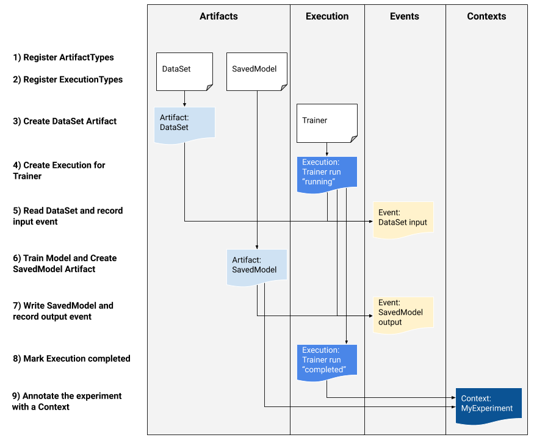

# ML Metadata

[ML Metadata (MLMD)](https://github.com/google/ml-metadata) is a library for
recording and retrieving metadata associated with ML developer and data
scientist workflows. MLMD is an integral part of
[TensorFlow Extended (TFX)](https://www.tensorflow.org/tfx), but is designed so
that it can be used independently.

Every run of a production ML pipeline generates metadata containing information
about the various pipeline components, their executions (e.g. training runs),
and resulting artifacts (e.g. trained models). In the event of unexpected
pipeline behavior or errors, this metadata can be leveraged to analyze the
lineage of pipeline components and debug issues. Think of this metadata as the
equivalent of logging in software development.

MLMD helps you understand and analyze all the interconnected parts of your ML
pipeline instead of analyzing them in isolation and can help you answer
questions about your ML pipeline such as:

*   Which dataset did the model train on?
*   What were the hyperparameters used to train the model?
*   Which pipeline run created the model?
*   Which training run led to this model?
*   Which version of TensorFlow created this model?
*   When was the failed model pushed?

## Metadata store

MLMD registers the following types of metadata in a database called the
**Metadata Store**.

1.  Metadata about the artifacts generated through the components/steps of your
    ML pipelines
1.  Metadata about the executions of these components/steps
1.  Metadata about pipelines and associated lineage information

The Metadata Store provides APIs to record and retrieve metadata to and from the
storage backend. The storage backend is pluggable and can be extended. MLMD
provides reference implementations for SQLite (which supports in-memory and
disk) and MySQL out of the box.

This graphic shows a high-level overview of the various components that are part
of MLMD.


### Metadata storage backends and store connection configuration

The `MetadataStore` object receives a connection configuration that corresponds
to the storage backend used.

*   **Fake Database** provides an in-memory DB (using SQLite) for fast
    experimentation and local runs. The database is deleted when the store
    object is destroyed.

```python
import ml_metadata as mlmd
from ml_metadata.metadata_store import metadata_store
from ml_metadata.proto import metadata_store_pb2

connection_config = metadata_store_pb2.ConnectionConfig()
connection_config.fake_database.SetInParent() # Sets an empty fake database proto.
store = metadata_store.MetadataStore(connection_config)
```

*   **SQLite** reads and writes files from disk.

```python
connection_config = metadata_store_pb2.ConnectionConfig()
connection_config.sqlite.filename_uri = '...'
connection_config.sqlite.connection_mode = 3 # READWRITE_OPENCREATE
store = metadata_store.MetadataStore(connection_config)
```

*   **MySQL** connects to a MySQL server.

```python
connection_config = metadata_store_pb2.ConnectionConfig()
connection_config.mysql.host = '...'
connection_config.mysql.port = '...'
connection_config.mysql.database = '...'
connection_config.mysql.user = '...'
connection_config.mysql.password = '...'
store = metadata_store.MetadataStore(connection_config)
```

Similarly, when using a MySQL instance with Google CloudSQL
([quickstart](https://cloud.google.com/sql/docs/mysql/quickstart),
[connect-overview](https://cloud.google.com/sql/docs/mysql/connect-overview)),
one could also use SSL option if applicable.

```python
connection_config.mysql.ssl_options.key = '...'
connection_config.mysql.ssl_options.cert = '...'
connection_config.mysql.ssl_options.ca = '...'
connection_config.mysql.ssl_options.capath = '...'
connection_config.mysql.ssl_options.cipher = '...'
connection_config.mysql.ssl_options.verify_server_cert = '...'
store = metadata_store.MetadataStore(connection_config)
```

## Data model

The Metadata Store uses the following data model to record and retrieve metadata
from the storage backend.

*   `ArtifactType` describes an artifact's type and its properties that are
    stored in the metadata store. You can register these types on-the-fly with
    the metadata store in code, or you can load them in the store from a
    serialized format. Once you register a type, its definition is available
    throughout the lifetime of the store.
*   An `Artifact` describes a specific instance of an `ArtifactType`, and its
    properties that are written to the metadata store.
*   An `ExecutionType` describes a type of component or step in a workflow, and
    its runtime parameters.
*   An `Execution` is a record of a component run or a step in an ML workflow
    and the runtime parameters. An execution can be thought of as an instance of
    an `ExecutionType`. Executions are recorded when you run an ML pipeline or
    step.
*   An `Event` is a record of the relationship between artifacts and executions.
    When an execution happens, events record every artifact that was used by the
    execution, and every artifact that was produced. These records allow for
    lineage tracking throughout a workflow. By looking at all events, MLMD knows
    what executions happened and what artifacts were created as a result. MLMD
    can then recurse back from any artifact to all of its upstream inputs.
*   A `ContextType` describes a type of conceptual group of artifacts and
    executions in a workflow, and its structural properties. For example:
    projects, pipeline runs, experiments, owners etc.
*   A `Context` is an instance of a `ContextType`. It captures the shared
    information within the group. For example: project name, changelist commit
    id, experiment annotations etc. It has a user-defined unique name within its
    `ContextType`.
*   An `Attribution` is a record of the relationship between artifacts and
    contexts.
*   An `Association` is a record of the relationship between executions and
    contexts.

## MLMD Functionality

Tracking the inputs and outputs of all components/steps in an ML workflow and
their lineage allows ML platforms to enable several important features. The
following list provides a non-exhaustive overview of some of the major benefits.

*   **List all Artifacts of a specific type.** Example: all Models that have
    been trained.
*   **Load two Artifacts of the same type for comparison.** Example: compare
    results from two experiments.
*   **Show a DAG of all related executions and their input and output artifacts
    of a context.** Example: visualize the workflow of an experiment for
    debugging and discovery.
*   **Recurse back through all events to see how an artifact was created.**
    Examples: see what data went into a model; enforce data retention plans.
*   **Identify all artifacts that were created using a given artifact.**
    Examples: see all Models trained from a specific dataset; mark models based
    upon bad data.
*   **Determine if an execution has been run on the same inputs before.**
    Example: determine whether a component/step has already completed the same
    work and the previous output can just be reused.
*   **Record and query context of workflow runs.** Examples: track the owner and
    changelist used for a workflow run; group the lineage by experiments; manage
    artifacts by projects.
*   **Declarative nodes filtering capabilities on properties and 1-hop
    neighborhood nodes.** Examples: look for artifacts of a type and under some
    pipeline context; return typed artifacts where a given property’s value is
    within a range; find previous executions in a context with the same inputs.

See the
[MLMD tutorial](https://www.tensorflow.org/tfx/tutorials/mlmd/mlmd_tutorial) for
an example that shows you how to use the MLMD API and the metadata store to
retrieve lineage information.

### Integrate ML Metadata into your ML Workflows

If you are a platform developer interested in integrating MLMD into your system,
use the example workflow below to use the low-level MLMD APIs to track the
execution of a training task. You can also use higher-level Python APIs in
notebook environments to record experiment metadata.



1) Register artifact types

```python
# Create ArtifactTypes, e.g., Data and Model
data_type = metadata_store_pb2.ArtifactType()
data_type.name = "DataSet"
data_type.properties["day"] = metadata_store_pb2.INT
data_type.properties["split"] = metadata_store_pb2.STRING
data_type_id = store.put_artifact_type(data_type)

model_type = metadata_store_pb2.ArtifactType()
model_type.name = "SavedModel"
model_type.properties["version"] = metadata_store_pb2.INT
model_type.properties["name"] = metadata_store_pb2.STRING
model_type_id = store.put_artifact_type(model_type)

# Query all registered Artifact types.
artifact_types = store.get_artifact_types()
```

2) Register execution types for all steps in the ML workflow

```python
# Create an ExecutionType, e.g., Trainer
trainer_type = metadata_store_pb2.ExecutionType()
trainer_type.name = "Trainer"
trainer_type.properties["state"] = metadata_store_pb2.STRING
trainer_type_id = store.put_execution_type(trainer_type)

# Query a registered Execution type with the returned id
[registered_type] = store.get_execution_types_by_id([trainer_type_id])
```

3) Create an artifact of DataSet ArtifactType

```python
# Create an input artifact of type DataSet
data_artifact = metadata_store_pb2.Artifact()
data_artifact.uri = 'path/to/data'
data_artifact.properties["day"].int_value = 1
data_artifact.properties["split"].string_value = 'train'
data_artifact.type_id = data_type_id
[data_artifact_id] = store.put_artifacts([data_artifact])

# Query all registered Artifacts
artifacts = store.get_artifacts()

# Plus, there are many ways to query the same Artifact
[stored_data_artifact] = store.get_artifacts_by_id([data_artifact_id])
artifacts_with_uri = store.get_artifacts_by_uri(data_artifact.uri)
artifacts_with_conditions = store.get_artifacts(
      list_options=mlmd.ListOptions(
          filter_query='uri LIKE "%/data" AND properties.day.int_value > 0'))
```

4) Create an execution of the Trainer run

```python
# Register the Execution of a Trainer run
trainer_run = metadata_store_pb2.Execution()
trainer_run.type_id = trainer_type_id
trainer_run.properties["state"].string_value = "RUNNING"
[run_id] = store.put_executions([trainer_run])

# Query all registered Execution
executions = store.get_executions_by_id([run_id])
# Similarly, the same execution can be queried with conditions.
executions_with_conditions = store.get_executions(
    list_options = mlmd.ListOptions(
        filter_query='type = "Trainer" AND properties.state.string_value IS NOT NULL'))
```

5) Define the input event and read data

```python
# Define the input event
input_event = metadata_store_pb2.Event()
input_event.artifact_id = data_artifact_id
input_event.execution_id = run_id
input_event.type = metadata_store_pb2.Event.DECLARED_INPUT

# Record the input event in the metadata store
store.put_events([input_event])
```

6) Declare the output artifact

```python
# Declare the output artifact of type SavedModel
model_artifact = metadata_store_pb2.Artifact()
model_artifact.uri = 'path/to/model/file'
model_artifact.properties["version"].int_value = 1
model_artifact.properties["name"].string_value = 'MNIST-v1'
model_artifact.type_id = model_type_id
[model_artifact_id] = store.put_artifacts([model_artifact])
```

7) Record the output event

```python
# Declare the output event
output_event = metadata_store_pb2.Event()
output_event.artifact_id = model_artifact_id
output_event.execution_id = run_id
output_event.type = metadata_store_pb2.Event.DECLARED_OUTPUT

# Submit output event to the Metadata Store
store.put_events([output_event])
```

8) Mark the execution as completed

```python
trainer_run.id = run_id
trainer_run.properties["state"].string_value = "COMPLETED"
store.put_executions([trainer_run])
```

9) Group artifacts and executions under a context using attributions and
assertions artifacts

```python
# Create a ContextType, e.g., Experiment with a note property
experiment_type = metadata_store_pb2.ContextType()
experiment_type.name = "Experiment"
experiment_type.properties["note"] = metadata_store_pb2.STRING
experiment_type_id = store.put_context_type(experiment_type)

# Group the model and the trainer run to an experiment.
my_experiment = metadata_store_pb2.Context()
my_experiment.type_id = experiment_type_id
# Give the experiment a name
my_experiment.name = "exp1"
my_experiment.properties["note"].string_value = "My first experiment."
[experiment_id] = store.put_contexts([my_experiment])

attribution = metadata_store_pb2.Attribution()
attribution.artifact_id = model_artifact_id
attribution.context_id = experiment_id

association = metadata_store_pb2.Association()
association.execution_id = run_id
association.context_id = experiment_id

store.put_attributions_and_associations([attribution], [association])

# Query the Artifacts and Executions that are linked to the Context.
experiment_artifacts = store.get_artifacts_by_context(experiment_id)
experiment_executions = store.get_executions_by_context(experiment_id)

# You can also use neighborhood queries to fetch these artifacts and executions
# with conditions.
experiment_artifacts_with_conditions = store.get_artifacts(
    list_options = mlmd.ListOptions(
        filter_query=('contexts_a.type = "Experiment" AND contexts_a.name = "exp1"')))
experiment_executions_with_conditions = store.get_executions(
    list_options = mlmd.ListOptions(
        filter_query=('contexts_a.id = {}'.format(experiment_id))))
```

## Use MLMD with a remote gRPC server

You can use MLMD with remote gRPC servers as shown below:

*   Start a server

```bash
bazel run -c opt --define grpc_no_ares=true  //ml_metadata/metadata_store:metadata_store_server
```

By default, the server uses a fake in-memory db per request and does not persist
the metadata across calls. It can also be configured with a MLMD
`MetadataStoreServerConfig` to use SQLite files or MySQL instances. The config
can be stored in a text protobuf file and passed to the binary with
`--metadata_store_server_config_file=path_to_the_config_file`.

An example `MetadataStoreServerConfig` file in text protobuf format:

```textpb
connection_config {
  sqlite {
    filename_uri: '/tmp/test_db'
    connection_mode: READWRITE_OPENCREATE
  }
}
```

*   Create the client stub and use it in Python

```python
from grpc import insecure_channel
from ml_metadata.proto import metadata_store_pb2
from ml_metadata.proto import metadata_store_service_pb2
from ml_metadata.proto import metadata_store_service_pb2_grpc

channel = insecure_channel('localhost:8080')
stub = metadata_store_service_pb2_grpc.MetadataStoreServiceStub(channel)
```

*   Use MLMD with RPC calls

```python
# Create ArtifactTypes, e.g., Data and Model
data_type = metadata_store_pb2.ArtifactType()
data_type.name = "DataSet"
data_type.properties["day"] = metadata_store_pb2.INT
data_type.properties["split"] = metadata_store_pb2.STRING

request = metadata_store_service_pb2.PutArtifactTypeRequest()
request.all_fields_match = True
request.artifact_type.CopyFrom(data_type)
stub.PutArtifactType(request)

model_type = metadata_store_pb2.ArtifactType()
model_type.name = "SavedModel"
model_type.properties["version"] = metadata_store_pb2.INT
model_type.properties["name"] = metadata_store_pb2.STRING

request.artifact_type.CopyFrom(model_type)
stub.PutArtifactType(request)
```

## Resources

The MLMD library has a high-level API that you can readily use with your ML
pipelines. See the
[MLMD API documentation](https://www.tensorflow.org/tfx/ml_metadata/api_docs/python/mlmd)
for more details.

Check out
[MLMD Declarative Nodes Filtering](https://github.com/google/ml-metadata/blob/v1.2.0/ml_metadata/proto/metadata_store.proto#L708-L786)
to learn how to use MLMD declarative nodes filtering capabilities on properties
and 1-hop neighborhood nodes.

Also check out the
[MLMD tutorial](https://www.tensorflow.org/tfx/tutorials/mlmd/mlmd_tutorial) to
learn how to use MLMD to trace the lineage of your pipeline components.

MLMD provides utilities to handle schema and data migrations across releases.
See the MLMD
[Guide](https://github.com/google/ml-metadata/blob/master/g3doc/get_started.md#upgrade-the-mlmd-library)
for more details.
