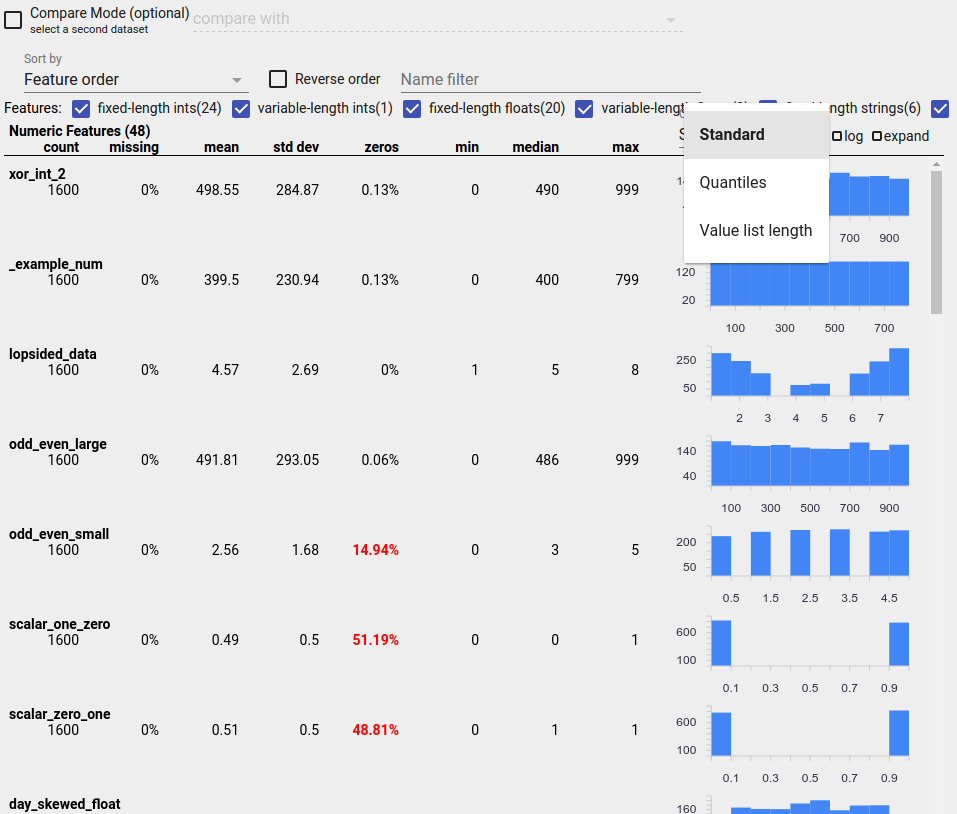
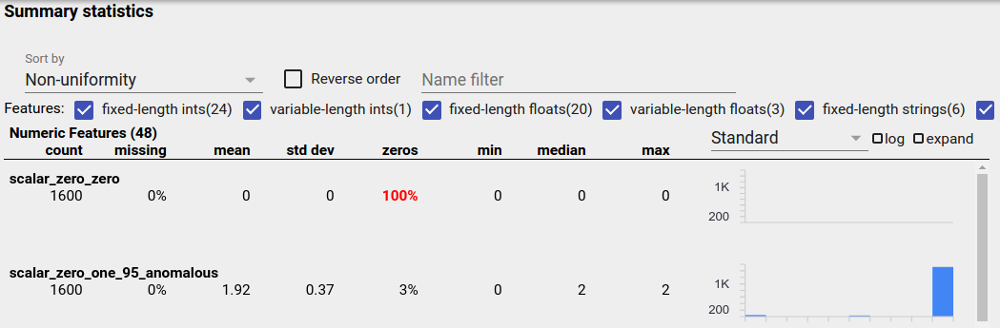
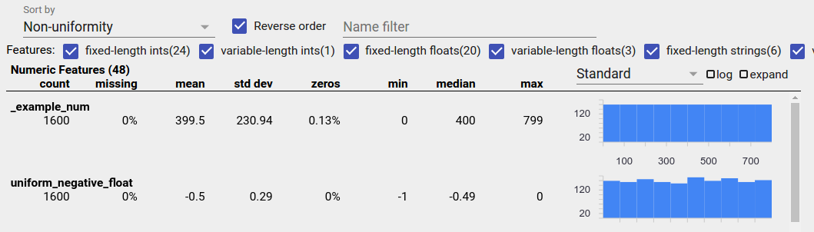
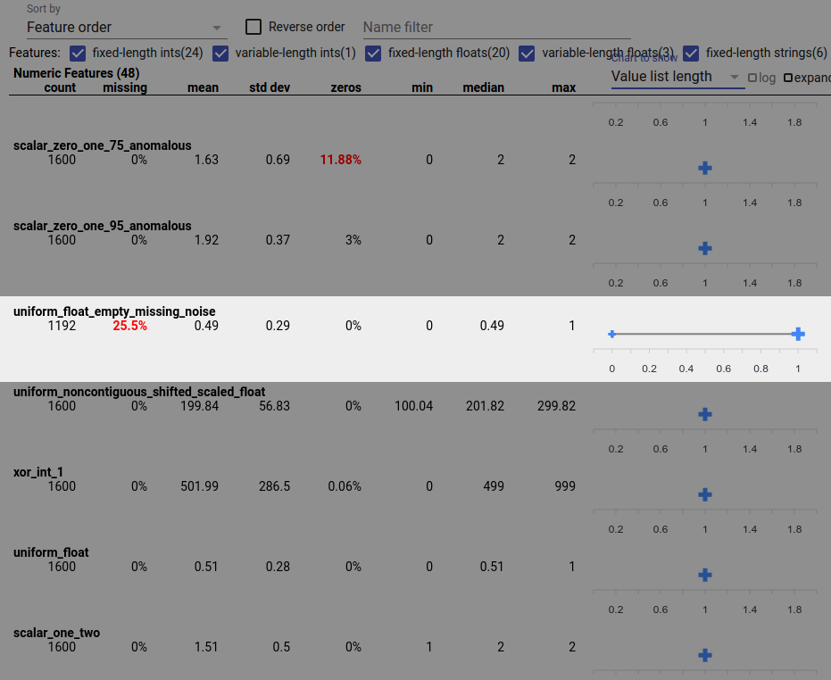

# TensorFlow Data Validation: Checking and analyzing your data

Once your data is in a TFX pipeline, you can use TFX components to analyze
and transform it. You can use these tools even before you train a model.

There are many reasons to analyze and transform your data:

*   To find problems in your data. Common problems include:
    *   Missing data, such as features with empty values.
    *   Labels treated as features, so that your model gets to peek at the right
        answer during training.
    *   Features with values outside the range you expect.
    *   Data anomalies.
    *   Transfer learned model has preprocessing that does not match the
        training data.
*   To engineer more effective feature sets. For example, you can identify:
    *   Especially informative features.
    *   Redundant features.
    *   Features that vary so widely in scale that they may slow learning.
    *   Features with little or no unique predictive information.

TFX tools can both help find data bugs, and help with feature engineering.

## TensorFlow Data Validation

*   [Overview](#overview)
*   [Schema Based Example Validation](#schema_based_example_validation)
*   [Training-Serving Skew Detection](#skewdetect)
*   [Drift Detection](#drift_detection)

### Overview

TensorFlow Data Validation identifies anomalies in training and serving data,
and can automatically create a schema by examining the data. The component can
be configured to detect different classes of anomalies in the data. It can

1.  Perform validity checks by comparing data statistics against a schema that
    codifies expectations of the user.
1.  Detect training-serving skew by comparing examples in training and serving
    data.
1.  Detect data drift by looking at a series of data.

We document each of these functionalities independently:

*   [Schema Based Example Validation](#schema_based_example_validation)
*   [Training-Serving Skew Detection](#skewdetect)
*   [Drift Detection](#drift_detection)

### Schema Based Example Validation

TensorFlow Data Validation identifies any anomalies in the input data by
comparing data statistics against a schema. The schema codifies properties
which the input data is expected to satisfy, such as data types or categorical
values, and can be modified or replaced by the user.

Tensorflow Data Validation is typically invoked multiple times within the
context of the TFX pipeline: (i) for every split obtained from ExampleGen,
(ii) for all pre-transformed data used by Transform and (iii) for all
post-transform data generated by Transform. When invoked in the context of
Transform (ii-iii), statistics options and schema-based constraints can be set
by defining the [`stats_options_updater_fn`](tft.md). This is particilarly
useful when validating unstructured data (e.g. text features). See the
[user code](
https://github.com/tensorflow/tfx/blob/master/tfx/examples/bert/mrpc/bert_mrpc_utils.py)
for an example.

#### Advanced Schema Features

This section covers more advanced schema configuration that can help with
special setups.

##### Sparse Features

Encoding sparse features in Examples usually introduces multiple Features that
are expected to have the same valency for all Examples. For example the sparse
feature:
<pre><code>
WeightedCategories = [('CategoryA', 0.3), ('CategoryX', 0.7)]
</code></pre>
would be encoded using separate Features for index and value:
<pre><code>
WeightedCategoriesIndex = ['CategoryA', 'CategoryX']
WeightedCategoriesValue = [0.3, 0.7]
</code></pre>
with the restriction that the valency of the index and value feature should
match for all Examples. This restriction can be made explicit in the schema by
defining a sparse_feature:
<pre><code class="lang-proto">
sparse_feature {
  name: 'WeightedCategories'
  index_feature { name: 'WeightedCategoriesIndex' }
  value_feature { name: 'WeightedCategoriesValue' }
}
</code></pre>

The sparse feature definition requires one or more index and one value feature
which refer to features that exist in the schema. Explicitly defining
sparse features enables TFDV to check that the valencies of all referred
features match.

Some use cases introduce similar valency restrictions between Features, but do
not necessarily encode a sparse feature. Using sparse feature should unblock
you, but is not ideal.

##### Schema Environments

By default validations assume that all Examples in a pipeline adhere to a single
schema. In some cases introducing slight schema variations is necessary, for
instance features used as labels are required during training (and should be
validated), but are missing during serving. Environments can be used to express
such requirements, in particular `default_environment()`, `in_environment()`,
`not_in_environment()`.

For example, assume a feature named 'LABEL' is required for training, but is
expected to be missing from serving. This can be expressed by:

*   Define two distinct environments in the schema: ["SERVING", "TRAINING"] and
    associate 'LABEL' only with environment "TRAINING".
*   Associate the training data with environment "TRAINING" and the
    serving data with environment "SERVING".

##### Schema Generation

The input data schema is specified as an instance of the TensorFlow
[Schema](https://github.com/tensorflow/metadata/blob/master/tensorflow_metadata/proto/v0/schema.proto).

Instead of constructing a schema manually from scratch, a developer can rely on
TensorFlow Data Validation's automatic schema construction. Specifically,
TensorFlow Data Validation automatically constructs an initial schema based on
statistics computed over training data available in the pipeline. Users can
simply review this autogenerated schema, modify it as needed, check it into a
version control system, and push it explicitly into the pipeline for further
validation.

TFDV includes `infer_schema()` to generate a schema automatically.  For example:

```python
schema = tfdv.infer_schema(statistics=train_stats)
tfdv.display_schema(schema=schema)
```

This triggers an automatic schema generation based on the following rules:

*   If a schema has already been auto-generated then it is used as is.

*   Otherwise, TensorFlow Data Validation examines the available data statistics
and computes a suitable schema for the data.

_Note: The auto-generated schema is best-effort and only tries to infer basic
properties of the data. It is expected that users review and modify it as
needed._

### Training-Serving Skew Detection<a name="skewdetect"></a>

#### Overview

TensorFlow Data Validation can detect distribution skew between training and
serving data. Distribution skew occurs when the distribution of feature values
for training data is significantly different from serving data. One of the key
causes for distribution skew is using either a completely different corpus for
training data generation to overcome lack of initial data in the desired corpus.
Another reason is a faulty sampling mechanism that only chooses a subsample of
the serving data to train on.

##### Example Scenario

Note: For instance, in order to compensate for an underrepresented slice of
data, if a biased sampling is used without upweighting the downsampled examples
appropriately, the distribution of feature values between training and
serving data gets artificially skewed.

See the [TensorFlow Data Validation Get Started Guide](https://www.tensorflow.org/tfx/data_validation/get_started#checking_data_skew_and_drift)
for information about configuring training-serving skew detection.

### Drift Detection

Drift detection is supported between consecutive
spans of data (i.e., between span N and span N+1), such as between different
days of training data. We express drift in terms of
[L-infinity distance](https://en.wikipedia.org/wiki/Chebyshev_distance) for
categorical features and approximate
[Jensen-Shannon divergence](https://en.wikipedia.org/wiki/Jensen%E2%80%93Shannon_divergence)
for numeric features. You can set the threshold distance so that you receive
warnings when the drift is higher than is acceptable. Setting the correct
distance is typically an iterative process requiring domain knowledge and
experimentation.

See the
[TensorFlow Data Validation Get Started Guide](https://www.tensorflow.org/tfx/data_validation/get_started#checking_data_skew_and_drift)
for information about configuring drift detection.

## Using Visualizations to Check Your Data

TensorFlow Data Validation provides tools for visualizing the distribution of
feature values. By examining these distributions in a Jupyter notebook using
[Facets](https://pair-code.github.io/facets/)
you can catch common problems with data.



### Identifying Suspicious Distributions

You can identify common bugs in your data by using a Facets Overview
display to look for suspicious distributions of feature values.

#### Unbalanced Data

An unbalanced feature is a feature for which one value predominates. Unbalanced
features can occur naturally, but if a feature always has the same value you may
have a data bug. To detect unbalanced features in a Facets Overview, choose
"Non-uniformity" from the "Sort by" dropdown.

The most unbalanced features will be listed at the top of each feature-type
list. For example, the following screenshot shows one feature that is all zeros,
and a second that is highly unbalanced, at the top of the "Numeric Features"
list:



#### Uniformly Distributed Data

A uniformly distributed feature is one for which all possible values appear with
close to the same frequency. As with unbalanced data, this distribution can
occur naturally, but can also be produced by data bugs.

To detect uniformly distributed features in a Facets Overview, choose "Non-
uniformity" from the "Sort by" dropdown and check the "Reverse order" checkbox:



String data is represented using bar charts if there are 20 or fewer unique
values, and as a cumulative distribution graph if there are more than 20 unique
values. So for string data, uniform distributions can appear as either flat bar
graphs like the one above or straight lines like the one below:


##### Bugs That Can Produce Uniformly Distributed Data

Here are some common bugs that can produce uniformly distributed data:

*   Using strings to represent non-string data types such as dates. For example,
    you will have many unique values for a datetime feature with representations
    like "2017-03-01-11-45-03". Unique values will be distributed uniformly.

*   Including indices like "row number" as features. Here again you have many
    unique values.

#### Missing Data

To check whether a feature is missing values entirely:

1.  Choose "Amount missing/zero" from the "Sort by" drop-down.
2.  Check the "Reverse order" checkbox.
3.  Look at the "missing" column to see the percentage of instances with missing
    values for a feature.

A data bug can also cause incomplete feature values. For example you may expect
a feature's value list to always have three elements and discover that sometimes
it only has one. To check for incomplete values or other cases where feature
value lists don't have the expected number of elements:

1.  Choose "Value list length" from the "Chart to show" drop-down menu on the
    right.

2.  Look at the chart to the right of each feature row. The chart shows the
    range of value list lengths for the feature. For example, the highlighted
    row in the screenshot below shows a feature that has some zero-length value
    lists:



#### Large Differences in Scale Between Features

If your features vary widely in scale, then the model may have difficulties
learning. For example, if some features vary from 0 to 1 and others vary from 0
to 1,000,000,000, you have a big difference in scale. Compare the "max" and
"min" columns across features to find widely varying scales.

Consider normalizing feature values to reduce these wide variations.

#### Labels with Invalid Labels

TensorFlow's Estimators have restrictions on the type of data they accept as
labels. For example, binary classifiers typically only work with {0, 1} labels.

Review the label values in the Facets Overview and make sure they conform to the
[requirements of Estimators](https://github.com/tensorflow/docs/blob/master/site/en/r1/guide/feature_columns.md).
