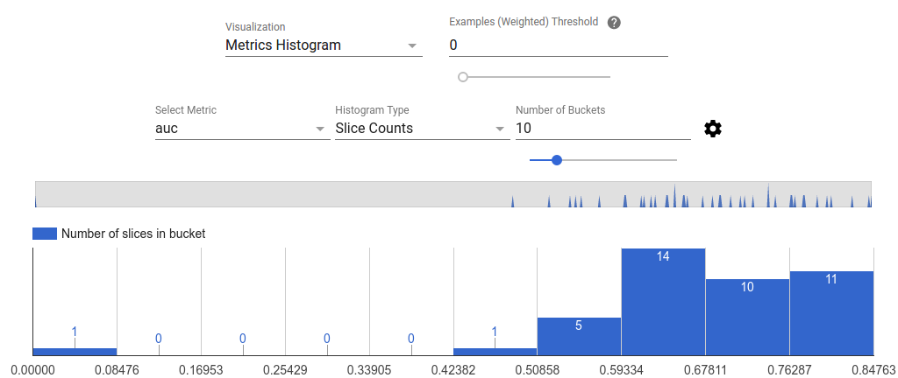

# Improving Model Quality With TensorFlow Model Analysis

## Introduction

As you tweak your model during development, you need to check whether your
changes are improving your model. Just checking accuracy may not be enough. For
example, if you have a classifier for a problem in which 95% of your instances
are positive, you may be able to improve accuracy by simply always predicting
positive, but you won't have a very robust classifier.

## Overview

The goal of TensorFlow Model Analysis is to provide a mechanism for model
evaluation in TFX. TensorFlow Model Analysis allows you to perform model
evaluations in the TFX pipeline, and view resultant metrics and plots in a
Jupyter notebook. Specifically, it can provide:

*   metrics computed on entire training and holdout dataset, as well as next-day
    evaluations
*   tracking metrics over time
*   model quality performance on different feature slices

## Exporting the EvalSavedModel from your model

In order to setup TensorFlow Model Analysis in a TFX pipeline, an EvalSavedModel
needs to be exported during training, which is a special SavedModel containing
annotations for the metrics, features, labels, and so on in your model.
TensorFlow Model Analysis uses this EvalSavedModel to compute metrics.

As part of this, you will have to provide a special `eval_input_receiver_fn`,
analogous to the `serving_input_receiver_fn`, which will extract the features
and labels from the input data. As with `serving_input_receiver_fn`, we have
utility functions to help you with this. In most cases, you will have to add
less than 20 lines of code.

## Visualization in a Jupyter notebook

The evaluation results are visualized in a Jupyter notebook.

### Evaluations tab

The UI is composed of three parts:

*   Metrics Selector

    By default, all computed metrics are displayed and the columns are sorted
    alphabetically. Metrics selector allows the user to add / remove / reorder
    metrics. Simply check / uncheck metrics from the dropdown (hold Ctrl for
    multi-select) or type / re-arrange them directly in the input box.

    

*   Time Series Graphs

    Time series graphs make it easy to spot trends of a specific metric over
    data spans or model runs. To render the graph for the interested metric,
    simply click on it from the dropdown list. To dismiss a graph, click on the
    X on the upper right corner.

    

    Hover over any data point in the graph shows a tooltip indicating model run,
    data span, and metric value.

*   Metrics Table

    The metric table summarizes results for all metrics chosen in metrics
    selector. It can be sorted by clicking on the metric name.

### Slicing Metrics tab

The slicing metrics tab shows how different slices of a particular evaluation
run perform. Please choose the desired configuration (eval, feature, etc) and
click refresh.

The URL is updated upon refresh and contains a deep link that encodes the chosen
configuration. It can be shared.

The UI is composed of three parts:

*    Metrics Selector

     See above.

*    Metric Visualization

     Metric visualization aims to provide intuition about slices in the feature
     chosen. A quick filtering is available to filter out slices with small
     weighted sample count.

     

     Two type of visualizations are supported:
     1. Slice overview

     In this view, value for the chosen metric is rendered for each slice and
     the slices can be sorted by the slice name or the value of another metric.

     

     When the number of slices are small, this is the default view.

     2. Metrics Histogram

     In this view, slices are broken down into buckets based on their metric
     values. The value(s) displayed in each bucket can be the number of slices
     in the bucket or the total weighted sample count for all slices in the
     bucket or both.

     

     The number of buckets can be changed and logarithmic scale can be applied
     in the settings menu by clicking on the gear icon.

     

     It is also possible to filter out outliers in the histogram view. Simply
     drag the desired range in the histogram as shown in the screenshot below.

     

     When the number of slices are large, this is the default view.

*    Metrics Table

     Only slices not filtered out will be rendered. It can be sorted by clicking
     on a column header.
