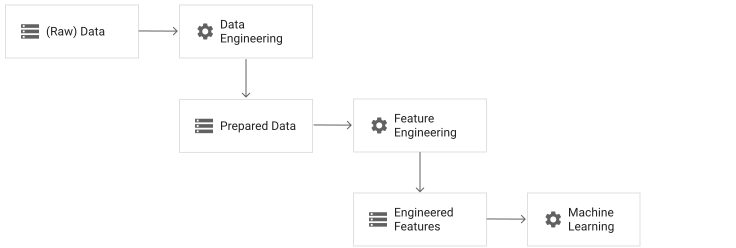
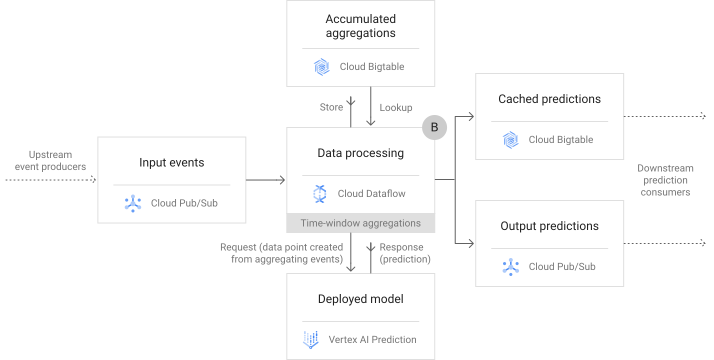
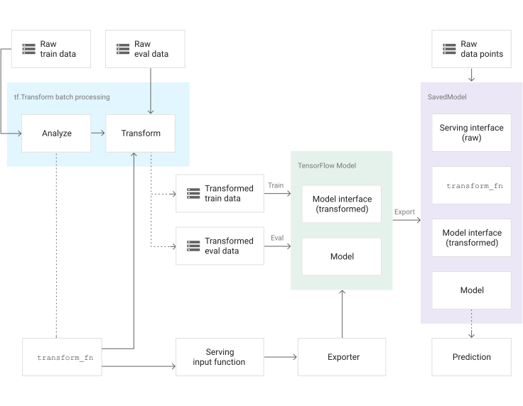

<devsite-mathjax config="TeX-AMS-MML_SVG"></devsite-mathjax>

# Data preprocessing for ML: options and recommendations

This document is the first in a two-part series that explores the topic of data
engineering and feature engineering for machine learning (ML), with a focus on
supervised learning tasks. This first part discusses the best practices for
preprocessing data in an ML pipeline on Google Cloud. The document focuses on
using TensorFlow and the open source
[TensorFlow Transform](https://github.com/tensorflow/transform){: target="github" class="external" track-type="solution" track-name="gitHubLink" track-metadata-position="body" }
(`tf.Transform`) library to prepare data, train the model, and serve the model
for prediction. This document highlights the challenges of preprocessing data
for ML, and it describes the options and scenarios for performing data
transformation on Google Cloud effectively.

This document assumes that you're familiar with
[BigQuery](https://cloud.google.com/bigquery/docs){: .external },
[Dataflow](https://cloud.google.com/dataflow/docs){: .external },
[Vertex AI](https://cloud.google.com/vertex-ai/docs/start/introduction-unified-platform){: .external },
and the TensorFlow
[Keras](https://www.tensorflow.org/guide/keras/overview) API.

The second document,
[Data preprocessing for ML with Google Cloud](../../tutorials/transform/data_preprocessing_with_cloud),
provides a step-by-step tutorial for how to implement a `tf.Transform` pipeline.

## Introduction

ML helps you automatically find complex and potentially useful patterns in
data. These patterns are condensed in an ML model that can then be used on new
data points—a process called *making predictions* or *performing inference*.

Building an ML model is a multistep process. Each step presents its own
technical and conceptual challenges. This two-part series focuses on supervised
learning tasks and  the process of selecting, transforming, and augmenting the
source data to create powerful predictive signals to the target variable. These
operations combine domain knowledge with data science techniques. The operations
are the essence of
[feature engineering](https://developers.google.com/machine-learning/glossary/#feature_engineering){: .external }.

The size of training datasets for real-world ML models can easily be equal to or
greater than one terabyte (TB). Therefore, you need large-scale data processing
frameworks in order to process these datasets efficiently and distributedly.
When you use an ML model to make predictions, you have to apply the same
transformations that you used for the training data on the new data points. By
applying the same transformations, you present the live dataset to the ML model
the way that the model expects.

This document discusses these challenges for different levels of granularity of
feature engineering operations: instance-level, full-pass, and time-window
aggregations. This document also describes the options and scenarios to perform
data transformation for ML on Google Cloud.

This document also provides an overview of
[TensorFlow Transform](https://github.com/tensorflow/transform){: .external }
(`tf.Transform`), a library for TensorFlow that lets you define
both instance-level and full-pass data transformation through data preprocessing
pipelines. These pipelines are executed with
[Apache Beam](https://beam.apache.org/){: .external },
and they create artifacts that let you apply the same transformations during
prediction as when the model is served.

## Preprocessing data for ML

This section introduces data preprocessing operations and stages of data
readiness. It also discusses the types of the preprocessing operations and their
granularity.

### Data engineering compared to feature engineering

Preprocessing the data for ML involves both data engineering and feature
engineering. Data engineering is the process of converting *raw data* into
*prepared data*. Feature engineering then tunes the prepared data to create the
features that are expected by the ML model. These terms have the following
meanings:

**Raw data** (or just **data**)
:  The data in its source form, without
  any prior preparation for ML. In this context, the data might be in its raw
  form (in a data lake) or in a transformed form (in a data warehouse).
  Transformed data that's in a data warehouse might have been converted from
  its original raw form to be used for analytics. However, in this context,
  *raw data* means that the data hasn't been prepared specifically for your
  ML task. Data is also considered raw data if it's sent from streaming
  systems that eventually call ML models for predictions.

**Prepared data**
:   The dataset in the form ready for your ML task: data sources have been
    parsed, joined, and put into a
    tabular form. Prepared data is aggregated and summarized to the right
    granularity—for example, each row in the dataset represents a unique
    customer, and each column represents summary information for the customer,
    like the total spent in the last six weeks. In a prepared data table,
    irrelevant columns have been dropped, and invalid records have been
    filtered out. For supervised learning tasks, the target feature is present.

**Engineered features**
:   The dataset with the tuned features that are expected by the model—that is,
    features that are created by performing certain ML-specific operations on
    the columns in the prepared dataset, and creating new features for your
    model during training and prediction, as described later in
    [Preprocessing operations](#preprocessing-operations).
    Examples of these operations include scaling numerical columns to a value
    between 0 and 1, clipping values, and
    [one-hot-encoding](https://developers.google.com/machine-learning/glossary/#one-hot_encoding){: .external }
    categorical features.

The following diagram, figure 1, shows the steps that are involved in preparing
preprocessed data:

Figure: The flow of data from raw data to prepared data to engineered features to machine learning. {data-flow-raw-prepared-engineered-features}

In practice, data from the same source is often at different stages of
readiness. For example, a field from a table in your data warehouse might be
used directly as an engineered feature. At the same time, another field in the
same table might need to go through transformations before it becomes an
engineered feature. Similarly, data engineering and feature engineering
operations might be combined in the same data preprocessing step.

### Preprocessing operations

Data preprocessing includes several operations. Each operation is designed to
help ML build better predictive models. The details of these preprocessing
operations are outside the scope of this document, but some operations are
briefly described in this section.

For structured data, data preprocessing operations include the following:

-   **Data cleansing:** removing or correcting records that have corrupted
    or invalid values from raw data, and removing records that are missing a
    large number of columns.
-   **Instances selection and partitioning:** selecting data points from the
    input dataset to create
    [training, evaluation (validation), and test sets](https://en.wikipedia.org/wiki/Training,_validation,_and_test_data_sets){: .external }.
    This process includes techniques for repeatable random sampling, minority
    classes oversampling, and stratified partitioning.
-   **Feature tuning:** improving the quality of a feature for ML, which
    includes scaling and normalizing numeric values, imputing missing values,
    clipping outliers, and adjusting values that have skewed distributions.
-   **Feature transformation:** converting a numeric feature to a
    categorical feature (through
    [bucketization](https://developers.google.com/machine-learning/glossary/#bucketing){: .external }),
    and converting categorical features to a numeric representation (through
    one-hot encoding,
    [learning with counts](https://dl.acm.org/doi/10.1145/3326937.3341260){: .external },
    sparse feature embeddings, etc.). Some models work only with numeric or
    categorical features, while others can handle mixed type features. Even
    when models handle both types, they can benefit from different
    representations (numeric and categorical) of the same feature.
-   **Feature extraction:** reducing the number of features by creating
    lower-dimension, more powerful data representations using techniques such
    as
    [PCA](https://en.wikipedia.org/wiki/Principal_component_analysis){: .external },
    [embedding](https://developers.google.com/machine-learning/crash-course/embeddings){: .external }
    extraction, and
    [hashing](https://medium.com/value-stream-design/introducing-one-of-the-best-hacks-in-machine-learning-the-hashing-trick-bf6a9c8af18f){: .external }.
-   **Feature selection:** selecting a subset of the input features for
    training the model, and ignoring the irrelevant or redundant ones, using
    [filter or wrapper methods](https://en.wikipedia.org/wiki/Feature_selection){: .external }.
    Feature selection can also involve simply dropping features if the features
    are missing a large number of values.
-   **Feature construction:** creating new features by using typical
    techniques, such as
    [polynomial expansion](https://en.wikipedia.org/wiki/Polynomial_expansion){: .external }
    (by using univariate mathematical functions) or
    [feature crossing](https://developers.google.com/machine-learning/glossary/#feature_cross){: .external }
    (to capture feature interactions). Features can also be constructed by
    using business logic from the domain of the ML use case.

When you work with unstructured data (for example, images, audio, or text
documents), deep learning replaces domain-knowledge-based feature engineering by
folding it into the model architecture. A
[convolutional layer](https://developers.google.com/machine-learning/glossary/#convolutional_layer){: .external }
is an automatic feature preprocessor. Constructing the right model architecture
requires some empirical knowledge of the data. In addition, some amount of
preprocessing is needed, such as the following:

-   For text documents:
    [stemming and lemmatization](https://nlp.stanford.edu/IR-book/html/htmledition/stemming-and-lemmatization-1.html){: .external },
    [TF-IDF](https://en.wikipedia.org/wiki/Tf%e2%80%93idf){: .external }
    calculation, and
    [n-gram](https://en.wikipedia.org/wiki/N-gram){: .external }
    extraction, embedding lookup.
-   For images: clipping, resizing, cropping, Gaussian blur, and canary filters.
-   For all types of data (including text and images):
    [transfer learning](https://developers.google.com/machine-learning/glossary/#transfer_learning){: .external },
    which treats all-but-last layers of the fully trained model as a feature
    engineering step.

### Preprocessing granularity

This section discusses the granularity of types of data transformations. It
shows why this perspective is critical when preparing new data points for
predictions using transformations that are applied on training data.

Preprocessing and transformation operations can be categorized as follows, based
on operation granularity:

-   **Instance-level transformations during training and prediction**.
    These are straightforward transformations, where only values from the same
    instance are needed for the transformation. For example, instance-level
    transformations might include clipping the value of a feature to some
    threshold, polynomially expanding another feature, multiplying two
    features, or comparing two features to create a Boolean flag.

    These transformations must be applied identically during training and
    prediction, because the model will be trained on the transformed features,
    not on the raw input values. If the data isn't transformed identically,
    then the model behaves poorly because it is presented with data that has a
    distribution of values that it wasn't trained with. For more information,
    see the discussion of training-serving skew in the
    [Preprocessing challenges](#preprocessing-challenges)
    section.
-   **Full-pass transformations during training, but instance-level
    transformations during prediction**. In this scenario, transformations are
    stateful, because they use some precomputed statistics to perform the
    transformation. During training, you analyze the whole body of training
    data to compute quantities such as minimum, maximum, mean, and variance for
    transforming training data, evaluation data, and new data at prediction time.

    For example, to normalize a numeric feature for training, you compute
    its mean (μ) and its standard deviation (σ) across the whole of the
    training data. This computation is called a *full-pass* (or *analyze*)
    operation. When you serve the model for prediction, the value of a new data
    point is normalized to avoid training-serving skew. Therefore, μ and σ
    values that are computed during training are used to adjust the feature
    value, which is the following simple *instance-level* operation:

    \[ value_{\text{scaled}} = \frac{value_{\text{raw}} - \mu}{\sigma} \]

    Full-pass transformations include the following:

    -   MinMax scaling numerical features using *min* and *max*
        computed from the training dataset.
    -   Standard scaling (z-score normalization) numerical features
        using μ and σ computed on the training dataset.
    -   Bucketizing numerical features using quantiles.
    -   Imputing missing values using the median (numerical features) or
        the mode (categorical features).
    -   Converting strings (nominal values) to integers (indexes) by
        extracting all the distinct values (vocabulary) of an input categorical
        feature.
    -   Counting the occurrence of a term (feature value) in all the
        documents (instances) to calculate for TF-IDF.
    -   Computing the PCA of the input features to project the data into
        a lower dimensional space (with linearly dependent features).

    You should use only the training data to compute statistics like μ, σ,
    *min*, and *max*. If you add the test and evaluation data for these
    operations, you are
    [leaking information](https://towardsdatascience.com/data-leakage-in-machine-learning-10bdd3eec742){: .external }
    from the evaluation and test data to train the model. Doing so affects the
    reliability of the test and evaluation results. To ensure that you apply a
    consistent transformation to all datasets, you use the same statistics
    computed from the training data to transform the test and evaluation data.

-   **Historical aggregations during training and prediction**. This
    involves creating business aggregations, derivations, and flags as input
    signals to the prediction task—for example, creating
    [recency, frequency, and monetary (RFM)](https://en.wikipedia.org/wiki/RFM_(market_research)){: .external }
    metrics for customers to build propensity models. These types of features
    can be precomputed and stored in a feature store to be used during model
    training, batch scoring, and online prediction serving. You can also
    perform additional feature engineering (for example, transformation and
    tuning) to these aggregations before training and prediction.
-   **Historical aggregations during training, but real-time aggregations
    during prediction**. This approach involves creating a feature by
    summarizing real-time values over time. In this approach, the instances to
    be aggregated are defined through temporal window clauses. For example, you
    can use this approach if you want to train a model that estimates the taxi
    trip time based on the traffic metrics for the route in the last 5 minutes,
    in the last 10 minutes, in the last 30 minutes, and at other intervals. You
    can also use this approach to predict the failure of an engine part based
    on the moving average of temperature and vibration values computed over the
    last 3 minutes. Although these aggregations can be prepared offline for
    training, they are computed in real time from a data stream during serving.

    More precisely, when you prepare training data, if the aggregated value
    isn't in the raw data, the value is created during the data engineering
    phase. The raw data is usually stored in a database with a format of
    `(entity, timestamp, value)`. In the previous examples, `entity` is the
    route segment identifier for the taxi routes and the engine part identifier
    for the engine failure. You can use windowing operations to compute
    `(entity, time_index, aggregated_value_over_time_window)` and use
    the aggregation features as an input for your model training.

    When the model for real-time (online) prediction is served, the model
    expects features derived from the aggregated values as an input. Therefore,
    you can use a stream-processing technology like Apache Beam to compute the
    aggregations from the real-time data points streamed into your system.
    Stream-processing technology aggregates real-time data based on time windows
    as new data points arrive. You can also perform additional feature
    engineering (for example, transformation and tuning) to these aggregations
    before training and prediction.

## ML pipeline on Google Cloud

This section discusses the core components of a typical end-to-end pipeline to
train and serve TensorFlow ML models on Google Cloud using
managed services. It also discusses where you can implement different categories
of the data preprocessing operations, and common challenges that you might face
when you implement such transformations. The
[How tf.Transform works](#how-tftransform-works)
section shows how the TensorFlow Transform library helps to
address these challenges.

### High-level architecture

The following diagram, figure 2, shows a high-level architecture of a typical
ML pipeline for training and serving TensorFlow models. The
labels A, B, and C in the diagram refer to the different places in the pipeline
where data preprocessing can take place. Details about these steps are provided
in the following section.

Figure: High-level architecture for ML training and serving on Google Cloud. {#high-level-architecture-for-training-and-serving}

The pipeline consists of the following steps:

1.  After raw data is imported, tabular data is stored in BigQuery, and other
    data like images, audio, and video, is stored in Cloud Storage. The second
    part of this series uses tabular data stored in BigQuery as an example.
1.  Data engineering (preparation) and feature engineering are executed at scale
    using Dataflow. This execution produces ML-ready training, evaluation, and
    test sets that are stored in Cloud Storage. Ideally, these datasets are
    stored as
    [TFRecord](https://www.tensorflow.org/tutorials/load_data/tfrecord) files,
    which is the optimized format for TensorFlow computations.
1.  A TensorFlow model
    [trainer package](https://cloud.google.com/vertex-ai/docs/training/create-python-pre-built-container){: .external }
    is submitted to Vertex AI Training, which uses the preprocessed data from
    the previous steps to train the model. The output of this step is a trained
    TensorFlow [SavedModel](https://www.tensorflow.org/guide/saved_model) that
    is exported to Cloud Storage.
1.  The trained TensorFlow model is deployed to Vertex AI Prediction as a
    service that has a REST API so that it can be used for online predictions.
    The same model can also be used for batch prediction jobs.
1.  After the model is deployed as a REST API, client apps and internal systems
    can invoke the API by sending requests with some data points, and receiving
    responses from the model with predictions.
1.  For orchestrating and automating this pipeline, you can use
    [Vertex AI Pipelines](https://cloud.google.com/vertex-ai/docs/pipelines/introduction){: .external }
    as a scheduler to invoke the data preparation, model training, and model
    deployment steps.

You can also use
[Vertex AI Feature Store](https://cloud.google.com/vertex-ai/docs/featurestore/){: .external }
to store input features to make predictions. For example, you can periodically
create engineered features from the latest raw data and store them in Vertex AI
Feature Store. Client apps fetch the required input features from Vertex AI
Feature Store and send them to the model to receive predictions.

### Where to do preprocessing

In figure 2, the labels A, B, and C show that data preprocessing operations can
take place in BigQuery, Dataflow, or
TensorFlow. The following sections describe how each of these
options work.

#### Option A: BigQuery

Typically, logic is implemented in BigQuery for the following
operations:

-   Sampling: randomly selecting a subset from the data.
-   Filtering: removing irrelevant or invalid instances.
-   Partitioning: splitting the data to produce training, evaluation, and
    test sets.

BigQuery SQL scripts can be used as a source query for the
Dataflow preprocessing pipeline, which is the data processing
step in figure 2. For example, if a system is used in Canada, and the data
warehouse has transactions from around the world, filtering to get Canada-only
training data is best done in BigQuery. Feature engineering in
BigQuery is simple and scalable, and supports implementing
instance-level and historical aggregations feature transformations.

However, we recommend that you use BigQuery for feature
engineering only if you use your model for batch prediction (scoring), or if the
features are precomputed in BigQuery, but stored in
Vertex AI Feature Store to be used during online prediction. If you
plan to deploy the model for online predictions, and if you don't have the
engineered feature in an online feature store, you have to replicate the SQL
preprocessing operations to transform the raw data points that other systems
generate. In other words, you need to implement the logic twice: one time in SQL
to preprocess training data in BigQuery, and a second time in the
logic of the app that consumes the model to preprocess online data points for
prediction.

For example, if your client app is written in Java, you need to reimplement the
logic in Java. This can introduce errors due to implementation discrepancies, as
described in the training-serving skew section of
[Preprocessing challenges](#preprocessing-challenges)
later in this document. It's also extra overhead to maintain two different
implementations. Whenever you change the logic in SQL to preprocess the training
data, you need to change the Java implementation accordingly to preprocess data
at serving time.

If you are using your model only for batch prediction (for example, using Vertex
AI
[batch prediction](https://cloud.google.com/vertex-ai/docs/predictions/get-batch-predictions){: .external }),
and if your data for scoring is sourced from BigQuery, you can implement these
preprocessing operations as part of the BigQuery SQL script. In that case, you
can use the same preprocessing SQL script to prepare both training and scoring
data.

Full-pass stateful transformations aren't suitable for implementation in
BigQuery. If you use BigQuery for full-pass
transformations, you need auxiliary tables to store quantities needed by
stateful transformations, such as means and variances to scale numerical
features. Further, implementation of full-pass transformations using SQL on
BigQuery creates increased complexity in the SQL scripts, and
creates intricate dependency between training and the scoring SQL scripts.

#### Option B: Dataflow

As shown in figure 2, you can implement computationally expensive preprocessing
operations in Apache Beam, and run them at scale using Dataflow.
Dataflow is a fully managed autoscaling service for batch and
stream data processing. When you use Dataflow, you can also use
external specialized libraries for data processing, unlike
BigQuery.

Dataflow can perform instance-level transformations, and
historical and real-time aggregation feature transformations. In particular, if
your ML models expect an input feature like `total_number_of_clicks_last_90sec`,
Apache Beam
[windowing functions](https://beam.apache.org/documentation/programming-guide/#windowing){: .external }
can compute these features based on aggregating the values of time windows of
real-time (streaming) events data (for example, click events). In the earlier
discussion of
[granularity of transformations](#preprocessing-granularity),
this was referred to as "Historical aggregations during training, but real-time
aggregations during prediction."

The following diagram, figure 3, shows the role of Dataflow in
processing stream data for near real-time predictions.

Figure: High-level architecture using stream data for prediction in Dataflow. {#high-level-architecture-for-stream-data}

As shown in figure 3, during processing, events called *data points* are
ingested into [Pub/Sub](https://cloud.google.com/pubsub/docs){: .external }.
Dataflow consumes these data points, computes features based on aggregates over
time, and then calls the deployed ML model API for predictions. Predictions are
then sent to an outbound Pub/Sub queue. From Pub/Sub, predictions can be
consumed by downstream systems like monitoring or control, or they can be pushed
back (for example, as notifications) to the original requesting client.
Predictions can also be stored in a low-latency data store like
[Cloud Bigtable](https://cloud.google.com/bigtable/docs){: .external } for
real-time fetching. Cloud Bigtable can also be used to accumulate and store
these real-time aggregations so they can be looked up when needed for
prediction.

The same Apache Beam implementation can be used to batch-process training data
that comes from an offline datastore like BigQuery and
stream-process real-time data for serving online predictions.

In other typical architectures, such as the architecture shown in figure 2, the
client app directly calls the deployed model API for online predictions. In that
case, if preprocessing operations are implemented in Dataflow to
prepare the training data, the operations aren't applied to the prediction data
that goes directly to the model. Therefore, transformations like these should be
integrated in the model during serving for online predictions.

Dataflow can be used to perform full-pass transformation, by
computing the required statistics at scale. However, these statistics need to be
stored somewhere to be used during prediction to transform prediction data
points. By using the TensorFlow Transform (`tf.Transform`)
library, you can directly embed these statistics in the model instead of storing
them elsewhere. This approach is explained later in
[How tf.Transform works](#how-tftransform-works).

#### Option C: TensorFlow

As shown in figure 2, you can implement data preprocessing and transformation
operations in the TensorFlow model itself. As shown in the
figure, the preprocessing that you implement for training the
TensorFlow model becomes an integral part of the model when the
model is exported and deployed for predictions. Transformations in the
TensorFlow model can be accomplished in one of the following
ways:

-   Implementing all of the instance-level transformation logic in the
    `input_fn` function and in the `serving_fn` function. The `input_fn`
    function prepares a dataset using the
    [`tf.data.Dataset` API](https://www.tensorflow.org/api_docs/python/tf/data/Dataset)
    for training a model. The `serving_fn` function receives and prepares the
    data for predictions.
-   Putting the transformation code directly in your TensorFlow
    model by using
    [Keras preprocessing layers](https://keras.io/api/layers/preprocessing_layers/){: .external }
    or
    [creating custom layers](https://keras.io/guides/making_new_layers_and_models_via_subclassing/){: .external }.

The transformation logic code in the
[`serving_fn`](https://www.tensorflow.org/guide/saved_model#savedmodels_from_estimators)
function defines the serving interface of your SavedModel for online prediction.
If you implement the same transformations that were used for preparing training
data in the transformation logic code of the `serving_fn` function, it ensures
that the same transformations are applied to new prediction data points when
they're served.

However, because the TensorFlow model processes each data point
independently or in a small batch, you can't calculate aggregations from all
data points. As a result, full-pass transformations can't be implemented in your
TensorFlow model.

### Preprocessing challenges

The following are the primary challenges of implementing data preprocessing:

-   **Training-serving skew**.
    [Training-serving skew](https://developers.google.com/machine-learning/guides/rules-of-ml/#training-serving_skew){: .external }
    refers to a difference between effectiveness (predictive performance)
    during training and during serving. This skew can be caused by a
    discrepancy between how you handle data in the training and the serving
    pipelines. For example, if your model is trained on a logarithmically
    transformed feature, but it's presented with the raw feature during
    serving, the prediction output might not be accurate.

    If the transformations become part of the model itself, it can be
    straightforward to handle instance-level transformations, as described
    earlier in
    [Option C: TensorFlow](#option-c-tensorflow).
    In that case, the model serving interface (the
    [`serving_fn`](https://www.tensorflow.org/guide/saved_model#savedmodels_from_estimators)
    function) expects raw data, while the model internally transforms this data
    before computing the output. The transformations are the same as those that
    were applied on the raw training and prediction data points.

-   **Full-pass transformations**. You can't implement full-pass
    transformations such as scaling and normalization transformations in your
    TensorFlow model. In full-pass transformations, some
    statistics (for example, `max` and `min` values to scale numeric features)
    must be computed on the training data beforehand, as described in
    [Option B: Dataflow](#option-b-dataflow).
    The values then have to be stored somewhere to be used during model serving
    for prediction to transform the new raw data points as instance-level
    transformations, which avoids training-serving skew. You can use the
    TensorFlow Transform (`tf.Transform`) library to directly
    embed the statistics in your TensorFlow model. This approach
    is explained later in
    [How tf.Transform works](#how-tftransform-works).
-   **Preparing the data up front for better training efficiency**.
    Implementing instance-level transformations as part of the model can
    degrade the efficiency of the training process. This degradation occurs
    because the same transformations are repeatedly applied to the same
    training data on each epoch. Imagine that you have raw training data with
    1,000 features, and you apply a mix of instance-level transformations to
    generate 10,000 features. If you implement these transformations as part of
    your model, and if you then feed the model the raw training data, these
    10,000 operations are applied *N* times on each instance, where *N* is the
    number of epochs. In addition, if you're using accelerators (GPUs or TPUs),
    they sit idle while the CPU performs those transformations, which isn't an
    efficient use of your costly accelerators.

    Ideally, the training data is transformed before training, using the
    technique described under
    [Option B: Dataflow](#option-b-dataflow),
    where the 10,000 transformation operations are applied only once on each
    training instance. The transformed training data is then presented to the
    model. No further transformations are applied, and the accelerators are
    busy all of the time. In addition, using Dataflow helps you
    to preprocess large amounts of data at scale, using a fully managed service.

    Preparing the training data up front can improve training efficiency.
    However, implementing the transformation logic outside of the model (the
    approaches described in
    [Option A: BigQuery](#option-a-bigquery)
    or
    [Option B: Dataflow](#option-b-dataflow))
    doesn't resolve the issue of training-serving skew. Unless you store the
    engineered feature in the feature store to be used for both training and
    prediction, the transformation logic must be implemented somewhere to be
    applied on new data points coming for prediction, because the model
    interface expects transformed data. The TensorFlow Transform
    (`tf.Transform`) library can help you to address this issue, as described in
    the following section.

## How tf.Transform works

The `tf.Transform` library is useful for transformations that require a full
pass. The output of the `tf.Transform` library is exported as a
TensorFlow graph that represents the instance-level
transformation logic and the statistics computed from full-pass transformations,
to be used for training and serving. Using the same graph for both training and
serving can prevent skew, because the same transformations are applied in both
stages. In addition, the `tf.Transform` library can run at scale in a batch
processing pipeline on Dataflow to prepare the training data up
front and improve training efficiency.

The following diagram, figure 4, shows how the `tf.Transform` library
preprocesses and transforms data for training and prediction. The process is
described in the following sections.

Figure: Behavior of `tf.Transform` for preprocessing and transforming data.

### Transform training and evaluation data

You preprocess the raw training data using the transformation implemented in
the `tf.Transform` Apache Beam APIs, and run it at scale on
Dataflow. The preprocessing occurs in the following phases:

-   **Analyze phase:** During the analyze phase, the required statistics
    (like means, variances, and quantiles) for stateful transformations are
    computed on the training data with full-pass operations. This phase
    produces a set of transformation artifacts, including the `transform_fn`
    graph. The `transform_fn` graph is a TensorFlow graph that
    has the transformation logic as instance-level operations. It includes the
    statistics computed in the analyze phase as constants.
-   **Transform phase:** During the transform phase, the `transform_fn`
    graph is applied to the raw training data, where the computed statistics
    are used to process the data records (for example, to scale numerical
    columns) in an instance-level fashion.

A two-phase approach like this addresses the
[preprocessing challenge](#preprocessing-challenges)
of performing full-pass transformations.

When the evaluation data is preprocessed, only instance-level operations are
applied, using the logic in the `transform_fn` graph and the statistics computed
from the analyze phase in the training data. In other words, you don't analyze
the evaluation data in a full-pass fashion to compute new statistics, such as μ
and σ, to normalize numeric features in evaluation data. Instead, you use the
computed statistics from the training data to transform the evaluation data in
an instance-level fashion.

The transformed training and evaluation data are prepared at scale using
Dataflow, before they are used to train the model. This batch
data-preparation process addresses the
[preprocessing challenge](#preprocessing-challenges)
of preparing the data up front to improve training efficiency. As shown in
figure 4, the model internal interface expects transformed features.

### Attach transformations to the exported model

As noted, the `transform_fn` graph that's produced by the `tf.Transform`
pipeline is stored as an exported TensorFlow graph. The exported
graph consists of the transformation logic as instance-level operations, and all
of the statistics computed in the full-pass transformations as graph constants.
When the trained model is exported for serving, the `transform_fn` graph is
attached to the SavedModel as part of its `serving_fn` function.

While it's serving the model for prediction, the model serving interface
expects data points in the raw format (that is, before any transformations).
However, the model internal interface expects the data in the transformed
format.

The `transform_fn` graph, which is now part of the model, applies all the
preprocessing logic on the incoming data point. It uses the stored constants
(like μ and σ to normalize the numeric features) in the instance-level operation
during prediction. Therefore, the `transform_fn` graph converts the raw data
point into the transformed format. The transformed format is what is expected by
the model internal interface in order to produce prediction, as shown in figure
4.

This mechanism resolves the
[preprocessing challenge](#preprocessing-challenges)
of the training-serving skew, because the same logic (implementation) that is
used to transform the training and evaluation data is applied to transform the
new data points during prediction serving.

## Preprocessing options summary

The following table summarizes the data preprocessing options that this document
discussed. In the table, "N/A" stands for "not applicable."

+----------------------------------+-------------------------------------------------------------------------------------------------------------------------------------------------------------------------+-----------------------------------------------------------------------------------------------------------------------------------------------------------------------------------------------------------------------------+-------------------------------------------------------------------------------------------------------------------------------------------------------------------------+
| Data preprocessing option        | Instance-level                                                                                                                                                          | Full-pass during training and instance-level during serving                                                                                                                                                                 | Real-time (window) aggregations during training and serving                                                                                                             |
|                                  |                                                                                                                                                                         |                                                                                                                                                                                                                             |                                                                                                                                                                         |
|                                  | (stateless transformations)                                                                                                                                             | (stateful transformations)                                                                                                                                                                                                  | (streaming transformations)                                                                                                                                             |
+==================================+=========================================================================================================================================================================+=============================================================================================================================================================================================================================+=========================================================================================================================================================================+
| **BigQuery**                     | **Batch scoring: OK**&mdash;the same transformation implementation is applied on data during training and batch scoring.                                                | **Batch scoring: Not recommended**.                                                                                                                                                                                         | **Batch scoring: N/A**&mdash;aggregates like these are computed based on real-time events.                                                                              |
|                                  |                                                                                                                                                                         |                                                                                                                                                                                                                             |                                                                                                                                                                         |
| (SQL)                            | **Online prediction: Not recommended**&mdash;you can process training data, but it results in training-serving skew because you process serving data using different    | **Online prediction: Not recommended**.                                                                                                                                                                                     | **Online prediction: Not recommended**&mdash;you can process training data, but it results in training-serving skew because you process serving data using different    |
|                                  | tools.                                                                                                                                                                  |                                                                                                                                                                                                                             | tools.                                                                                                                                                                  |
|                                  |                                                                                                                                                                         | Although you can use statistics computed using BigQuery for instance-level batch/online transformations, it isn't easy because you must maintain a stats store to be populated during training and used during prediction.  |                                                                                                                                                                         |
+----------------------------------+-------------------------------------------------------------------------------------------------------------------------------------------------------------------------+-----------------------------------------------------------------------------------------------------------------------------------------------------------------------------------------------------------------------------+-------------------------------------------------------------------------------------------------------------------------------------------------------------------------+
| **Dataflow**                     | **Batch scoring: OK**&mdash;the same transformation implementation is applied on data during training and batch scoring.                                                | **Batch scoring: Not recommended**.                                                                                                                                                                                         | **Batch scoring: N/A**---aggregates like these are computed based on real-time events.                                                                                  |
|                                  |                                                                                                                                                                         |                                                                                                                                                                                                                             |                                                                                                                                                                         |
| (Apache Beam)                    | **Online prediction: OK**&mdash;if data at serving time comes from Pub/Sub to be consumed by Dataflow. Otherwise, results in training-serving skew.                     | **Online predictions: Not recommended**.                                                                                                                                                                                    | **Online prediction: OK**&mdash;the same Apache Beam transformation is applied on data during training (batch) and serving (stream).                                    |
|                                  |                                                                                                                                                                         |                                                                                                                                                                                                                             |                                                                                                                                                                         |
|                                  |                                                                                                                                                                         | Although you can use statistics computed using Dataflow for instance-level batch/online transformations, it isn't easy because you must maintain a stats store to be populated during training and used during prediction.  |                                                                                                                                                                         |
+----------------------------------+-------------------------------------------------------------------------------------------------------------------------------------------------------------------------+-----------------------------------------------------------------------------------------------------------------------------------------------------------------------------------------------------------------------------+-------------------------------------------------------------------------------------------------------------------------------------------------------------------------+
| **Dataflow**                     | **Batch scoring: OK**&mdash;the same transformation implementation is applied to data during training and batch scoring.                                                | **Batch scoring: Recommended**.                                                                                                                                                                                             | **Batch scoring: N/A**---aggregates like these are computed based on real-time events.                                                                                  |
|                                  |                                                                                                                                                                         |                                                                                                                                                                                                                             |                                                                                                                                                                         |
| (Apache Beam + TFT)              | **Online prediction: Recommended**&mdash;it avoids training-serving skew and prepares training data up front.                                                           | **Online prediction: Recommended**.                                                                                                                                                                                         | **Online prediction: OK**&mdash;the same Apache Beam transformation is applied on data during training (batch) and serving (stream).                                    |
|                                  |                                                                                                                                                                         |                                                                                                                                                                                                                             |                                                                                                                                                                         |
|                                  |                                                                                                                                                                         | Both uses are recommended because transformation logic and computed statistics during training are stored as a TensorFlow graph that's attached to the exported model for serving.                                          |                                                                                                                                                                         |
+----------------------------------+-------------------------------------------------------------------------------------------------------------------------------------------------------------------------+-----------------------------------------------------------------------------------------------------------------------------------------------------------------------------------------------------------------------------+-------------------------------------------------------------------------------------------------------------------------------------------------------------------------+
| **TensorFlow** ^\*^              | **Batch scoring: Not recommended**.                                                                                                                                     | **Batch scoring: Not Possible**.                                                                                                                                                                                            | **Batch scoring: N/A**&mdash;aggregates like these are computed based on real-time events.                                                                              |
|                                  |                                                                                                                                                                         |                                                                                                                                                                                                                             |                                                                                                                                                                         |
| (`input_fn` & `serving_fn`)      | **Online prediction: Not recommended**.                                                                                                                                 | **Online prediction: Not Possible**.                                                                                                                                                                                        | **Online prediction: Not Possible**.                                                                                                                                    |
|                                  |                                                                                                                                                                         |                                                                                                                                                                                                                             |                                                                                                                                                                         |
|                                  | For training efficiency in both cases, it's better to prepare the training data up front.                                                                               |                                                                                                                                                                                                                             |                                                                                                                                                                         |
+----------------------------------+-------------------------------------------------------------------------------------------------------------------------------------------------------------------------+-----------------------------------------------------------------------------------------------------------------------------------------------------------------------------------------------------------------------------+-------------------------------------------------------------------------------------------------------------------------------------------------------------------------+

^\*^ With TensorFlow, transformations like crossing, embedding,
and one-hot encoding should be performed declaratively as `feature_columns`
columns.

## What's next

-   To implement a `tf.Transform` pipeline and run it using Dataflow, read part
    two of this series,
    [Data preprocessing for ML using TensorFlow Transform](https://www.tensorflow.org/tfx/tutorials/transform/data_preprocessing_with_cloud).
-   Take the Coursera specialization on ML with
    [TensorFlow on Google Cloud](https://www.coursera.org/specializations/machine-learning-tensorflow-gcp){: .external }.
-   Learn about best practices for ML engineering in
    [Rules of ML](https://developers.google.com/machine-learning/guides/rules-of-ml/){: .external }.
+   For more reference architectures, diagrams, and best practices, explore the
    <a href="../solutions" track-type="tutorial" track-name="textLink" track-metadata-position="nextSteps">TFX
    Cloud Solutions</a>.
