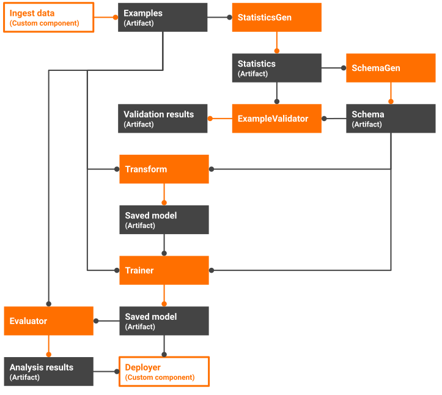

# Understanding TFX Pipelines

MLOps is the practice of applying DevOps practices to help automate, manage, and
audit machine learning (ML) workflows. ML workflows include steps to:

*   Prepare, analyze, and transform data.
*   Train and evaluate a model.
*   Deploy trained models to production.
*   Track ML artifacts and understand their dependencies.

Managing these steps in an ad-hoc manner can be difficult and time-consuming.

TFX makes it easier to implement MLOps by providing a toolkit that helps you
orchestrate your ML process on various orchestrators, such as: Apache Airflow,
Apache Beam, and Kubeflow Pipelines. By implementing your workflow as a TFX
pipeline, you can:

*   Automate your ML process, which lets you regularly retrain, evaluate, and
    deploy your model.
*   Utilize distributed compute resources for processing large datasets and
    workloads.
*   Increase the velocity of experimentation by running a pipeline with
    different sets of hyperparameters.

This guide describes the core concepts required to understand TFX pipelines.

## Artifact

The outputs of steps in a TFX pipeline are called **artifacts**. Subsequent
steps in your workflow may use these artifacts as inputs. In this way, TFX lets
you transfer data between workflow steps.

For instance, the `ExampleGen` standard component emits serialized examples,
which components such as the `StatisticsGen` standard component use as inputs.

Artifacts must be strongly typed with an **artifact type** registered in the
[ML Metadata](mlmd) store. Learn more about the
[concepts used in ML Metadata](mlmd#concepts).

Artifact types have a name and define a schema of its properties. Artifact type
names must be unique in your ML Metadata store. TFX provides several
[standard artifact types](https://github.com/tensorflow/tfx/blob/master/tfx/types/standard_artifacts.py){: .external }
that describe complex data types and value types, such as: string, integer, and
float. You can
[reuse these artifact types](https://github.com/tensorflow/tfx/blob/master/tfx/types/standard_artifacts.py){: .external }
or define custom artifact types that derive from
[`Artifact`](https://github.com/tensorflow/tfx/blob/master/tfx/types/artifact.py){: .external }.

## Parameter

Parameters are inputs to pipelines that are known before your pipeline is
executed. Parameters let you change the behavior of a pipeline, or a part of a
pipeline, through configuration instead of code.

For example, you can use parameters to run a pipeline with different sets of
hyperparameters without changing the pipeline's code.

Using parameters lets you increase the velocity of experimentation by making it
easier to run your pipeline with different sets of parameters.

Learn more about the
[RuntimeParameter class](https://github.com/tensorflow/tfx/blob/master/tfx/orchestration/data_types.py){: .external }.

## Component

A **component** is an implementation of an ML task that you can use as a step in
your TFX pipeline. Components are composed of:

*   A component specification, which defines the component's input and output
    artifacts, and the component's required parameters.
*   An executor, which implements the code to perform a step in your ML
    workflow, such as ingesting and transforming data or training and evaluating
    a model.
*   A component interface, which packages the component specification and
    executor for use in a pipeline.

TFX provides several [standard components](index#tfx_standard_components) that
you can use in your pipelines. If these components do not meet your needs, you
can build custom components.
[Learn more about custom components](understanding_custom_components).

## Pipeline

A TFX pipeline is a portable implementation of an ML workflow that can be run on
various orchestrators, such as: Apache Airflow, Apache Beam, and Kubeflow
Pipelines. A pipeline is composed of component instances and input parameters.

Component instances produce artifacts as outputs and typically depend on
artifacts produced by upstream component instances as inputs. The execution
sequence for component instances is determined by creating a directed acyclic
graph of the artifact dependencies.

For example, consider a pipeline that does the following:

*   Ingests data directly from a proprietary system using a custom component.
*   Calculates statistics for the training data using the StatisticsGen standard
    component.
*   Creates a data schema using the SchemaGen standard component.
*   Checks the training data for anomalies using the ExampleValidator standard
    component.
*   Performs feature engineering on the dataset using the Transform standard
    component.
*   Trains a model using the Trainer standard component.
*   Evaluates the trained model using the Evaluator component.
*   If the model passes its evaluation, the pipeline enqueues the trained model
    to a proprietary deployment system using a custom component.

To determine the execution sequence for the component instances, TFX analyzes
the artifact dependencies.

*   The data ingestion component does not have any artifact dependencies, so it
    can be the first node in the graph.
*   StatisticsGen depends on the _examples_ produced by data ingestion, so it
    must be executed after data ingestion.
*   SchemaGen depends on the _statistics_ created by StatisticsGen, so it must
    be executed after StatisticsGen.
*   ExampleValidator depends on the _statistics_ created by StatisticsGen and
    the _schema_ created by SchemaGen, so it must be executed after
    StatisticsGen and SchemaGen.
*   Transform depends on the _examples_ produced by data ingestion and the
    _schema_ created by SchemaGen, so it must be executed after data ingestion
    and SchemaGen.
*   Trainer depends on the _examples_ produced by data ingestion, the _schema_
    created by SchemaGen, and the _saved model_ produced by Transform. The
    Trainer can be executed only after data ingestion, SchemaGen, and Transform.
*   Evaluator depends on the _examples_ produced by data ingestion and the
    _saved model_ produced by the Trainer, so it must be executed after data
    ingestion and the Trainer.
*   The custom deployer depends on the _saved model_ produced by the Trainer and
    the _analysis results_ created by the Evaluator, so the deployer must be
    executed after the Trainer and the Evaluator.

Based on this analysis, an orchestrator runs:

*   The data ingestion, StatisticsGen, SchemaGen component instances
    sequentially.
*   The ExampleValidator and Transform components can run in parallel since they
    share input artifact dependencies and do not depend on each other's output.
*   After the Transform component is complete, the Trainer, Evaluator, and
    custom deployer component instances run sequentially.

Learn more about [building a TFX pipeline](build_tfx_pipeline).

## TFX Pipeline Template

TFX Pipeline Templates make it easier to get started with pipeline development
by providing a prebuilt pipeline that you can customize for your use case.

Learn more about
[customizing a TFX pipeline template](build_tfx_pipeline#build-a-pipeline-using-a-template).

## Pipeline Run

A run is a single execution of a pipeline.

## Orchestrator

An Orchestrator is a system where you can execute pipeline runs. TFX supports
orchestrators such as: [Apache Airflow](airflow),
[Apache Beam](beam_orchestrator), and [Kubeflow Pipelines](kubeflow). TFX also
uses the term _DagRunner_ to refer to an implementation that supports an
orchestrator.
