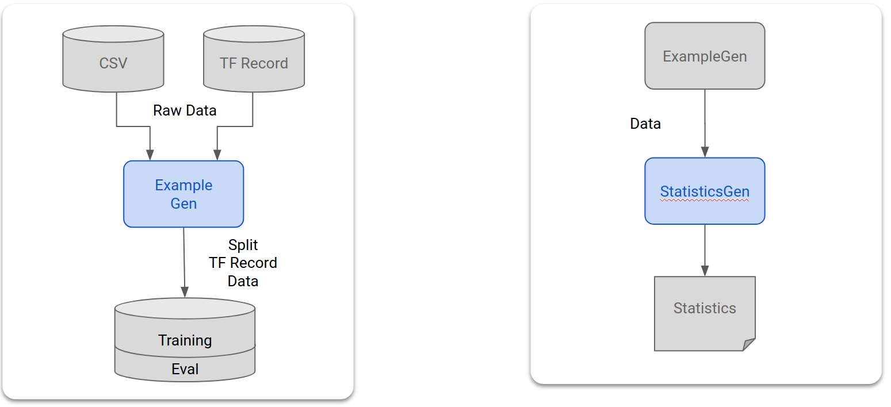

# TFX Airflow Tutorial

[](
https://github.com/tensorflow/tfx)
[](https://badge.fury.io/py/tfx)

## Introduction

This tutorial is designed to introduce TensorFlow Extended (TFX)
and help you create your own machine learning
pipelines. The tutorial code runs locally, and shows integration with TFX and TensorBoard
as well as interaction with TFX in Jupyter notebooks.

Key Term: A TFX pipeline is a Directed Acyclic Graph, or "DAG".  We will often
refer to pipelines as DAGs.

This tutorial follows a typical ML development process. 
You will be start by examining the dataset, and end the tutorial with a fully
working pipeline.  Along the way you'll explore ways to debug
and update your pipeline, and measure performance of your pipeline too.

### Learn more

Please see the [TFX User Guide](https://www.tensorflow.org/tfx/guide) to learn
more

## Step by step

In this tutorial, you'll get your pipeline working step by step. You will be 
following a typical ML development process, namely:

1. [Setting up your environment](#step_1_setup_your_environment)
1. [Bringing up an initial pipeline skeleton](
#step_2_bring_up_initial_pipeline_skeleton)
1. [Diving into your data](#step_3_dive_into_your_data)
1. [Engineering your features](#step_4_feature_engineering)
1. [Training your data](#step_5_training)
1. [Analyzing your model's performance](#step_6_analyzing_model_performance)
1. [Preparing your model for production](#step_7_ready_for_production)

## Prerequisites

* Linux / MacOS
* Virtualenv
* Python 3.5+
* Git

### Required packages

Depending on your environment you may need to install several packages:

```bash
sudo apt-get install \
    build-essential libssl-dev libffi-dev \
    libxml2-dev libxslt1-dev zlib1g-dev \
    python3-pip git software-properties-common
```

If you are running Python 3.6, you should install python3.6-dev:

```bash
sudo apt-get install python3.6-dev
```

If you are running Python 3.7, you should install python3.7-dev:

```bash
sudo apt-get install python3.7-dev
```

In addition, if your system has a GCC version < 7, you should update your GCC.
Otherwise, you will see errors when running `airflow webserver`. You can check
your current GCC version with:

```bash
gcc --version
```

If you need to update GCC, you can run this:

```bash
sudo add-apt-repository ppa:ubuntu-toolchain-r/test
sudo apt update
sudo apt install gcc-7
sudo apt install g++-7
sudo update-alternatives --install /usr/bin/gcc gcc /usr/bin/gcc-7 60 --slave /usr/bin/g++ g++ /usr/bin/g++-7
```

### MacOS Environment

If you do not have Python 3 and git already installed, you can install them
using the [Homebrew](https://brew.sh/) package manager:

```bash
/usr/bin/ruby -e "$(curl -fsSL https://raw.githubusercontent.com/Homebrew/install/master/install)"
export PATH="/usr/local/bin:/usr/local/sbin:$PATH"
brew update
brew install python
brew install git
```

Depending on
the configuration, MacOS sometimes has problems forking threads when running Airflow.
To avoid those problems you should edit your
`~/.bash_profile` and add the following line to the end of the file:

```bash
export OBJC_DISABLE_INITIALIZE_FORK_SAFETY=YES
```

## Tutorial material

The code for this tutorial is available at 
[https://github.com/tensorflow/tfx/tree/master/tfx/examples/airflow_workshop](
https://github.com/tensorflow/tfx/tree/master/tfx/examples/airflow_workshop)

The tutorial code is organized by the steps that you're working on; so
for each step you'll have the code you need and instructions
on what to do with it.

The tutorial files include both, an exercise and the solution to
the exercise in case you get stuck.

#### Exercise

* `taxi_pipeline.py`
* `taxi_utils.py`
* taxi DAG

#### Solution

* `taxi_pipeline_solution.py`
* `taxi_utils_solution.py`
* taxi_solution DAG

## What you're doing

You’re learning how to create an ML pipeline using TFX. Google uses TFX pipelines for production ML. TFX pipelines 
are appropriate when:

* You will be deploying a production ML
application
* Datasets are large
* Training/serving consistency is important
* Version management for inference is
important

You’re following a typical ML development process, namely:

* Ingesting, understanding, and cleaning your data
* Feature engineering
* Training your model
* Analyze your model's performance
* "Lather, rinse, repeat"-ing
* Preparing your model for production

### Adding the code for each step

This tutorial is designed so that all the code is included in the files. However, all
the code for steps 3-7 is commented out and marked with inline comments. The
inline comments identify which step the line of code applies to. For example,
the code for step 3 is marked with the comment `# Step 3`.

The code that you will add for each step typically falls into 4 regions of the
code:

* imports
* The DAG configuration
* The list returned from the create_pipeline() call
* The supporting code in taxi_utils.py

As you go through the tutorial, you'll uncomment the lines of code that apply to
the tutorial step that you're currently working on.  That will add the code for
that step, and update your pipeline.  As you do that, **we strongly encourage
you to review the code that you're uncommenting**.

## Chicago Taxi Dataset
<!-- Image free for commercial use, does not require attribution:
https://pixabay.com/photos/new-york-cab-cabs-taxi-urban-city-2087998/ -->


You're using the [Taxi Trips dataset](
https://data.cityofchicago.org/Transportation/Taxi-Trips/wrvz-psew)
released by the City of Chicago.

Note: This site provides applications using data that has been modified
for use from its original source, www.cityofchicago.org, the official website of
the City of Chicago. The City of Chicago makes no claims as to the content,
accuracy, timeliness, or completeness of any of the data provided at this site.
The data provided at this site is subject to change at any time. It is
understood that the data provided at this site is being used at one’s own risk.

You can [read more](https://cloud.google.com/bigquery/public-data/chicago-taxi)
about the dataset in [Google BigQuery](https://cloud.google.com/bigquery/).
Explore the full dataset in the [BigQuery UI](
https://bigquery.cloud.google.com/dataset/bigquery-public-data:chicago_taxi_trips).

### Model Goal - Binary classification

Will the customer tip more (Or less) than 20%?

## Step 1: Setup your environment

The setup script (`setup_demo.sh`) installs TFX and
[Airflow](https://airflow.apache.org/), and configures
Airflow in a way that makes it easy to work with for this tutorial.

In a shell:

```bash
cd
virtualenv -p python3 tfx-env
source ~/tfx-env/bin/activate

git clone https://github.com/tensorflow/tfx.git
cd ~/tfx
# Release 0.14 is the latest stable release
git checkout -f origin/r0.14
cd ~/tfx/tfx/examples/airflow_workshop/setup
./setup_demo.sh
```

You should review `setup_demo.sh` to see what it's doing.

## Step 2: Bringing up initial pipeline skeleton

### Hello World

In a shell:

```bash
# Open a new terminal window, and in that window ...
source ~/tfx-env/bin/activate
airflow webserver -p 8080

# Open another new terminal window, and in that window ...
source ~/tfx-env/bin/activate
airflow scheduler

# Open yet another new terminal window, and in that window ...
# Assuming that you've cloned the TFX repo into ~/tfx
source ~/tfx-env/bin/activate
cd ~/tfx/tfx/examples/airflow_workshop/notebooks
jupyter notebook
```

You have started Jupyter notebook in this step.  You will be running the
notebooks in this folder later on.

### In a browser:

* Open a browser and go to http://127.0.0.1:8080

#### Troubleshooting

If you have any issues with loading the Airflow console in your web browser,
or if there were any errors when you ran `airflow webserver`, then you may have
another application running on port 8080.  That's the default port for Airflow,
but you can change it to any other user port that's not being used.  For
example, to run Airflow on port 7070 you could run:

```bash
airflow webserver -p 7070
```

#### DAG view buttons


* Use the _Enable_ button on the left to _enable_ the taxi DAG
* Use the _Refresh_ button on the right to _refresh_ the taxi DAG when you make changes
* Use the _Trigger_ button on the right to _trigger_ the taxi DAG
* Click on taxi to go to the graph view of the taxt DAG


#### Airflow CLI

You can also use the [Airflow CLI](https://airflow.apache.org/cli.html) to
enable and trigger your DAGs:

```bash
# enable/disable
airflow unpause <your DAG>
airflow pause <your DAG>

# trigger
airflow trigger_dag <your DAG>
```

#### Waiting for the pipeline to complete

After you've triggered your pipeline in the DAGs view, you can watch as your
pipeline completes processing.  As each component runs, the outline color of the
component in the DAG graph will change to show its state.  When a component has
finished processing, the outline will turn dark green to show that the component's done processing.

Note: You need to use the _graph refresh_ button on the right or refresh the
page to see the updated status of the components as they run.

So far you only have the `CsvExampleGen` component in your pipeline. You need
to wait for it to turn dark green (~1 minutes).


## Step 3: Diving into your data

The first task in any data science or ML project is to understand
and clean the data. Generally, in this step, you will:

* Understand the data types for each feature
* Look for anomalies and missing values
* Understand the distributions for each feature

### Components




* The [ExampleGen](https://www.tensorflow.org/tfx/guide/examplegen) component 
ingests and splits the input dataset
* The [StatisticsGen](https://www.tensorflow.org/tfx/guide/statsgen) component
calculates statistics for the input dataset
* The [SchemaGen](https://www.tensorflow.org/tfx/guide/schemagen) component 
SchemaGen examines the statistics and creates a data schema
* The [ExampleValidator](https://www.tensorflow.org/tfx/guide/exampleval) component 
looks for anomalies and missing values in the dataset

### In an editor:

* In `~/airflow/dags`, uncomment the lines marked `# Step 3` in
`taxi_pipeline.py`
* Take a moment to review the code that you uncommented

### In a browser:

* Return to the DAGs list page in Airflow by clicking on the "DAGs" link in the top
left corner
* Click the refresh button on the right side of the taxi DAG
  * You should see "DAG [taxi] is now fresh as a daisy"
* Trigger the taxi pipeline by clicking the _Trigger_ button
* Wait for the pipeline to complete
  * Once the component's dark green
  * Use the refresh button on the right side or refresh your page


### Back on Jupyter:

Earlier, you ran `jupyter notebook`, which opened a Jupyter session in a browser
tab.  Now return to that tab in your browser.

* Open `step3.ipynb`
* Follow the instructions in the notebook


### A more advanced example

The example presented here is really only meant to get you started. For a more
advanced example, see the [TensorFlow Data Validation Colab](
https://www.tensorflow.org/tfx/tutorials/data_validation/chicago_taxi).

For more information on using TFDV to explore and validate a
dataset, [see the examples on tensorflow.org](
https://www.tensorflow.org/tfx/data_validation).

## Step 4: Engineering your features

In this step you'll increase the predictive quality of your data and/or reduce its
dimensionality with feature engineering. Some feature engineering methods are:

* Feature crosses
* Vocabularies
* Embeddings
* PCA (Principal Component Analysis)
* Categorical encoding

One of the benefits of using TFX is that you will write your data transformation
code once, and the resulting transforms will be consistent in all the steps between training
and serving.

### Components


* The [Transform](https://www.tensorflow.org/tfx/guide/transform) component 
performs feature engineering on the dataset

### In an editor:

* In `~/airflow/dags`, uncomment the lines marked `# Step 4` in both
`taxi_pipeline.py` and `taxi_utils.py`
* Take a moment to review the code that you uncommented

### In a browser:

* Return to the DAGs list page in Airflow
* Click the refresh button on the right side of the taxi DAG
  * You should see "DAG [taxi] is now fresh as a daisy"
* Trigger the taxi pipeline by clicking the _Trigger_ button
* Wait for the pipeline to complete
  * Once the component's dark green
  * Use the refresh button on the right side or refresh your page


### Back on Jupyter:

Return to the Jupyter tab in your browser.

* Open `step4.ipynb`
* Follow the instructions in the notebook

### A more advanced example

The example presented here is really only meant to get you started. For a more
advanced example, see the [TensorFlow Transform Colab](
https://www.tensorflow.org/tfx/tutorials/transform/census).

## Step 5: Training your data

In this step, you'll train a TensorFlow model with your nice, clean, transformed data.

* Include the transformations from step 4 so that they are applied consistently
* Save the results as a `SavedModel` for production
* Visualize and explore the training process using TensorBoard
* Also save an `EvalSavedModel` for analysis of model performance

### Components

*   The [Trainer](https://www.tensorflow.org/tfx/guide/trainer) component trains the model
    using TensorFlow
    [Estimators](https://github.com/tensorflow/docs/blob/master/site/en/r1/guide/estimators.md)

### In an editor:

* In `~/airflow/dags`, uncomment the lines marked `# Step 5` in both 
`taxi_pipeline.py` and `taxi_utils.py`
* Take a moment to review the code that you uncommented

### In a browser:

* Return to the DAGs list page in Airflow
* Click the refresh button on the right side for the taxi DAG
  * You should see "DAG [taxi] is now fresh as a daisy"
* Trigger the taxi pipeline by clicking the _Trigger_ button
* Wait for the pipeline to complete
  * Once the component's dark green
  * Use the refresh button on the right side or refresh your page


### Back on Jupyter:

Return to the Jupyter tab in your browser.

* Open `step5.ipynb`
* Follow the notebook


### A more advanced example

The example presented here is really only meant to get you started. For a more
advanced example, see the [TensorBoard Tutorial](
https://www.tensorflow.org/tensorboard/r1/summaries)

## Step 6: Analyzing your model's performance

In this step you'll understand more than just the top level metrics. Some things to keep in mind are:

* Users experience model performance only for their queries
* Poor performance on certain slices of data can be hidden by top level metrics
* Model fairness is important
* Often, key subsets of users or data may be very important, and may be small. Some examples are:
    * Performance in critical but unusual conditions
    * Performance for key audiences such as influencers

### Components

* The [Evaluator](https://www.tensorflow.org/tfx/guide/evaluator) component
performs deep analysis of the training results

### In an editor:

* In `~/airflow/dags`, uncomment the lines marked `# Step 6` in both
`taxi_pipeline.py` and `taxi_utils.py`
* Take a moment to review the code that you uncommented

### In a browser:

* Return to the DAGs list page in Airflow
* Click the refresh button on the right side for the taxi DAG
  * You should see "DAG [taxi] is now fresh as a daisy"
* Trigger the taxi pipeline by clicking the _Trigger_ button
* Wait for pipeline to complete
  * Once the component's dark green
  * Use the refresh button on the right side or refresh your page


### Back on Jupyter:

Return to the Jupyter tab in your browser.

* Open `step6.ipynb`
* Follow the notebook


### A more advanced example

The example presented here is really only meant to get you started.
For a more advanced example, see the [TFMA Chicago Taxi Tutorial](
https://www.tensorflow.org/tfx/tutorials/model_analysis/chicago_taxi).

## Step 7: Preparing your model for production

The model is now ready to serve. A few things to keep in mind before deploying 
a model to production:

* If you’re replacing a model that is currently in production, first make sure
that the new one is better
* `ModelValidator` tells the `Pusher` component if the model is OK
* `Pusher` deploys `SavedModel`s to well-known locations

Deployment targets receive new models from well-known locations such as:

* TensorFlow Serving
* TensorFlow Lite
* TensorFlow JS
* TensorFlow Hub

### Components

* The [ModelValidator](https://www.tensorflow.org/tfx/guide/modelval) component 
ensures that the model is "good enough" to be pushed to production
* The [Pusher](https://www.tensorflow.org/tfx/guide/pusher) component 
deploys the model to a serving infrastructure

### In an editor:

* In `~/airflow/dags`, uncomment the lines marked `# Step 7` in both
`taxi_pipeline.py` and `taxi_utils.py`
* Take a moment to review the code that you uncommented

### In a browser:

* Return to the DAGs list page in Airflow
* Click the refresh button on the right side for the taxi DAG
  * You should see "DAG [taxi] is now fresh as a daisy"
* Trigger the taxi pipeline by clicking the _Trigger_ button
* Wait for the pipeline to complete
  * Once the component's dark green
  * Use the refresh button on the right side or refresh your page


## Next Steps

You have trained and validated your model, and exported a `SavedModel` file
under the `~/airflow/saved_models/taxi` directory.  Your model is now
ready for production.  You can now deploy your model to any of the following TensorFlow
deployment targets:

* [TensorFlow Serving](https://www.tensorflow.org/tfx/guide/serving) for
serving your model on a server or server farm and processing REST and/or gRPC
inference requests
* [TensorFlow Lite](https://www.tensorflow.org/lite) for including your model
in an Android or iOS native mobile application, or in a Raspberry Pi, IoT, or
microcontroller application
* [TensorFlow.js](https://www.tensorflow.org/js) for running your model in a
web browser or Node.JS application
