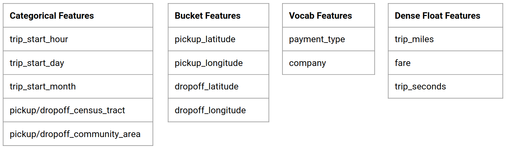

# **TFX Airflow Tutorial**

## Overview

This tutorial is designed to help you learn to create your own machine learning pipelines using TensorFlow Extended (TFX) and Apache Airflow as the orchestrator. It runs on on Vertex AI Workbench, and shows integration with TFX and TensorBoard as well as interaction with TFX in a Jupyter Lab environment.

### What you'll be doing?
You’ll learn how to create an ML pipeline using TFX

* A TFX pipeline is a Directed Acyclic Graph, or "DAG". We will often refer to pipelines as DAGs.
* TFX pipelines are appropriate when you will be deploying a production ML application
* TFX pipelines are appropriate when datasets are large, or may grow to be large
* TFX pipelines are appropriate when training/serving consistency is important
* TFX pipelines are appropriate when version management for inference is important
* Google uses TFX pipelines for production ML

Please see the [TFX User Guide](https://www.tensorflow.org/tfx/guide) to learn more.

You'll follow a typical ML development process:

* Ingesting, understanding, and cleaning our data
* Feature engineering
* Training
* Analyze model performance
* Lather, rinse, repeat
* Ready for production 

## **Chicago Taxi Dataset**




You'll be using the [Taxi Trips dataset](https://data.cityofchicago.org/Transportation/Taxi-Trips/wrvz-psew) released by the City of Chicago.

Note: This tutorial builds an application using data that has been modified for use from its original source, www.cityofchicago.org, the official website of the City of Chicago. The City of Chicago makes no claims as to the content, accuracy, timeliness, or completeness of any of the data provided at in this tutorial. The data provided at this site is subject to change at any time. It is understood that the data provided in this tutorial is being used at one’s own risk.

### Model Goal - Binary classification
Will the customer tip more or less than 20%?

## Setup the Google Cloud Project

**Before you click the Start Lab button**
Read these instructions. Labs are timed and you cannot pause them. The timer, which starts when you click **Start Lab**, shows how long Google Cloud resources will be made available to you.

This hands-on lab lets you do the lab activities yourself in a real cloud environment, not in a simulation or demo environment. It does so by giving you new, temporary credentials that you use to sign in and access Google Cloud for the duration of the lab.

**What you need**
To complete this lab, you need:

* Access to a standard internet browser (Chrome browser recommended).
* Time to complete the lab.

**Note:** If you already have your own personal Google Cloud account or project, do not use it for this lab.

**Note:** If you are using a Chrome OS device, open an Incognito window to run this lab.

**How to start your lab and sign in to the Google Cloud Console**
1. Click the **Start Lab** button. If you need to pay for the lab, a pop-up opens for you to select your payment method. On the left is a panel populated with the temporary credentials that you must use for this lab.


2. Copy the username, and then click **Open Google Console**. The lab spins up resources, and then opens another tab that shows the **Sign in** page.


_**Tip:**_ Open the tabs in separate windows, side-by-side.


3. In the **Sign in** page, paste the username that you copied from the left panel. Then copy and paste the password.

_**Important:**_- You must use the credentials from the left panel. Do not use your Google Cloud Training credentials. If you have your own Google Cloud account, do not use it for this lab (avoids incurring charges).

4. Click through the subsequent pages:
* Accept the terms and conditions.

* Do not add recovery options or two-factor authentication (because this is a temporary account).

* Do not sign up for free trials.

After a few moments, the Cloud Console opens in this tab.

**Note:** You can view the menu with a list of Google Cloud Products and Services by clicking the **Navigation menu** at the top-left.


### Activate Cloud Shell
Cloud Shell is a virtual machine that is loaded with development tools. It offers a persistent 5GB home directory and runs on the Google Cloud. Cloud Shell provides command-line access to your Google Cloud resources.

In the Cloud Console, in the top right toolbar, click the **Activate Cloud Shell** button.


Click **Continue**.


It takes a few moments to provision and connect to the environment. When you are connected, you are already authenticated, and the project is set to your _PROJECT_ID_. For example:


`gcloud` is the command-line tool for Google Cloud. It comes pre-installed on Cloud Shell and supports tab-completion.

You can list the active account name with this command:

```
gcloud auth list
```
(Output)
>ACTIVE: *
ACCOUNT: student-01-xxxxxxxxxxxx@qwiklabs.net
To set the active account, run:
    $ gcloud config set account `ACCOUNT`

You can list the project ID with this command:
```
gcloud config list project
```
(Output)
>[core]
project = <project_ID>

(Example output)
>[core]
project = qwiklabs-gcp-44776a13dea667a6

For full documentation of gcloud see the [gcloud command-line tool overview](https://cloud.google.com/sdk/gcloud).

## Enable Google Cloud services
1. In Cloud Shell, use gcloud to enable the services used in the lab.
```
gcloud services enable \
  compute.googleapis.com \
  iam.googleapis.com \
  iamcredentials.googleapis.com \
  monitoring.googleapis.com \
  logging.googleapis.com \
  notebooks.googleapis.com \
  aiplatform.googleapis.com \
  bigquery.googleapis.com \
  artifactregistry.googleapis.com \
  cloudbuild.googleapis.com \
  container.googleapis.com
  ```


## Deploy Vertex Notebook instance
1. Click on the __Navigation Menu__.
2. Navigate to __Vertex AI__, then to __Workbench__


3. On the Notebook instances page, navigate to the __User-Managed Notebooks__ tab and click **New Notebook**.
4. In the Customize instance menu, select **TensorFlow Enterprise** and choose the version of **TensorFlow Enterprise 2.8 (with LTS)** > **Without GPUs**.


5. In the __New notebook instance__ dialog, for __Region__, select `us-central1`, for __Zone__, select a zone within the selected region, leave all other fields with their default options, and click __Create__.

After a few minutes, the Vertex AI console will display your instance name, followed by `Open Jupyterlab`.

6. Click **Open JupyterLab**. Your notebook is now set up.

## Setup the environment

### Clone the lab repository
Next you'll clone the `tfx` repository in your JupyterLab instance.
1. In JupyterLab, click the __Terminal__ icon to open a new terminal.
<ql-infobox><strong>Note:</strong> If prompted, click <code>Cancel</code> for Build Recommended.</ql-infobox>
2. To clone the `tfx` Github repository, type in the following command, and press __Enter__.

```bash
git clone https://github.com/priankakariatyml/tfx.git
```

3. Checkout to the recent branch
```bash
cd tfx/
git checkout upgrading-pipeline-codes-and-utils
```

4. To confirm that you have cloned the repository, double-click the `tfx` directory and confirm that you can see its contents.


  
### Install lab dependencies
1. Run the following to go to the `tfx/tfx/examples/airflow_workshop/taxi/setup/` folder, then run `./setup_demo.sh` to install lab dependencies:

```bash
cd ~/tfx/tfx/examples/airflow_workshop/taxi/setup/
./setup_demo.sh
```

The above code will

* Install the required packages.
* Create an `airflow` folder in the home folder.
* Copy the entire `dags` folder from `tfx/tfx/examples/airflow_workshop/taxi/setup/` folder to `~/airflow/` folder.
* Copy the csv file from `tfx/tfx/examples/airflow_workshop/taxi/setup/data` to `~/airflow/data`.


## Configuring Airflow server

### Create firewall rule to access to airflow server in browser
1. Go to `https://console.cloud.google.com/networking/firewalls/list` and make sure the project name is selected appropriately
2. Click on `CREATE FIREWALL RULE` option on top


3. In the **Create a firewall dialog**, for **Priority**, select `1`, for **Targets**, select `All instances in the network`,for **Source IPv4 ranges**, select `0.0.0.0/0`, for **Protocols and ports**, click on `tcp` and enter `7000` in the box next to `tcp` and click `Create`.


### Run airflow server from your shell

1. In the Jupyter Lab Terminal window, change to home directory, run the `airflow users  create` command to create an admin user for airflow. Then run the `airflow webserver` and `airflow scheduler` command to run the server
2. Choose port `7000` since it is allowed through firewall.

```bash
cd
airflow users  create --role Admin --username admin --email admin --firstname admin --lastname admin --password admin
nohup airflow webserver -p 7000 &> webserver.out &
nohup airflow scheduler &> scheduler.out &
```

### Get your external ip

1. Go to the `https://console.cloud.google.com/vertex-ai/workbench` page. Make sure you are on the right project. Click on the instance name to open the `Notebook details` page.


2. Click on `VIEW VM DETAILS` to open the `instancesDetail` page.


3. Scroll down on the `instancesDetail` page and go to `Network interfaces` section. You can get your external ip from the `External IP address` section. 


## Running a DAG/Pipeline

### In a browser
Open a browser and go to http://<external_ip>:7000

* Enter username and password mentioned in `airflow users  create` command in the login page.


Airflow will check all the python files inside `~/airflow/dags/` folder for '**DAG**' arguement.

If found it will list it as pipeline in airflow homepage (here `~/airflow/dags/taxi_pipeline.py`)


If you click on taxi, it will go to the graph view of the DAG


### Trigger the taxi pipeline

On the homepage you can see the buttons that can be used to interact with the DAG


Under actions header, click on the trigger button and start the process

In the taxi DAG page use the button on the right to refresh the DAG when you make changes


You can also use the [Airflow CLI](https://airflow.apache.org/cli.html) in terminal to enable and trigger your DAGs:

```bash
# enable/disable
airflow pause <your DAG name>
airflow unpause <your DAG name>

# trigger
airflow trigger_dag <your DAG name>
```

#### Waiting for the pipeline to complete
After you've triggered your pipeline in the DAGs view, you can watch as your pipeline completes processing. As each component runs the outline color of the component in the DAG graph will change to show its state. When a component has finished processing the outline will turn dark green to show that it's done.


## Understanding the components
Now we will look at the components of pipeline in detail and individually look at the outputs produced by each step in the pipeline.

* Go to `~/tfx/tfx/examples/airflow_workshop/taxi/setup/` and open `notebook.ipynb`
* Follow the notebook for the remaining instructions
