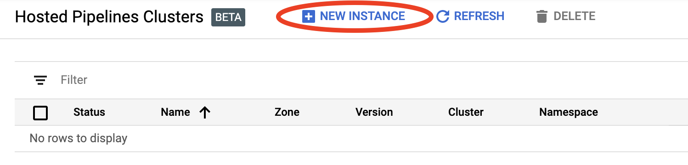
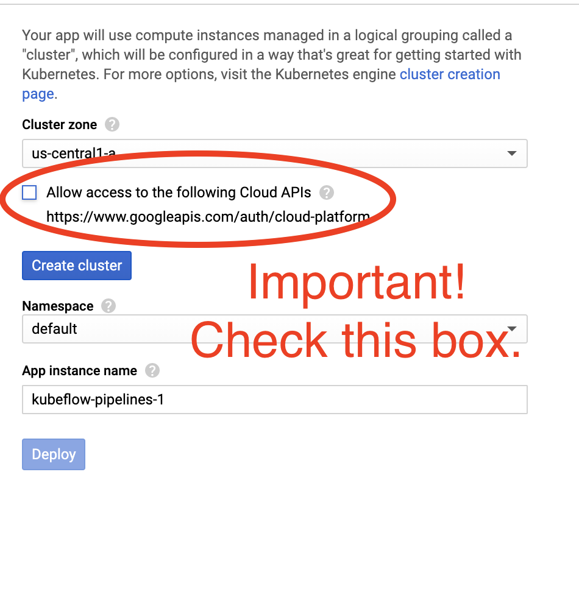

# TFX on Cloud AI Platform Pipelines

## Introduction

This tutorial is designed to introduce TensorFlow Extended (TFX) and Cloud AI
Platform Pipelines, and help you learn to create your own machine learning
pipelines on Google Cloud. It shows integration with TFX, AI Platform Pipelines,
and Kubeflow, as well as interaction with TFX in Jupyter notebooks.

At the end of this tutorial, you will have created and run an ML Pipeline,
hosted on Google Cloud. You'll be able to visualize the results of each run, and
view the lineage of the created artifacts.

Key Term: A TFX pipeline is a Directed Acyclic Graph, or "DAG". We will often
refer to pipelines as DAGs.

You'll follow a typical ML development process, starting by examining the
dataset, and ending up with a complete working pipeline. Along the way you'll
explore ways to debug and update your pipeline, and measure performance.

Note: Completing this tutorial may take 45-60 minutes.

### Chicago Taxi Dataset

<!-- Image free for commercial use, does not require attribution:
https://pixabay.com/photos/new-york-cab-cabs-taxi-urban-city-2087998/ -->


You're using the
[Taxi Trips dataset](https://data.cityofchicago.org/Transportation/Taxi-Trips/wrvz-psew)
released by the City of Chicago.

Note: This site provides applications using data that has been modified for use
from its original source, www.cityofchicago.org, the official website of the
City of Chicago. The City of Chicago makes no claims as to the content,
accuracy, timeliness, or completeness of any of the data provided at this site.
The data provided at this site is subject to change at any time. It is
understood that the data provided at this site is being used at one’s own risk.

You can [read more](https://cloud.google.com/bigquery/public-data/chicago-taxi)
about the dataset in [Google BigQuery](https://cloud.google.com/bigquery/).
Explore the full dataset in the
[BigQuery UI](https://bigquery.cloud.google.com/dataset/bigquery-public-data:chicago_taxi_trips).

#### Model Goal - Binary classification

Will the customer tip more or less than 20%?

## 1. Set up a Google Cloud project

### 1.a Set up your environment on Google Cloud

To get started, you need a Google Cloud Account. If you already have one, skip
ahead to [Create New Project](#create_project).

Warning: This demo is designed to not exceed
[Google Cloud's Free Tier](https://cloud.google.com/free) limits. If you already
have a Google Account, you may have reached your Free Tier limits, or exhausted
any free Google Cloud credits given to new users. **If that is the case,
following this demo will result in charges to your Google Cloud account**.

1.  Go to the [Google Cloud Console](https://console.cloud.google.com/).

1.  Agree to Google Cloud terms and conditions

    

1.  If you would like to start with a free trial account, click on
    [**Try For Free**](https://console.cloud.google.com/freetrial) (or
    [**Get started for free**](https://console.cloud.google.com/freetrial)).

    1.  Select your country.

    1.  Agree to the terms of service.

    1.  Enter billing details.

        You will not be charged at this point. If you have no other Google Cloud
        projects, you can complete this tutorial without exceeding the
        [Google Cloud Free Tier](https://cloud.google.com/free) limits, which
        includes a max of 8 cores running at the same time.

Note: You can choose at this point to become a paid user instead of relying on
the free trial. Since this tutorial stays within the Free Tier limits, you still
won't be charged if this is your only project and you stay within those limits.
For more details, see
[Google Cloud Cost Calculator](https://cloud.google.com/products/calculator/)
and [Google Cloud Platform Free Tier](https://cloud.google.com/free).

### 1.b Create a new project.<a name='create_project' />

Note: This tutorial assumes you want to work on this demo in a new project. You
can, if you want, work in an existing project.

Note: You must have a verified credit card on file before creating the project.

1.  From the
    [main Google Cloud dashboard](https://console.cloud.google.com/home/dashboard),
    click the project dropdown next to the **Google Cloud Platform** header, and
    select **New Project**.
1.  Give your project a name and enter other project details
1.  Once you have created a project, select it from the project drop-down.

## 2. Set up and deploy an AI Platform Pipeline on a new Kubernetes cluster

Note: This will take up to 10 minutes, as it requires waiting at several points
for resources to be provisioned.

1.  Go to the
    [AI Platform Pipelines Clusters](https://console.cloud.google.com/ai-platform/pipelines)
    page.

    Under the Main Navigation Menu: ≡ > AI Platform > Pipelines

1.  Click **+ New Instance** to create a new cluster.

    

1.  On the **Kubeflow Pipelines** overview page, click **Configure**.

    

    You may have to wait several minutes before moving on, while the Kubernetes
    Engine APIs are being enabled for you.

1.  On the **Deploy Kubeflow Pipelines** page:

    1.  Select a [zone](https://cloud.google.com/compute/docs/regions-zones) (or
        "region") for your cluster.
    1.  **IMPORTANT** Check the box labeled *Allow access to the following cloud
        APIs*. (This is required for this cluster to access the other pieces of
        your project. If you miss this step, fixing it later is a bit tricky.)

        

    1.  Click **Create**, and wait several minutes until the cluster has been
        created.

    1.  Select a namespace and instance name (using the defaults is fine).

    1.  Click **Deploy**, and wait several moments until the pipeline has been
        deployed. By deploying Kubeflow Pipelines, you accept the Terms of
        Service.

## 3. Set up Cloud AI Platform Notebook instance.

1.  Go to the
    [AI Platform Notebooks](https://console.cloud.google.com/ai-platform/notebooks)
    page.

    Under the Main Navigation Menu: ≡ -> AI Platform -> Notebooks

1.  If prompted, enable the Compute Engine API.

1.  Create a **New Instance** with TensorFlow 2.1 (or higher) installed.

    New Instance -> TensorFlow 2.1 -> Without GPU

    To stay within the Free Tier limits, do not accept the default settings
    here. You need to reduce the number of vCPUs available to this instance from
    4 to 2:

    1.  Select **Customize** at the bottom of the **New notebook instance**
        form.
    1.  Select a **Machine configuration** with 1 or 2 vCPUs.

        

Note: You may experience slow performance in your notebook if you use 1 or 2
vCPUs instead of the default. This should not seriously hinder your completion
of this tutorial. If would like to use the default settings,
[upgrade your account](https://cloud.google.com/free/docs/gcp-free-tier#to_upgrade_your_account)
to at least 12 vCPUs. This will accrue charges. See
[Google Kubernetes Engine Pricing](https://cloud.google.com/kubernetes-engine/pricing/)
for more details on pricing, including a
[pricing calculator](https://cloud.google.com/products/calculator) and
information about the [Google Cloud Free Tier](https://cloud.google.com/free).

## 4. Launch the Getting Started Notebook

1.  Go to the
    [**AI Platform Pipelines Clusters**](https://console.cloud.google.com/ai-platform/pipelines)
    page.

    Under the Main Navigation Menu: ≡ -> AI Platform -> Pipelines

1.  On the line for the cluster you are using in this tutorial, click **Open
    Pipelines Dashboard**.

    

1.  On the **Getting Started** page, click **Open TF 2.1 Notebook**.

1.  Select the Notebook instance you are using for this tutorial and
    **Continue**.

    

## 5. Continue working in the Notebook

Important: The rest of this tutorial should be completed in Jupyter Lab Notebook
you opened in the previous step. The instructions and explanations are available
here as a reference.

### Install

The Getting Started Notebook starts by installing
[TFX](https://www.tensorflow.org/tfx) and
[Kubeflow Pipelines (KFP)](https://www.kubeflow.org/docs/pipelines/) into the VM
which Jupyter Lab is running in, along with the
[Skaffold](https://github.com/GoogleContainerTools/skaffold) module:


It then sets the `PATH` to include user Python binary directory and a directory
containing `skaffold`:


It then checks which version of TFX is installed, does an import, and sets and
prints the Project ID:


### Connect with your Google Cloud services

The pipeline configuration needs your project ID, which you can get through the
notebook and set as an environmental variable.

```python
# Read GCP project id from env.
shell_output=!gcloud config list --format 'value(core.project)' 2>/dev/null
GCP_PROJECT_ID=shell_output[0]
print("GCP project ID:" + GCP_PROJECT_ID)
```

Now set your KFP cluster endpoint.

This can be found from the URL of the Pipelines dashboard. Go to the Kubeflow
Pipeline dashboard and look at the URL. The endpoint is everything in the URL
*after* the `https://`, *up to, and including*, `googleusercontent.com`.

```python
ENDPOINT='' # Enter YOUR ENDPOINT here.
```

The notebook then sets a unique name for the custom Docker image:

```python
# Docker image name for the pipeline image
CUSTOM_TFX_IMAGE='gcr.io/' + GCP_PROJECT_ID + '/tfx-pipeline'
```

## 6. Copy a template into your project directory

Edit the next notebook cell to set a name for your pipeline. In this tutorial we
will use `my_pipeline`.

```python
PIPELINE_NAME="my_pipeline"
PROJECT_DIR=os.path.join(os.path.expanduser("~"),"AIHub",PIPELINE_NAME)
```

The notebook then uses the `tfx` CLI to copy the pipeline template. This
tutorial uses the Chicago Taxi dataset to perform binary classification, so the
template sets the model to `taxi`:

```
!tfx template copy \
  --pipeline_name={PIPELINE_NAME} \
  --destination_path={PROJECT_DIR} \
  --model=taxi
```

The notebook then changes its CWD context to the project directory:

```
%cd {PROJECT_DIR}
```

### Browse the pipeline files

On the left-hand side of the Cloud AI Platform Notebook, you should see a file
browser. There should be a directory with your pipeline name (`my_pipeline`).
Open it and view the files. (You'll be able to open them and edit from the
notebook environment as well.)

```
# You can also list the files from the shell
! ls
```

The `tfx template copy` command above created a basic scaffold of files that
build a pipeline. These include Python source codes, sample data, and Jupyter
notebooks. These are meant for this particular example. For your own pipelines
these would be the supporting files that your pipeline requires.

Here is brief description of the Python files.

-   `configs.py` — defines common constants for pipeline runners
-   `pipeline.py` — defines TFX components and a pipeline
-   `beam_dag_runner.py` / `kubeflow_dag_runner.py` — define runners for each
    orchestration engine
-   `features.py` `features_test.py` — defines features for the model
-   `hparams.py` — defines hyperparameters of the model
-   `preprocessing.py` / `preprocessing_test.py` — defines preprocessing jobs
    using `tf::Transform`
-   `model.py` / `model_test.py` — defines DNN model using TF estimator

## 7. Run your first TFX pipeline on Kubeflow

The notebook will run the pipeline using the `tfx run` CLI command.

### Connect to storage

Running pipelines create artifacts which have to be stored in
[ML-Metadata](https://github.com/google/ml-metadata). Artifacts refer to
payloads, which are files that must be stored in a file system or block storage.
For this tutorial, we'll use GCS to store our metadata payloads, using the
bucket that was created automatically during setup. The notebook gets the names
of the current buckets:

Get a list of bucket names:

```
!gsutil ls | cut -d / -f 3
```

Copy the name of the bucket you are using to the clipboard.

Caution: You must open the `configs.py` file and set the `GCS_BUCKET_NAME`
constant to the name of the bucket.

### Create the pipeline

The notebook then uses the `tfx pipeline create` command to create the pipeline.

```
!tfx pipeline create  \
--pipeline_path=kubeflow_dag_runner.py \
--endpoint={ENDPOINT} \
--build_target_image={CUSTOM_TFX_IMAGE}
```

While creating a pipeline, `Dockerfile` and `build.yaml` will be generated to
build a Docker image. Don't forget to add these files to your source control
system (for example, git) along with other source files.

### Run the pipeline

The notebook then uses the `tfx run create` command to start an execution run of
your pipeline. You will also see this run listed under Experiments in the
Kubeflow Pipelines Dashboard.

```
!tfx run create --pipeline_name={PIPELINE_NAME} --endpoint={ENDPOINT}
```

You can view your pipeline from the Kubeflow Pipelines Dashboard.

Note: If your pipeline run fails, you can see detailed logs in the KFP
Dashboard. One of the major sources of failure is permission related problems.
Make sure your KFP cluster has permissions to access Google Cloud APIs. This can
be configured
[when you create a KFP cluster in GCP](https://cloud.google.com/ai-platform/pipelines/docs/setting-up),
or see
[Troubleshooting document in GCP](https://cloud.google.com/ai-platform/pipelines/docs/troubleshooting).

## 8. Validate your data

The first task in any data science or ML project is to understand and clean the
data.

*   Understand the data types for each feature
*   Look for anomalies and missing values
*   Understand the distributions for each feature

### Components


*   [ExampleGen](https://www.tensorflow.org/tfx/guide/examplegen) ingests and
    splits the input dataset.
*   [StatisticsGen](https://www.tensorflow.org/tfx/guide/statsgen) calculates
    statistics for the dataset.
*   [SchemaGen](https://www.tensorflow.org/tfx/guide/schemagen) SchemaGen
    examines the statistics and creates a data schema.
*   [ExampleValidator](https://www.tensorflow.org/tfx/guide/exampleval) looks
    for anomalies and missing values in the dataset.

### In Jupyter lab file editor:

In `pipeline.py`, uncomment the lines which append these components to your
pipeline:

```
# components.append(statistics_gen)
# components.append(infer_schema)
# components.append(validate_stats)
```

(`ExampleGen` was already enabled when the template files were copied.)

### Update the pipeline and re-run it

```
# Update the pipeline
! tfx pipeline update \
  --pipeline_path=kubeflow_dag_runner.py \
  --endpoint={ENDPOINT}

! tfx run create --pipeline_name "{PIPELINE_NAME}"
```

### Check the pipeline

For Kubeflow Orchestrator, visit KFP dashboard and find pipeline outputs in the
page for your pipeline run. Click "Experiments" tab on the left, and "All runs"
in the Experiments page. You should be able to find the run with the name of
your pipeline.

### More advanced example

The example presented here is really only meant to get you started. For a more
advanced example see the
[TensorFlow Data Validation Colab](https://www.tensorflow.org/tfx/tutorials/data_validation/chicago_taxi).

For more information on using TFDV to explore and validate a dataset,
[see the examples on tensorflow.org](https://www.tensorflow.org/tfx/data_validation).

## 9. Feature engineering

You can increase the predictive quality of your data and/or reduce
dimensionality with feature engineering.

*   Feature crosses
*   Vocabularies
*   Embeddings
*   PCA
*   Categorical encoding

One of the benefits of using TFX is that you will write your transformation code
once, and the resulting transforms will be consistent between training and
serving.

### Components


*   [Transform](https://www.tensorflow.org/tfx/guide/transform) performs feature
    engineering on the dataset.

### In Jupyter lab file editor:

In `pipeline.py`, find and uncomment the line which appends
[Transform](https://www.tensorflow.org/tfx/guide/transform) to the pipeline.

```
# components.append(transform)
```

### Update the pipeline and re-run it

```
# Update the pipeline
! tfx pipeline update \
  --pipeline_path=kubeflow_dag_runner.py \
  --endpoint={ENDPOINT}

! tfx run create --pipeline_name "{PIPELINE_NAME}"
```

### Check pipeline outputs

For Kubeflow Orchestrator, visit KFP dashboard and find pipeline outputs in the
page for your pipeline run. Click "Experiments" tab on the left, and "All runs"
in the Experiments page. You should be able to find the run with the name of
your pipeline.

### More advanced example

The example presented here is really only meant to get you started. For a more
advanced example see the
[TensorFlow Transform Colab](https://www.tensorflow.org/tfx/tutorials/transform/census).

## 10. Training

Train a TensorFlow model with your nice, clean, transformed data.

*   Include the transformations from the previous step so that they are applied
    consistently
*   Save the results as a SavedModel for production
*   Visualize and explore the training process using TensorBoard
*   Also save an EvalSavedModel for analysis of model performance

### Components

*   [Trainer](https://www.tensorflow.org/tfx/guide/trainer) trains a TensorFlow
    model.

### In Jupyter lab file editor:

In `pipeline.py`, find and uncomment the which appends Trainer to the pipeline:

```
# components.append(trainer)
```

### Update the pipeline and re-run it

```
# Update the pipeline
! tfx pipeline update \
  --pipeline_path=kubeflow_dag_runner.py \
  --endpoint={ENDPOINT}

! tfx run create --pipeline_name "{PIPELINE_NAME}"
```

### Check pipeline outputs

For Kubeflow Orchestrator, visit KFP dashboard and find pipeline outputs in the
page for your pipeline run. Click "Experiments" tab on the left, and "All runs"
in the Experiments page. You should be able to find the run with the name of
your pipeline.

### More advanced example

The example presented here is really only meant to get you started. For a more
advanced example see the
[TensorBoard Tutorial](https://www.tensorflow.org/tensorboard/r1/summaries).

## 11. Analyzing model performance

Understanding more than just the top level metrics.

*   Users experience model performance for their queries only
*   Poor performance on slices of data can be hidden by top level metrics
*   Model fairness is important
*   Often key subsets of users or data are very important, and may be small
    *   Performance in critical but unusual conditions
    *   Performance for key audiences such as influencers

### Components

*   [Evaluator](https://www.tensorflow.org/tfx/guide/evaluator) performs deep
    analysis of the training results.

### In Jupyter lab file editor:

In `pipeline.py`, find and uncomment the line which appends Evaluator to the
pipeline:

```
components.append(model_analyzer)
```

### Update the pipeline and re-run it

```
# Update the pipeline
! tfx pipeline update \
  --pipeline_path=kubeflow_dag_runner.py \
  --endpoint={ENDPOINT}

! tfx run create --pipeline_name "{PIPELINE_NAME}"
```

### Check pipeline outputs

For Kubeflow Orchestrator, visit KFP dashboard and find pipeline outputs in the
page for your pipeline run. Click "Experiments" tab on the left, and "All runs"
in the Experiments page. You should be able to find the run with the name of
your pipeline.

### More advanced example

The example presented here is really only meant to get you started. For a more
advanced example see the
[TFMA Chicago Taxi Tutorial](https://www.tensorflow.org/tfx/tutorials/model_analysis/chicago_taxi).

## 12. Serving the model

If the new model is ready, make it so.

*   If you’re replacing a model that is currently in production, first make sure
    that the new one is better
*   Pusher deploys SavedModels to well-known locations

Deployment targets receive new models from well-known locations

*   TensorFlow Serving
*   TensorFlow Lite
*   TensorFlow JS
*   TensorFlow Hub

### Components

*   [Pusher](https://www.tensorflow.org/tfx/guide/pusher) deploys the model to a
    serving infrastructure.

### In Jupyter lab file editor:

In `pipeline.py`, find and uncomment the line that appends Pusher to the
pipeline:

```
# components.append(pusher)
```

### Check pipeline outputs

For Kubeflow Orchestrator, visit KFP dashboard and find pipeline outputs in the
page for your pipeline run. Click "Experiments" tab on the left, and "All runs"
in the Experiments page. You should be able to find the run with the name of
your pipeline.

### Available deployment targets

You have now trained and validated your model,
<!-- and something something WHERE DID IT GO?!--> Your model is now ready for
production. You can now deploy your model to any of the TensorFlow deployment
targets, including:

*   [TensorFlow Serving](https://www.tensorflow.org/tfx/guide/serving), for
    serving your model on a server or server farm and processing REST and/or
    gRPC inference requests.
*   [TensorFlow Lite](https://www.tensorflow.org/lite), for including your model
    in an Android or iOS native mobile application, or in a Raspberry Pi, IoT,
    or microcontroller application.
*   [TensorFlow.js](https://www.tensorflow.org/js), for running your model in a
    web browser or Node.JS application.

## 13. More scalable pipelines on Google Cloud (optional)

### Try `BigQueryExampleGen`

[BigQuery](https://cloud.google.com/bigquery) is a serverless, highly scalable,
and cost-effective cloud data warehouse. It can be used as a source for training
examples in TFX.

#### In Jupyter lab file editor:

1.  Open `pipeline.py`.

    1.  Comment out `CsvExampleGen`.
    1.  Uncomment the line which creates an instance of `BigQueryExampleGen`.
    1.  Uncomment `import` statement and `query` argument of the
        `create_pipeline` function.
    1.  Specify which GCP project to use for BigQuery by setting `--project` in
        `beam_pipeline_args` when creating a pipeline.

1.  Open `configs.py`

    1.  Uncomment the definition of `GCP_PROJECT_ID`, `GCP_REGION`,
        `BIG_QUERY_BEAM_PIPELINE_ARGS` and `BIG_QUERY_QUERY`.
    1.  Replace the project id and the region value in this file.

1.  Open `kubeflow_dag_runner.py`

    1.  In the `create_pipeline() method,
        uncomment`query`and`beam_pipeline_args`

#### Update the pipeline and re-run it

```
# Update the pipeline
! tfx pipeline update \
  --pipeline_path=kubeflow_dag_runner.py \
  --endpoint={ENDPOINT}

! tfx run create --pipeline_name "{PIPELINE_NAME}"
```

### Try Cloud AI Platform Training and Prediction with KFP

TFX interoperates with serveral managed GCP services, such as
[Cloud AI Platform for Training and Prediction](https://cloud.google.com/ai-platform/).
You can set your Trainer component to use Cloud AI Platform Training, a managed
service for ML training workload. Moreover, when your model is built and ready
to be served, you can *push* your model to Cloud AI Platform Prediction for
serving. In this step, we will set the `Trainer` and `Pusher` component to use
Cloud AI Platform services.

#### Enable [AI Platform Training & Prediction API]()

<!-- HOW?! -->

#### In Jupyter lab file editor:

1.  Open `configs.py`

    1.  Uncomment the definition of `GCP_PROJECT_ID`, `GCP_REGION`,
        `GCP_AI_PLATFORM_TRAINING_ARGS` and `GCP_AI_PLATFORM_SERVING_ARGS`.
    1.  Set `masterConfig.imageUri` in `GCP_AI_PLATFORM_TRAINING_ARGS` to the
        same value as `CUSTOM_TFX_IMAGE` above.

1.  Open `kubeflow_dag_runner.py`

    1.  Uncomment `ai_platform_training_args` and `ai_platform_serving_args`.

#### Update the pipeline and re-run it

```
# Update the pipeline
! tfx pipeline update \
  --pipeline_path=kubeflow_dag_runner.py \
  --endpoint={ENDPOINT}

! tfx run create --pipeline_name "{PIPELINE_NAME}"
```

## 14. Use your own data

In this tutorial, you made a pipeline for a model using the Chicago Taxi
dataset. Now try putting your own data into the pipeline. Your data can be
stored anywhere the pipeline can access it, including Google Cloud Storage,
BigQuery, or CSV files.

You need to modify the pipeline definition to accomodate your data.

### If your data is stored in files

1.  Modify `DATA_PATH` in `kubeflow_dag_runner.py`, indicating the location.

### If your data is stored in BigQuery

1.  Modify `BIG_QUERY_QUERY` in configs.py to your query statement.
1.  Add features in `features.py`.
1.  Modify `preprocessing.py` to
    [transform input data for training](https://www.tensorflow.org/tfx/guide/transform).
1.  Modify `model.py` and `hparams.py` to
    [describe your ML model](https://www.tensorflow.org/tfx/guide/trainer).

### Learn more about Trainer

See [Trainer component guide](https://www.tensorflow.org/tfx/guide/trainer) for
more details on Training pipelines.

## Cleaning up

To clean up all Google Cloud resources used in this project, you can
[delete the Google Cloud project](https://cloud.google.com/resource-manager/docs/creating-managing-projects#shutting_down_projects)
you used for the tutorial.

Alternatively, you can clean up individual resources by visiting each
consoles: - [Google Cloud Storage](https://console.cloud.google.com/storage) -
[Google Container Registry](https://console.cloud.google.com/gcr) -
[Google Kubernetes Engine](https://console.cloud.google.com/kubernetes)
