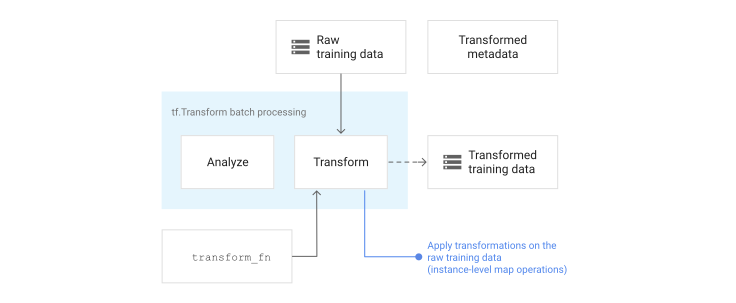
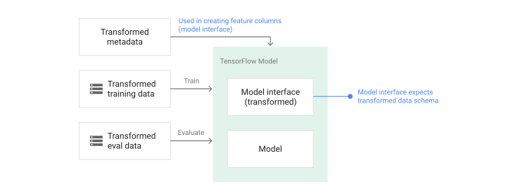

# Data preprocessing for ML with Google Cloud

This tutorial shows you how to use
[TensorFlow Transform](https://github.com/tensorflow/transform){: .external}
(the `tf.Transform` library) to implement data preprocessing for machine
learning (ML). The `tf.Transform` library for TensorFlow lets you
define both instance-level and full-pass data transformations through data
preprocessing pipelines. These pipelines are efficiently executed with
[Apache Beam](https://beam.apache.org/){: .external}
and they create as byproducts a TensorFlow graph to apply the
same transformations during prediction as when the model is served.

This tutorial provides an end-to-end example using
[Dataflow](https://cloud.google.com/dataflow/docs)
as a runner for Apache Beam. It assumes that you're familiar with
[BigQuery](https://cloud.google.com/bigquery/docs),
Dataflow,
[Vertex AI](https://cloud.google.com/vertex-ai/docs/start/introduction-unified-platform),
and the TensorFlow
[Keras](https://www.tensorflow.org/guide/keras/overview)
API. It also assumes that you have some experience using Jupyter Notebooks, such
as with
[Vertex AI Workbench](https://cloud.google.com/vertex-ai/docs/workbench/introduction).

This tutorial also assumes that you're familiar with the concepts of
preprocessing types, challenges, and options on Google Cloud, as described in
[Data preprocessing for ML: options and recommendations](../../guide/tft_bestpractices).

## Objectives

*   Implement the Apache Beam pipeline using the `tf.Transform` library.
*   Run the pipeline in Dataflow.
*   Implement the TensorFlow model using the `tf.Transform`
    library.
*   Train and use the model for predictions.

## Costs

This tutorial uses the following billable components of Google Cloud:

* [Vertex AI](https://cloud.google.com/vertex-ai/pricing){: .external}
* [Cloud Storage](https://cloud.google.com/storage/pricing){: .external}
* [BigQuery](https://cloud.google.com/bigquery/pricing){: .external}
* [Dataflow](https://cloud.google.com/dataflow/pricing){: .external}

<!-- This doc uses plain text cost information because the pricing calculator is pre-configured -->

To estimate the cost to run this tutorial, please refer to
[pricing calculator](https://cloud.google.com/products/calculator).


## Before you begin

1. In the Google Cloud console, on the project selector page, select or
  [create a Google Cloud project](https://cloud.google.com/resource-manager/docs/creating-managing-projects).

    !!! Note
        If you don't plan to keep the resources that you create in this
        procedure, create a project instead of selecting an existing project.
        After you finish these steps, you can delete the project, removing all
        resources associated with the project.

  [Go to project selector](https://console.cloud.google.com/projectselector2/home/dashboard){ .md-button .md-button--primary }

2. Make sure that billing is enabled for your Cloud project. Learn how to
  [check if billing is enabled on a project](https://cloud.google.com/billing/docs/how-to/verify-billing-enabled).

3. Enable the Dataflow, Vertex AI, and Notebooks APIs.

  [Enable the APIs](https://console.cloud.google.com/flows/enableapi?apiid=dataflow,aiplatform.googleapis.com,notebooks.googleapis.com){ .md-button .md-button--primary }

## Jupyter notebooks for this solution

The following Jupyter notebooks show the implementation example:

*   [Notebook 1](https://github.com/GoogleCloudPlatform/training-data-analyst/blob/master/blogs/babyweight_tft/babyweight_tft_keras_01.ipynb)
    covers data preprocessing. Details are provided in the
    [Implementing the Apache Beam pipeline](#implement-the-apache-beam-pipeline)
    section later.
*   [Notebook 2](https://github.com/GoogleCloudPlatform/training-data-analyst/blob/master/blogs/babyweight_tft/babyweight_tft_keras_02.ipynb)
    covers model training. Details are provided in the
    [Implementing the TensorFlow model](#implement-the-tensorflow-model)
    section later.

In the following sections, you clone these notebooks, and then you execute the
notebooks to learn how the implementation example works.

## Launch a user-managed notebooks instance

1.  In the Google Cloud console, go to the **Vertex AI Workbench** page.

    [Go to Workbench](https://console.cloud.google.com/ai-platform/notebooks/list/instances){ .md-button .md-button--primary }

1.  On the **User-managed notebooks** tab, click **+New notebook**.
1.  Select **TensorFlow Enterprise 2.8 (with LTS) without GPUs** for the
    instance type.
1.  Click **Create**.

After you create the notebook, wait for the proxy to JupyterLab to finish
initializing. When it's ready, **Open JupyterLab** is displayed next to the
notebook name.

## Clone the notebook

1.  On the **User-managed notebooks tab**, next to the notebook name, click
    **Open JupyterLab**. The JupyterLab interface opens in a new tab.

    If the JupyterLab displays a **Build Recommended** dialog, click
    **Cancel** to reject the suggested build.
1.  On the **Launcher** tab, click **Terminal**.
1.  In the terminal window, clone the notebook:

    ```sh
    git clone https://github.com/GoogleCloudPlatform/training-data-analyst
    ```

## Implement the Apache Beam pipeline

This section and the next section
[Run the pipeline in Dataflow](#run-the-pipeline-in-dataflow)
provide an overview and context for Notebook 1. The notebook provides a
practical example to describe how to use the `tf.Transform` library to
preprocess data. This example uses the Natality dataset, which is used to
predict baby weights based on various inputs. The data is stored in the public
[natality](https://console.cloud.google.com/bigquery?p=bigquery-public-data&amp;d=samples&amp;t=natality&amp;page=table&amp;_ga=2.267763789.2122871960.1676620306-376763843.1676620306)
table in BigQuery.

### Run Notebook 1

1.  In the JupyterLab interface, click **File > Open from path**, and
    then enter the following path:

    ```sh
    training-data-analyst/blogs/babyweight_tft/babyweight_tft_keras_01.ipynb
    ```

1.  Click **Edit > Clear all outputs**.
1.  In the **Install required packages** section, execute the first cell to
    run the `pip install apache-beam` command.

    The last part of the output is the following:

    ``` {.no-copy }
    Successfully installed ...
    ```

    You can ignore dependency errors in the output. You don't need to restart
    the kernel yet.

1.  Execute the second cell to run the `pip install tensorflow-transform
    `command. The last part of the output is the following:

    ``` { .no-copy }
    Successfully installed ...
    Note: you may need to restart the kernel to use updated packages.
    ```

    You can ignore dependency errors in the output.

1.  Click **Kernel > Restart Kernel**.
1.  Execute the cells in the **Confirm the installed packages** and **Create
    setup.py to install packages to Dataflow containers** sections.
1.  In the **Set global flags** section, next to `PROJECT` and `BUCKET`, replace
    `your-project` with your Cloud project ID, and
    then execute the cell.
1.  Execute all of the remaining cells through the last cell in the notebook.
    For information about what to do in each cell, see the instructions in the
    notebook.

### Overview of the pipeline

In the notebook example, Dataflow runs the `tf.Transform`
pipeline at scale to prepare the data and produce the transformation artifacts.
Later sections in this document describe the functions that perform each step in
the pipeline. The overall pipeline steps are as follows:

1.  Read training data from BigQuery.
1.  Analyze and transform training data using the `tf.Transform` library.
1.  Write transformed training data to Cloud Storage in the
    [TFRecord](https://www.tensorflow.org/tutorials/load_data/tfrecord)
    format.
1.  Read evaluation data from BigQuery.
1.  Transform evaluation data using the `transform_fn` graph produced by step 2.
1.  Write transformed training data to Cloud Storage in the
    TFRecord format.
1.  Write transformation artifacts to Cloud Storage that will be used
    later for creating and exporting the model.

The following example shows the Python code for the overall pipeline. The
sections that follow provide explanations and code listings for each step.

``` { .py .yaml .no-copy }
def run_transformation_pipeline(args):

    pipeline_options = beam.pipeline.PipelineOptions(flags=[], **args)

    runner = args['runner']
    data_size = args['data_size']
    transformed_data_location = args['transformed_data_location']
    transform_artefact_location = args['transform_artefact_location']
    temporary_dir = args['temporary_dir']
    debug = args['debug']

    # Instantiate the pipeline
    with beam.Pipeline(runner, options=pipeline_options) as pipeline:
        with impl.Context(temporary_dir):

            # Preprocess train data
            step = 'train'
            # Read raw train data from BigQuery
            raw_train_dataset = read_from_bq(pipeline, step, data_size)
            # Analyze and transform raw_train_dataset
            transformed_train_dataset, transform_fn = analyze_and_transform(raw_train_dataset, step)
            # Write transformed train data to sink as tfrecords
            write_tfrecords(transformed_train_dataset, transformed_data_location, step)

            # Preprocess evaluation data
            step = 'eval'
            # Read raw eval data from BigQuery
            raw_eval_dataset = read_from_bq(pipeline, step, data_size)
            # Transform eval data based on produced transform_fn
            transformed_eval_dataset = transform(raw_eval_dataset, transform_fn, step)
            # Write transformed eval data to sink as tfrecords
            write_tfrecords(transformed_eval_dataset, transformed_data_location, step)

            # Write transformation artefacts
            write_transform_artefacts(transform_fn, transform_artefact_location)

            # (Optional) for debugging, write transformed data as text
            step = 'debug'
            # Write transformed train data as text if debug enabled
            if debug == True:
                write_text(transformed_train_dataset, transformed_data_location, step)
```

### Read raw training data from BigQuery

The first step is to read the raw training data from BigQuery
using the `read_from_bq` function. This function returns a `raw_dataset` object
that is extracted from BigQuery. You pass a `data_size` value and
pass a `step` value of `train` or `eval`. The BigQuery source
query is constructed using the `get_source_query` function, as shown in the
following example:

``` { .py .yaml .no-copy }
def read_from_bq(pipeline, step, data_size):

    source_query = get_source_query(step, data_size)
    raw_data = (
        pipeline
        | '{} - Read Data from BigQuery'.format(step) >> beam.io.Read(
                           beam.io.BigQuerySource(query=source_query, use_standard_sql=True))
        | '{} - Clean up Data'.format(step) >> beam.Map(prep_bq_row)
    )

    raw_metadata = create_raw_metadata()
    raw_dataset = (raw_data, raw_metadata)
    return raw_dataset
```

Before you perform the `tf.Transform` preprocessing, you might need to perform
typical Apache Beam-based processing, including Map, Filter, Group, and Window
processing. In the example, the code cleans the records read from
BigQuery using the `beam.Map(prep_bq_row)` method, where
`prep_bq_row` is a custom function. This custom function converts the numeric
code for a categorical feature into human-readable labels.

In addition, to use the `tf.Transform` library to analyze and transform the
`raw_data` object extracted from BigQuery, you need to create a
`raw_dataset` object, which is a tuple of `raw_data` and `raw_metadata` objects.
The `raw_metadata` object is created using the `create_raw_metadata` function,
as follows:

``` { .py .yaml .no-copy }
CATEGORICAL_FEATURE_NAMES = ['is_male', 'mother_race']
NUMERIC_FEATURE_NAMES = ['mother_age', 'plurality', 'gestation_weeks']
TARGET_FEATURE_NAME = 'weight_pounds'

def create_raw_metadata():

    feature_spec = dict(
        [(name, tf.io.FixedLenFeature([], tf.string)) for name in CATEGORICAL_FEATURE_NAMES] +
        [(name, tf.io.FixedLenFeature([], tf.float32)) for name in NUMERIC_FEATURE_NAMES] +
        [(TARGET_FEATURE_NAME, tf.io.FixedLenFeature([], tf.float32))])

    raw_metadata = dataset_metadata.DatasetMetadata(
        schema_utils.schema_from_feature_spec(feature_spec))

    return raw_metadata
```

When you execute the cell in the notebook that immediately follows the cell that
defines this method, the content of the `raw_metadata.schema` object is
displayed. It includes the following columns:

-   `gestation_weeks` (type: `FLOAT`)
-   `is_male` (type: `BYTES`)
-   `mother_age` (type: `FLOAT`)
-   `mother_race` (type: `BYTES`)
-   `plurality` (type: `FLOAT`)
-   `weight_pounds` (type: `FLOAT`)

### Transform raw training data

Imagine that you want to apply typical preprocessing transformations to the
input raw features of the training data in order to prepare it for ML. These
transformations include both full-pass and instance-level operations, as shown
in the following table:

 | Input feature       | Transformation                                | Stats needed   | Type             | Output feature
 | ------------------- | --------------------------------------------- | -------------- | ---------------- | -------------------------- |
 | `weight_pound`      | None                                          | None           | NA               | `weight_pound`             |
 | `mother_age`        | Normalize                                     | mean, var      | Full-pass        | `mother_age_normalized`    |
 | `mother_age`        | Equal size bucketization                      | quantiles      | Full-pass        | `mother_age_bucketized`    |
 | `mother_age`        | Compute the log                               | None           | Instance-level   | `mother_age_log`           |
 | `plurality`         | Indicate if it is single or multiple babies   | None           | Instance-level   | `is_multiple`              |
 | `is_multiple`       | Convert nominal values to numerical index     | vocab          | Full-pass        | `is_multiple_index`        |
 | `gestation_weeks`   | Scale between 0 and 1                         | min, max       | Full-pass        | `gestation_weeks_scaled`   |
 | `mother_race`       | Convert nominal values to numerical index     | vocab          | Full-pass        | `mother_race_index`        |
 | `is_male`           | Convert nominal values to numerical index     | vocab          | Full-pass        | `is_male_index`            |

These transformations are implemented in a `preprocess_fn` function, which
expects a dictionary of tensors (`input_features`) and returns a dictionary of
processed features (`output_features`).

The following code shows the implementation of the `preprocess_fn` function,
using the `tf.Transform` full-pass transformation APIs (prefixed with `tft.`),
and TensorFlow (prefixed with `tf.`) instance-level operations:

``` { .py .yaml .no-copy }
def preprocess_fn(input_features):

    output_features = {}

    # target feature
    output_features['weight_pounds'] = input_features['weight_pounds']

    # normalization
    output_features['mother_age_normalized'] = tft.scale_to_z_score(input_features['mother_age'])

    # scaling
    output_features['gestation_weeks_scaled'] =  tft.scale_to_0_1(input_features['gestation_weeks'])

    # bucketization based on quantiles
    output_features['mother_age_bucketized'] = tft.bucketize(input_features['mother_age'], num_buckets=5)

    # you can compute new features based on custom formulas
    output_features['mother_age_log'] = tf.math.log(input_features['mother_age'])

    # or create flags/indicators
    is_multiple = tf.as_string(input_features['plurality'] > tf.constant(1.0))

    # convert categorical features to indexed vocab
    output_features['mother_race_index'] = tft.compute_and_apply_vocabulary(input_features['mother_race'], vocab_filename='mother_race')
    output_features['is_male_index'] = tft.compute_and_apply_vocabulary(input_features['is_male'], vocab_filename='is_male')
    output_features['is_multiple_index'] = tft.compute_and_apply_vocabulary(is_multiple, vocab_filename='is_multiple')

    return output_features
```

The `tf.Transform`
[framework](https://github.com/tensorflow/transform)
has several other transformations in addition to those in the preceding example,
including those listed in the following table:

 | Transformation                   | Applies to             | Description                                                                                              |
 | -------------------------------- | ---------------------- | -------------------------------------------------------------------------------------------------------- |
 | `scale_by_min_max`               | Numeric features       | Scales a numerical column into the range \[`output_min`, `output_max`\]                                  |
 | `scale_to_0_1`                   | Numeric features       | Returns a column which is the input column scaled to have range \[`0`,`1`\]                              |
 | `scale_to_z_score`               | Numeric features       | Returns a standardized column with mean 0 and variance 1                                                 |
 | `tfidf`                          | Text features          | Maps the terms in *x* to their term frequency \* inverse document frequency                              |
 | `compute_and_apply_vocabulary`   | Categorical features   | Generates a vocabulary for a categorical feature and maps it to an integer with this vocab               |
 | `ngrams`                         | Text features          | Creates a `SparseTensor` of n-grams                                                                      |
 | `hash_strings`                   | Categorical features   | Hashes strings into buckets                                                                              |
 | `pca`                            | Numeric features       | Computes PCA on the dataset using biased covariance                                                      |
 | `bucketize`                      | Numeric features       | Returns an equal-sized (quantiles-based) bucketized column, with a bucket index assigned to each input   |


In order to apply the transformations implemented in the `preprocess_fn`
function to the `raw_train_dataset` object produced in the previous step of the
pipeline, you use the `AnalyzeAndTransformDataset` method. This method expects
the `raw_dataset` object as input, applies the `preprocess_fn` function, and it
produces the `transformed_dataset` object and the `transform_fn` graph. The
following code illustrates this processing:

``` { .py .yaml .no-copy }
def analyze_and_transform(raw_dataset, step):

    transformed_dataset, transform_fn = (
        raw_dataset
        | '{} - Analyze & Transform'.format(step) >> tft_beam.AnalyzeAndTransformDataset(
            preprocess_fn, output_record_batches=True)
    )

    return transformed_dataset, transform_fn
```

The transformations are applied on the raw data in two phases: the analyze
phase and the transform phase. Figure 3 later in this document shows how the
`AnalyzeAndTransformDataset` method is decomposed to the `AnalyzeDataset` method
and the `TransformDataset` method.

#### The analyze phase

In the analyze phase, the raw training data is analyzed in a full-pass process
to compute the statistics that are needed for the transformations. This includes
computing the mean, variance, minimum, maximum, quantiles, and vocabulary. The
analyze process expects a raw dataset (raw data plus raw metadata), and it
produces two outputs:

-   `transform_fn`: a TensorFlow graph that contains the
    computed stats from the analyze phase and the transformation logic (which
    uses the stats) as instance-level operations. As discussed later in
    [Save the graph](#save-the-graph),
    the `transform_fn` graph is saved to be attached to the model `serving_fn`
    function. This makes it possible to apply the same transformation to the
    online prediction data points.
-   `transform_metadata`: an object that describes the expected schema of
    the data after transformation.

The analyze phase is illustrated in the following diagram, figure 1:

Figure: The `tf.Transform` analyze phase. { #tf-transform-analyze-phase }


The `tf.Transform`
[analyzers](https://github.com/tensorflow/transform/blob/master/tensorflow_transform/beam/analyzer_impls.py)
include `min`, `max`, `sum`, `size`, `mean`, `var`, `covariance`, `quantiles`,
`vocabulary`, and `pca`.

#### The transform phase

In the transform phase, the `transform_fn` graph that's produced by the analyze
phase is used to transform the raw training data in an instance-level process in
order to produce the transformed training data. The transformed training data is
paired with the transformed metadata (produced by the analyze phase) to produce
the `transformed_train_dataset` dataset.

The transform phase is illustrated in the following diagram, figure 2:

Figure: The `tf.Transform` transform phase. { #tf-transform-transform-phase }



To preprocess the features, you call the required `tensorflow_transform`
transformations (imported as `tft` in the code) in your implementation of the
`preprocess_fn` function. For example, when you call the `tft.scale_to_z_score`
operations, the `tf.Transform` library translates this function call into mean
and variance analyzers, computes the stats in the analyze phase, and then
applies these stats to normalize the numeric feature in the transform phase.
This is all done automatically by calling the
`AnalyzeAndTransformDataset(preprocess_fn)` method.

The `transformed_metadata.schema` entity produced by this call includes the
following columns:

-   `gestation_weeks_scaled` (type: `FLOAT`)
-   `is_male_index` (type: `INT`, is_categorical: `True`)
-   `is_multiple_index` (type: `INT`, is_categorical: `True`)
-   `mother_age_bucketized` (type: `INT`, is_categorical: `True`)
-   `mother_age_log` (type: `FLOAT`)
-   `mother_age_normalized` (type: `FLOAT`)
-   `mother_race_index` (type: `INT`, is_categorical: `True`)
-   `weight_pounds` (type: `FLOAT`)

As explained in
[Preprocessing operations](../data-preprocessing-for-ml-with-tf-transform-pt1#preprocessing-operations)
in the first part of this series, the feature transformation converts
categorical features to a numeric representation. After the transformation, the
categorical features are represented by integer values. In the
`transformed_metadata.schema` entity, the `is_categorical` flag for `INT` type
columns indicates whether the column represents a categorical feature or a true
numeric feature.

### Write transformed training data

After the training data is preprocessed with the `preprocess_fn` function
through the analyze and transform phases, you can write the data to a sink to be
used for training the TensorFlow model. When you execute the Apache
Beam pipeline using Dataflow, the sink is Cloud Storage.
Otherwise, the sink is the local disk. Although you can write the data as a CSV
file of fixed-width formatted files, the recommended file format for
TensorFlow datasets is the TFRecord format. This is a simple
record-oriented binary format that consists of
`tf.train.Example` protocol buffer messages.

Each `tf.train.Example` record contains one or more features. These are
converted into tensors when they are fed to the model for training. The
following code writes the transformed dataset to TFRecord files in the specified
location:

``` { .py .yaml .no-copy }
def write_tfrecords(transformed_dataset, location, step):
    from tfx_bsl.coders import example_coder

    transformed_data, transformed_metadata = transformed_dataset
    (
        transformed_data
        | '{} - Encode Transformed Data'.format(step) >> beam.FlatMapTuple(
                            lambda batch, _: example_coder.RecordBatchToExamples(batch))
        | '{} - Write Transformed Data'.format(step) >> beam.io.WriteToTFRecord(
                            file_path_prefix=os.path.join(location,'{}'.format(step)),
                            file_name_suffix='.tfrecords')
    )
```

### Read, transform, and write evaluation data

After you transform the training data and produce the `transform_fn` graph, you
can use it to transform the evaluation data. First, you read and clean the
evaluation data from BigQuery using the `read_from_bq` function
described earlier in
[Read raw training data from BigQuery](#read-raw-training-data-from-bigquery),
and passing a value of `eval` for the `step` parameter. Then, you use the
following code to transform the raw evaluation dataset (`raw_dataset`) to the
expected transformed format (`transformed_dataset`):

``` { .py .yaml .no-copy }
def transform(raw_dataset, transform_fn, step):

    transformed_dataset = (
        (raw_dataset, transform_fn)
        | '{} - Transform'.format(step) >> tft_beam.TransformDataset(output_record_batches=True)
    )

    return transformed_dataset
```

When you transform the evaluation data, only instance-level operations apply,
using both the logic in the `transform_fn` graph and the statistics computed
from the analyze phase in the training data. In other words, you don't analyze
the evaluation data in a full-pass fashion to compute new statistics, like the
mean and the variance for z-score normalization of numeric features in
evaluation data. Instead, you use the computed statistics from the training data
to transform the evaluation data in an instance-level fashion.

Therefore, you use the `AnalyzeAndTransform` method in the context of training
data to compute the statistics and transform the data. At the same time, you use
the `TransformDataset` method in the context of transforming evaluation data to
only transform the data using the statistics computed on the training data.

You then write the data to a sink (Cloud Storage or local disk,
depending on the runner) in the TFRecord format for evaluating the
TensorFlow model during the training process. To do this, you use
the `write_tfrecords` function that's discussed in
[Write transformed training data](#write-transformed-training-data).
The following diagram, figure 3, shows how the `transform_fn` graph that's
produced in the analyze phase of the training data is used to transform the
evaluation data.

Figure: Transforming evaluation data using the `transform_fn` graph. { #transform-eval-data-using-transform-fn }


### Save the graph

A final step in the `tf.Transform` preprocessing pipeline is to store the
artifacts, which includes the `transform_fn` graph that's produced by the
analyze phase on the training data. The code for storing the artifacts is shown
in the following `write_transform_artefacts` function:

``` { .py .yaml .no-copy }
def write_transform_artefacts(transform_fn, location):

    (
        transform_fn
        | 'Write Transform Artifacts' >> transform_fn_io.WriteTransformFn(location)
    )
```

These artifacts will be used later for model training and exporting for serving.
The following artifacts are also produced, as shown in the next section:

-   `saved_model.pb`: represents the TensorFlow graph
    that includes the transformation logic (the `transform_fn` graph), which is
    to be attached to the model serving interface to transform the raw data
    points to the transformed format.
-   `variables`: includes the statistics computed during the analyze
    phase of the training data, and is used in the transformation logic in the
    `saved_model.pb` artifact.
-   `assets`: includes vocabulary files, one for each categorical feature
    processed with the `compute_and_apply_vocabulary` method, to be used
    during serving to convert an input raw nominal value to a numerical index.
-   `transformed_metadata`: a directory that contains the `schema.json` file
    that describes the schema of the transformed data.

## Run the pipeline in Dataflow

After you define the `tf.Transform` pipeline, you run the pipeline using
Dataflow. The following diagram, figure 4, shows the
Dataflow execution graph of the `tf.Transform` pipeline described
in the example.

Figure: Dataflow execution graph of the `tf.Transform` pipeline. { #dataflow-execution-graph }


After you execute the Dataflow pipeline to preprocess the
training and evaluation data, you can explore the produced objects in
Cloud Storage by executing the last cell in the notebook. The code
snippets in this section show the results, where
<var>`YOUR_BUCKET_NAME`</var> is the name of your Cloud Storage
bucket.

The transformed training and evaluation data in TFRecord format are stored at
the following location:

``` { .yaml .no-copy }
gs://YOUR_BUCKET_NAME/babyweight_tft/transformed
```

The transform artifacts are produced at the following location:

``` { .yaml .no-copy }
gs://YOUR_BUCKET_NAME/babyweight_tft/transform
```

The following list is the output of the pipeline, showing the produced data
objects and artifacts:

``` { .yaml .no-copy }
transformed data:
gs://YOUR_BUCKET_NAME/babyweight_tft/transformed/eval-00000-of-00001.tfrecords
gs://YOUR_BUCKET_NAME/babyweight_tft/transformed/train-00000-of-00002.tfrecords
gs://YOUR_BUCKET_NAME/babyweight_tft/transformed/train-00001-of-00002.tfrecords

transformed metadata:
gs://YOUR_BUCKET_NAME/babyweight_tft/transform/transformed_metadata/
gs://YOUR_BUCKET_NAME/babyweight_tft/transform/transformed_metadata/asset_map
gs://YOUR_BUCKET_NAME/babyweight_tft/transform/transformed_metadata/schema.pbtxt

transform artefact:
gs://YOUR_BUCKET_NAME/babyweight_tft/transform/transform_fn/
gs://YOUR_BUCKET_NAME/babyweight_tft/transform/transform_fn/saved_model.pb
gs://YOUR_BUCKET_NAME/babyweight_tft/transform/transform_fn/assets/
gs://YOUR_BUCKET_NAME/babyweight_tft/transform/transform_fn/variables/

transform assets:
gs://YOUR_BUCKET_NAME/babyweight_tft/transform/transform_fn/assets/
gs://YOUR_BUCKET_NAME/babyweight_tft/transform/transform_fn/assets/is_male
gs://YOUR_BUCKET_NAME/babyweight_tft/transform/transform_fn/assets/is_multiple
gs://YOUR_BUCKET_NAME/babyweight_tft/transform/transform_fn/assets/mother_race
```

## Implement the TensorFlow model

This section and the next section,
[Train and use the model for predictions](#train-and-use-the-model-for-predictions),
provide an overview and context for Notebook 2. The notebook provides
an example ML model to predict baby weights. In this example, a
TensorFlow model is implemented using the Keras API. The model
uses the data and artifacts that are produced by the `tf.Transform`
preprocessing pipeline explained earlier.

### Run Notebook 2

1.  In the JupyterLab interface, click **File > Open from path**, and then
    enter the following path:

    ```sh
    training-data-analyst/blogs/babyweight_tft/babyweight_tft_keras_02.ipynb
    ```

1.  Click **Edit > Clear all outputs**.
1.  In the **Install required packages** section, execute the first cell to run
    the `pip install tensorflow-transform` command.

    The last part of the output is the following:

    ``` { .yaml .no-copy }
    Successfully installed ...
    Note: you may need to restart the kernel to use updated packages.
    ```

    You can ignore dependency errors in the output.

1.  In the **Kernel** menu, select **Restart Kernel**.
1.  Execute the cells in the **Confirm the installed packages** and **Create
    setup.py to install packages to Dataflow containers** sections.
1.  In the **Set global flags** section, next to `PROJECT` and `BUCKET`, replace
    <var>`your-project`</var> with your Cloud project ID, and
    then execute the cell.
1.  Execute all of the remaining cells through the last cell in the notebook.
    For information about what to do in each cell, see the instructions in the
    notebook.

### Overview of the model creation

The steps for creating the model are as follows:

1.  Create feature columns using the schema information that is stored in the
    `transformed_metadata` directory.
1.  Create the wide and deep model with the Keras API using the feature
    columns as input to the model.
1.  Create the `tfrecords_input_fn` function to read and parse the training
    and evaluation data using the transform artifacts.
1.  Train and evaluate the model.
1.  Export the trained model by defining a `serving_fn` function that has the
    `transform_fn` graph attached to it.
1.  Inspect the exported model using the
    [`saved_model_cli`](https://www.tensorflow.org/guide/saved_model)
    tool.
1.  Use the exported model for prediction.

This document doesn't explain how to build the model, so it doesn't discuss in
detail how the model was built or trained. However, the following sections show
how the information stored in the `transform_metadata` directory—which is
produced by the `tf.Transform` process—is used to create the feature columns of
the model. The document also shows how the `transform_fn` graph—which is also
produced by `tf.Transform` process—is used in the `serving_fn` function when the
model is exported for serving.

### Use the generated transform artifacts in model training

When you train the TensorFlow model, you use the transformed
`train` and `eval` objects produced in the previous data processing step. These
objects are stored as sharded files in the TFRecord format. The schema
information in the `transformed_metadata` directory generated in the previous
step can be useful in parsing the data (`tf.train.Example` objects) to feed into
the model for training and evaluation.

#### Parse the data

Because you read files in the TFRecord format to feed the model with training
and evaluation data, you need to parse each `tf.train.Example` object in the
files to create a dictionary of features (tensors). This ensures that the
features are mapped to the model input layer using the feature columns, which
act as the model training and evaluation interface. To parse the data, you use
the `TFTransformOutput` object that is created from the artifacts generated in
the previous step:

1.  Create a `TFTransformOutput` object from the artifacts that are generated
    and saved in the previous preprocessing step, as described in the
    [Save the graph](#save-the-graph)
    section:

    ```py
    tf_transform_output = tft.TFTransformOutput(TRANSFORM_ARTEFACTS_DIR)
    ```

1.  Extract a `feature_spec` object from the `TFTransformOutput` object:

    ```py
    tf_transform_output.transformed_feature_spec()
    ```

1.  Use the `feature_spec` object to specify the features contained in the
    `tf.train.Example` object as in the `tfrecords_input_fn` function:

    ```py
    def tfrecords_input_fn(files_name_pattern, batch_size=512):

        tf_transform_output = tft.TFTransformOutput(TRANSFORM_ARTEFACTS_DIR)
        TARGET_FEATURE_NAME = 'weight_pounds'

        batched_dataset = tf.data.experimental.make_batched_features_dataset(
            file_pattern=files_name_pattern,
            batch_size=batch_size,
            features=tf_transform_output.transformed_feature_spec(),
            reader=tf.data.TFRecordDataset,
            label_key=TARGET_FEATURE_NAME,
            shuffle=True).prefetch(tf.data.experimental.AUTOTUNE)

        return batched_dataset
    ```

#### Create the feature columns

The pipeline produces the schema information in the `transformed_metadata`
directory that describes the schema of the transformed data that is expected by
the model for training and evaluation. The schema contains the feature name and
data type, such as the following:

-   `gestation_weeks_scaled` (type: `FLOAT`)
-   `is_male_index` (type: `INT`, is_categorical: `True`)
-   `is_multiple_index` (type: `INT`, is_categorical: `True`)
-   `mother_age_bucketized` (type: `INT`, is_categorical: `True`)
-   `mother_age_log` (type: `FLOAT`)
-   `mother_age_normalized` (type: `FLOAT`)
-   `mother_race_index` (type: `INT`, is_categorical: `True`)
-   `weight_pounds` (type: `FLOAT`)

To see this information, use the following commands:

```sh
transformed_metadata = tft.TFTransformOutput(TRANSFORM_ARTEFACTS_DIR).transformed_metadata
transformed_metadata.schema
```

The following code shows how you use the feature name to create feature columns:

```py
def create_wide_and_deep_feature_columns():

    deep_feature_columns = []
    wide_feature_columns = []
    inputs = {}
    categorical_columns = {}

    # Select features you've checked from the metadata
    # Categorical features are associated with the vocabulary size (starting from 0)
    numeric_features = ['mother_age_log', 'mother_age_normalized', 'gestation_weeks_scaled']
    categorical_features = [('is_male_index', 1), ('is_multiple_index', 1),
                            ('mother_age_bucketized', 4), ('mother_race_index', 10)]

    for feature in numeric_features:
        deep_feature_columns.append(tf.feature_column.numeric_column(feature))
        inputs[feature] = layers.Input(shape=(), name=feature, dtype='float32')

    for feature, vocab_size in categorical_features:
        categorical_columns[feature] = (
            tf.feature_column.categorical_column_with_identity(feature, num_buckets=vocab_size+1))
        wide_feature_columns.append(tf.feature_column.indicator_column(categorical_columns[feature]))
        inputs[feature] = layers.Input(shape=(), name=feature, dtype='int64')

    mother_race_X_mother_age_bucketized = tf.feature_column.crossed_column(
        [categorical_columns['mother_age_bucketized'],
         categorical_columns['mother_race_index']],  55)
    wide_feature_columns.append(tf.feature_column.indicator_column(mother_race_X_mother_age_bucketized))

    mother_race_X_mother_age_bucketized_embedded = tf.feature_column.embedding_column(
        mother_race_X_mother_age_bucketized, 5)
    deep_feature_columns.append(mother_race_X_mother_age_bucketized_embedded)

    return wide_feature_columns, deep_feature_columns, inputs
```

The code creates a `tf.feature_column.numeric_column` column for numeric
features, and a `tf.feature_column.categorical_column_with_identity` column for
categorical features.

You can also create extended feature columns, as described in
[Option C: TensorFlow](../../../guide/tft_bestpractices#option-c-tensorflow)
in the first part of this series. In the example used for this series, a new
feature is created, `mother_race_X_mother_age_bucketized`, by crossing the
`mother_race` and `mother_age_bucketized` features using the
`tf.feature_column.crossed_column` feature column. Low-dimensional, dense
representation of this crossed feature is created using the
`tf.feature_column.embedding_column` feature column.

The following diagram, figure 5, shows the transformed data and how the
transformed metadata is used to define and train the TensorFlow
model:

Figure: Training the TensorFlow model with the transformed data. { #training-tf-with-transformed-data }



### Export the model for serving prediction

After you train the TensorFlow model with the Keras API, you
export the trained model as a SavedModel object, so that it can serve new data
points for prediction. When you export the model, you have to define its
interface—that is, the input features schema that is expected during serving.
This input features schema is defined in the `serving_fn` function, as shown in
the following code:

``` { .py .yaml .no-copy }
def export_serving_model(model, output_dir):

    tf_transform_output = tft.TFTransformOutput(TRANSFORM_ARTEFACTS_DIR)
    # The layer has to be saved to the model for Keras tracking purposes.
    model.tft_layer = tf_transform_output.transform_features_layer()

    @tf.function
    def serveing_fn(uid, is_male, mother_race, mother_age, plurality, gestation_weeks):
        features = {
            'is_male': is_male,
            'mother_race': mother_race,
            'mother_age': mother_age,
            'plurality': plurality,
            'gestation_weeks': gestation_weeks
        }
        transformed_features = model.tft_layer(features)
        outputs = model(transformed_features)
        # The prediction results have multiple elements in general.
        # But we need only the first element in our case.
        outputs = tf.map_fn(lambda item: item[0], outputs)

        return {'uid': uid, 'weight': outputs}

    concrete_serving_fn = serveing_fn.get_concrete_function(
        tf.TensorSpec(shape=[None], dtype=tf.string, name='uid'),
        tf.TensorSpec(shape=[None], dtype=tf.string, name='is_male'),
        tf.TensorSpec(shape=[None], dtype=tf.string, name='mother_race'),
        tf.TensorSpec(shape=[None], dtype=tf.float32, name='mother_age'),
        tf.TensorSpec(shape=[None], dtype=tf.float32, name='plurality'),
        tf.TensorSpec(shape=[None], dtype=tf.float32, name='gestation_weeks')
    )
    signatures = {'serving_default': concrete_serving_fn}

    model.save(output_dir, save_format='tf', signatures=signatures)
```

During serving, the model expects the data points in their raw form (that is,
raw features before transformations). Therefore, the `serving_fn` function
receives the raw features and stores them in a `features` object as a Python
dictionary. However, as discussed earlier, the trained model expects the data
points in the transformed schema. To convert the raw features into the
`transformed_features` objects that are expected by the model interface, you
apply the saved `transform_fn` graph to the `features` object with the
following steps:

1.  Create the `TFTransformOutput` object from the artifacts generated and
    saved in the previous preprocessing step:

    ```py
    tf_transform_output = tft.TFTransformOutput(TRANSFORM_ARTEFACTS_DIR)
    ```

1.  Create a `TransformFeaturesLayer` object from the `TFTransformOutput`
    object:

    ```py
    model.tft_layer = tf_transform_output.transform_features_layer()
    ```

1.  Apply the `transform_fn` graph using the `TransformFeaturesLayer` object:

    ```py
    transformed_features = model.tft_layer(features)
    ```

The following diagram, figure 6, illustrates the final step of exporting a model
for serving:

Figure: Exporting the model for serving with the `transform_fn` graph attached. { #exporting-model-for-serving-with-transform_fn }


## Train and use the model for predictions

You can train the model locally by executing the cells of the notebook. For
examples of how to package the code and train your model at scale using
Vertex AI Training, see the samples and guides in the Google Cloud
[cloudml-samples](https://github.com/GoogleCloudPlatform/cloudml-samples)
GitHub repository.

When you inspect the exported SavedModel object using the `saved_model_cli`
tool, you see that the `inputs` elements of the signature definition
`signature_def` include the raw features, as shown in the following example:

``` { .py .yaml .no-copy }
signature_def['serving_default']:
  The given SavedModel SignatureDef contains the following input(s):
    inputs['gestation_weeks'] tensor_info:
        dtype: DT_FLOAT
        shape: (-1)
        name: serving_default_gestation_weeks:0
    inputs['is_male'] tensor_info:
        dtype: DT_STRING
        shape: (-1)
        name: serving_default_is_male:0
    inputs['mother_age'] tensor_info:
        dtype: DT_FLOAT
        shape: (-1)
        name: serving_default_mother_age:0
    inputs['mother_race'] tensor_info:
        dtype: DT_STRING
        shape: (-1)
        name: serving_default_mother_race:0
    inputs['plurality'] tensor_info:
        dtype: DT_FLOAT
        shape: (-1)
        name: serving_default_plurality:0
    inputs['uid'] tensor_info:
        dtype: DT_STRING
        shape: (-1)
        name: serving_default_uid:0
  The given SavedModel SignatureDef contains the following output(s):
    outputs['uid'] tensor_info:
        dtype: DT_STRING
        shape: (-1)
        name: StatefulPartitionedCall_6:0
    outputs['weight'] tensor_info:
        dtype: DT_FLOAT
        shape: (-1)
        name: StatefulPartitionedCall_6:1
  Method name is: tensorflow/serving/predict
```

The remaining cells of the notebook show you how to use the exported model for
a local prediction, and how to deploy the model as a microservice using
Vertex AI Prediction. It is important to highlight that the input (sample)
data point is in the raw schema in both cases.

## Clean up

To avoid incurring additional charges to your Google Cloud account for the
resources used in this tutorial, delete the project that contains the resources.

### Delete the project

!!! danger "Caution"

    Deleting a project has the following effects:

    - __Everything in the project is deleted.__ If you used an existing project for
      this tutorial, when you delete it, you also delete any other work you've done in the project.
    - __Custom project IDs are lost.__ When you created this project, you might have created a custom project ID that you want to use in the future. To preserve the URLs that use the project ID, such as an `appspot.com`{translate="no" dir="ltr"} URL, delete selected resources inside the project instead of deleting the whole project.

    If you plan to explore multiple tutorials and quickstarts, reusing projects can help you avoid exceeding project quota limits.

1. In the Google Cloud console,
   go to the **Manage resources** page.

   [Go to Manage resources](https://console.cloud.google.com/iam-admin/projects){ .md-button .md-button--primary }

1. In the project list, select the project that you want to delete, and then
   click **Delete**.
1. In the dialog, type the project ID, and then click **Shut down** to delete
   the project.

## What's next

-   To learn about the concepts, challenges, and options of data
    preprocessing for machine learning on Google Cloud, see the first
    article in this series,
    [Data preprocessing for ML: options and recommendations](../../../guide/tft_bestpractices).
-   For more information about how to implement, package, and run a
    tf.Transform pipeline on Dataflow, see the
    [Predicting income with Census Dataset](https://github.com/GoogleCloudPlatform/cloudml-samples/tree/master/census/tftransformestimator)
    sample.
-   Take the Coursera specialization on ML with
    [TensorFlow on Google Cloud](https://www.coursera.org/specializations/machine-learning-tensorflow-gcp).
-   Learn about best practices for ML engineering in
    [Rules of ML](https://developers.google.com/machine-learning/guides/rules-of-ml/).
-   For more reference architectures, diagrams, and best practices, explore the
    [Cloud Architecture Center](https://cloud.google.com/architecture).
