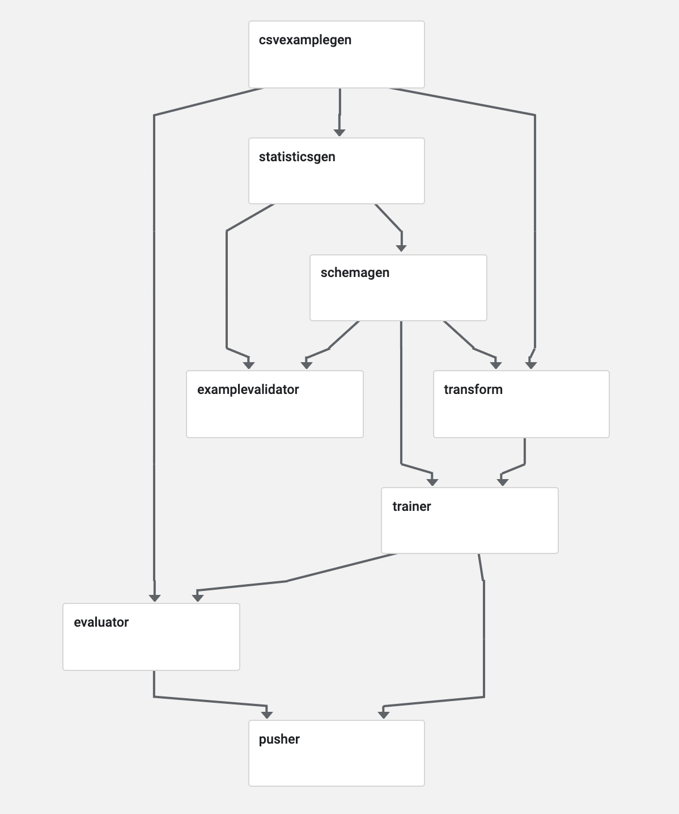

# Chicago Taxi Example

The Chicago Taxi example demonstrates the end-to-end workflow and the steps
required to analyze, validate, and transform data, train a model, analyze its
performance, and serve it. This example uses the following
[TFX](https://www.tensorflow.org/tfx) components:

* [ExampleGen](https://github.com/tensorflow/tfx/blob/master/docs/guide/examplegen.md)
  ingests and splits the input dataset.
* [StatisticsGen](https://github.com/tensorflow/tfx/blob/master/docs/guide/statsgen.md)
  calculates statistics for the dataset.
* [SchemaGen](https://github.com/tensorflow/tfx/blob/master/docs/guide/schemagen.md)
  examines the statistics and creates a data schema.
* [ExampleValidator](https://github.com/tensorflow/tfx/blob/master/docs/guide/exampleval.md)
  looks for anomalies and missing values in the dataset.
* [Transform](https://github.com/tensorflow/tfx/blob/master/docs/guide/transform.md)
  performs feature engineering on the dataset.
* [Trainer](https://github.com/tensorflow/tfx/blob/master/docs/guide/trainer.md)
  trains the model using TensorFlow [Estimators](https://www.tensorflow.org/guide/estimators)
  or [Keras](https://www.tensorflow.org/guide/keras).
* [Evaluator](https://github.com/tensorflow/tfx/blob/master/docs/guide/evaluator.md)
  performs deep analysis of the training results.
* [InfraValidator](https://github.com/tensorflow/tfx/blob/master/docs/guide/infra_validator.md)
  checks the model is actually servable from the infrastructure, and prevents
  bad model from being pushed.
* [Pusher](https://github.com/tensorflow/tfx/blob/master/docs/guide/pusher.md)
  deploys the model to a serving infrastructure.
* [BulkInferrer](https://github.com/tensorflow/tfx/blob/master/docs/guide/bulkinferrer.md)
  batch inference on the model with unlabelled examples.

Inference in the example is powered by:

* [TensorFlow Serving](https://www.tensorflow.org/serving) for serving.

## The dataset

This example uses the [Taxi Trips dataset](https://data.cityofchicago.org/Transportation/Taxi-Trips/wrvz-psew)
released by the City of Chicago.

Note: This site provides applications using data that has been modified
for use from its original source, www.cityofchicago.org, the official website of
the City of Chicago. The City of Chicago makes no claims as to the content,
accuracy, timeliness, or completeness of any of the data provided at this site.
The data provided at this site is subject to change at any time. It is
understood that the data provided at this site is being used at one’s own risk.

You can [read more](https://console.cloud.google.com/marketplace/details/city-of-chicago-public-data/chicago-taxi-trips)
about the dataset in [Google BigQuery](https://cloud.google.com/bigquery/).
Explore the full dataset in the
[BigQuery UI](https://bigquery.cloud.google.com/dataset/bigquery-public-data:chicago_taxi_trips).

## Local prerequisites

* [Apache Airflow](https://airflow.apache.org/) is used for pipeline orchestration.
* [Apache Beam](https://beam.apache.org/) is used for distributed processing.
* [TensorFlow](https://tensorflow.org) is used for model training, evaluation and inference.

### Install dependencies

Development for this example will be isolated in a Python virtual environment.
This allows us to experiment with different versions of dependencies.

There are many ways to install `virtualenv`, see the
[TensorFlow install guides](https://www.tensorflow.org/install) for different
platforms, but here are a couple:

* For Linux:

<pre class="devsite-terminal devsite-click-to-copy">
sudo apt-get install python-pip python-virtualenv python-dev build-essential
</pre>

* For Mac:

<pre class="devsite-terminal devsite-click-to-copy">
sudo easy_install pip
pip install --upgrade virtualenv
</pre>

Create a Python 3.6 virtual environment for this example and activate the
`virtualenv`:

<pre class="devsite-terminal devsite-click-to-copy">
virtualenv -p python3.6 taxi_pipeline
source ./taxi_pipeline/bin/activate
</pre>

Configure common paths:

<pre class="devsite-terminal devsite-click-to-copy">
export AIRFLOW_HOME=~/airflow
export TAXI_DIR=~/taxi
export TFX_DIR=~/tfx
</pre>

Next, install the dependencies required by the Chicago Taxi example:

<pre class="devsite-terminal devsite-click-to-copy">
pip install apache-airflow==1.10.9
pip install -U tfx[examples]
</pre>

Next, initialize Airflow

<pre class="devsite-terminal devsite-click-to-copy">
airflow initdb
</pre>

### Copy the pipeline definition to Airflow's DAG directory

The benefit of the local example is that you can edit any part of the pipeline
and experiment very quickly with various components.  First let's download the
data for the example:

<pre class="devsite-terminal devsite-click-to-copy">
mkdir -p $TAXI_DIR/data/simple
wget -O $TAXI_DIR/data/simple/data.csv https://github.com/tensorflow/tfx/blob/master/tfx/examples/chicago_taxi_pipeline/data/simple/data.csv?raw=true
</pre>

Next, copy the TFX pipeline definition to Airflow's <code>DAGs directory</code>
<code>($AIRFLOW_HOME/dags)</code> so it can run the pipeline.  To find the
location of your TFX installation, use this command:

<pre class="devsite-terminal devsite-click-to-copy">
pip show tfx
</pre>

Use the location shown when setting the TFX_EXAMPLES path below.

<pre class="devsite-terminal devsite-click-to-copy">
export TFX_EXAMPLES=~/taxi_pipeline/lib/python3.6/site-packages/tfx/examples/chicago_taxi_pipeline
</pre>

Copy the Chicago Taxi example pipeline into the Airflow DAG folder.

<pre class="devsite-terminal devsite-click-to-copy">
mkdir -p $AIRFLOW_HOME/dags/
cp $TFX_EXAMPLES/taxi_pipeline_simple.py $AIRFLOW_HOME/dags/
</pre>

The module file <code>taxi_utils.py</code> used by the Trainer and Transform
components will reside in $TAXI_DIR.  Copy it there.

<pre class="devsite-terminal devsite-click-to-copy">
cp $TFX_EXAMPLES/taxi_utils.py $TAXI_DIR
</pre>

## Run the local example

### Start Airflow

Start the <code>Airflow webserver</code> (in 'taxi_pipeline' virtualenv):

<pre class="devsite-terminal devsite-click-to-copy">
airflow webserver
</pre>

Open a new terminal window:

<pre class="devsite-terminal devsite-click-to-copy">
source ./taxi_pipeline/bin/activate
</pre>

and start the <code>Airflow scheduler</code>:

<pre class="devsite-terminal devsite-click-to-copy">
airflow scheduler
</pre>

Open a browser to <code>127.0.0.1:8080</code> and click on the <code>chicago_taxi_simple</code> example.
It should look like the image below if you click the Graph View option.

### Run the example

If you were looking at the graph above, click on the <code>DAGs</code> button to
get back to the DAGs view.

Enable the <code>chicago_taxi_simple</code> pipeline in Airflow by toggling
the DAG to <code>On</code>.  Now that it is schedulable, click on the
<code>Trigger DAG button</code> (triangle inside a circle) to start the run. You
can view status by clicking on the started job, found in the
<code>Last run</code> column. This process will take several minutes.

### Serve the TensorFlow model

Once the pipeline completes, the model will be copied by the [Pusher](https://github.com/tensorflow/tfx/blob/master/docs/guide/pusher.md)
to the directory configured in the example code:

<pre class="devsite-terminal devsite-click-to-copy">
ls $TAXI_DIR/serving_model/chicago_taxi_simple
</pre>

Now serve the created model with
[TensorFlow Serving](https://www.tensorflow.org/serving). For this example, run
the server in a Docker container that is run locally. Instructions for
installing Docker locally are found in the
[Docker install documentation](https://docs.docker.com/install).

In the terminal, run the following script to start a server:

<pre class="devsite-terminal devsite-click-to-copy">
bash $TFX_EXAMPLES/serving/start_model_server_local.sh \
$TAXI_DIR/serving_model/chicago_taxi_simple
</pre>

This script pulls a TensorFlow Serving serving image and listens for for gRPC
requests on `localhost` port 9000. The model server loads the latest model
exported from the Pusher at above path.

To send a request to the server for model inference, run:

<pre class="devsite-terminal devsite-click-to-copy">
bash $TFX_EXAMPLES/serving/classify_local.sh \
$TAXI_DIR/data/simple/data.csv \
$TFX_DIR/pipelines/chicago_taxi_simple/SchemaGen/output/<b>CHANGE_TO_LATEST_DIR</b>/schema.pbtxt
</pre>

For Gooogle Cloud AI Platform serving example, use
`start_model_server_aiplatform.sh` and `classify_aiplatform.sh` in a similar way
as above local example with local directory changing to `gs://YOUR_BUCKET`.

For more information, see [TensorFlow Serving](https://www.tensorflow.org/serving).

# Chicago Taxi Kubeflow Orchestrator Example

Use [Kubeflow as orchestrator](https://github.com/tensorflow/tfx/blob/r0.21/docs/guide/kubeflow.md), check [here](https://github.com/kubeflow/pipelines/tree/master/samples/core/tfx-oss) for details.

# Chicago Taxi Native Keras Example (tfx 0.21.1)

Instead of estimator, this example uses native Keras in user module file
`taxi_utils_native_keras.py`.

# Learn more

Please see the [TFX User Guide](https://github.com/tensorflow/tfx/blob/master/docs/guide/index.md) to learn more.
